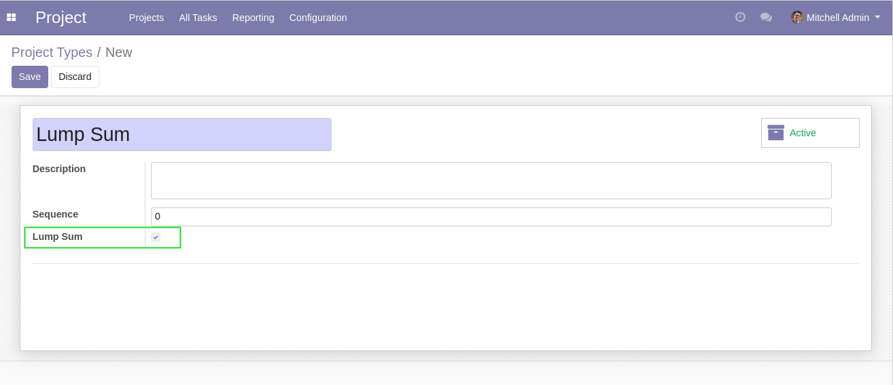
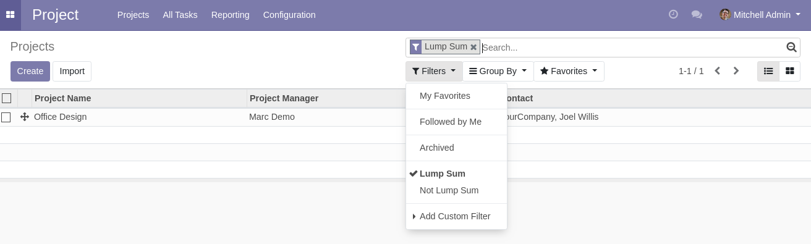
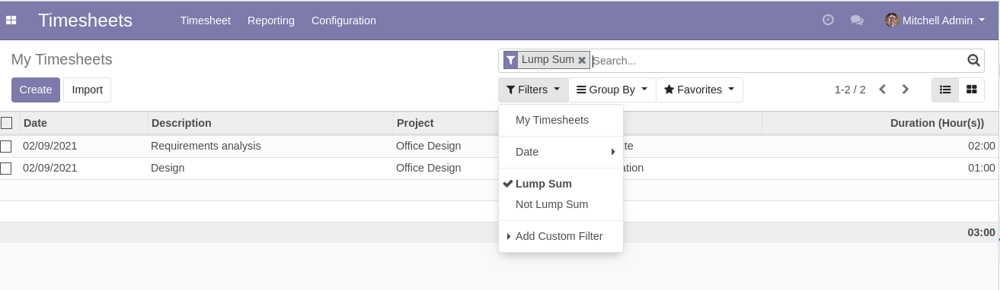

Project Lump Sum
================
This module types projects as ``Lump Sum``

.. contents:: Table of Contents

Project Types
-------------
In the form view of a project type, I find a new checkbox ``Lump Sum``.

When the box is checked, all projects linked to this type are considered ``Lump Sum`` projects.

In the list view of projects, I can filter the list to see only projects typed as ``Lump Sum``.

Analytic Lines
--------------
Any analytic line originated from a ``Lump Sum`` project are also typed as ``Lump Sum``.

Basically, this includes timesheets linked to the project.

It also includes analytic lines originated from an invoice line linked to the project.
This concept is defined by the module ``project_task_analytic_lines``.

Contributors
------------
* Numigi (tm) and all its contributors (https://bit.ly/numigiens)
