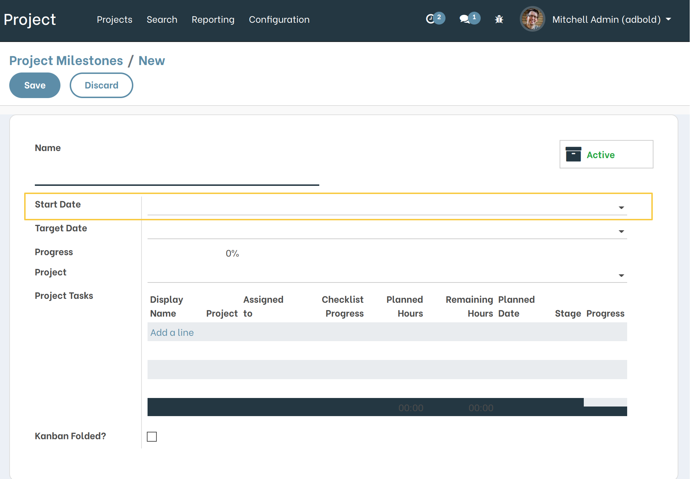
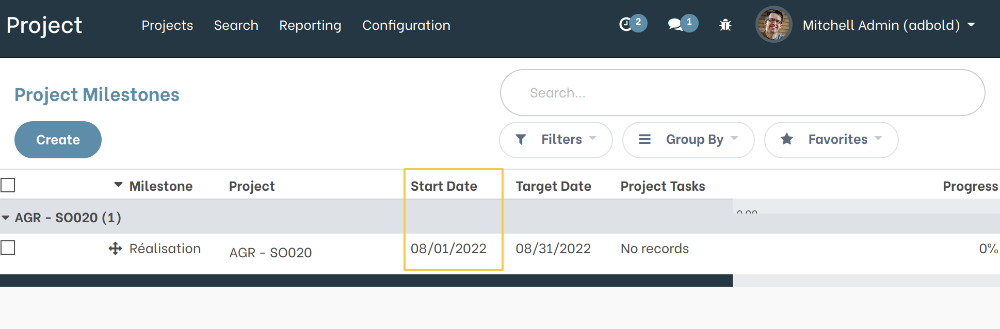
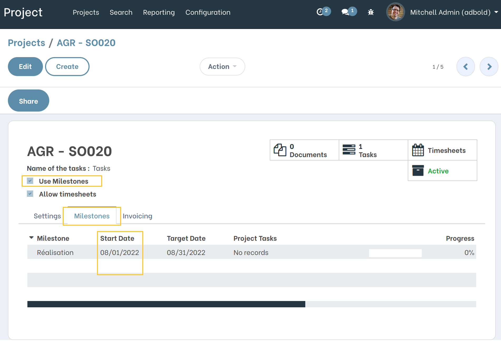

Project Milestone Start date
============================

.. contents:: Table of Contents

Description
-----------
This module adds a Start Date field to milestone object.

Overview
--------
I open the form view of a milestone, a new field is added ``Start Date``.

The same field is added to the list view of a milestone.

From a project form view with ``Use Milestone`` egal a True, I see the field ``Start Date`` added to Milestones Tab lines.

Contributors
------------
* Numigi (tm) and all its contributors (https://bit.ly/numigiens)

More information
----------------
* Meet us at https://bit.ly/numigi-com