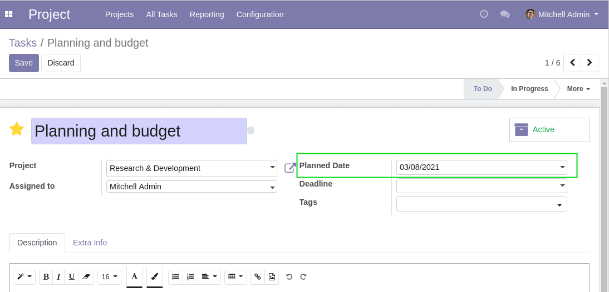
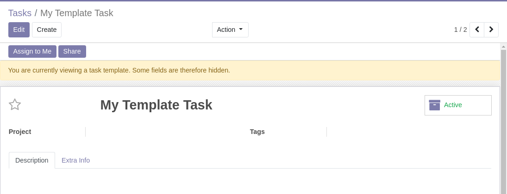

Project Template Date Planned
=============================

.. contents:: Table of Contents

Context
-------
The module project_task_date_planned adds the field ``Planned Date`` on tasks.

The module project_template allows to create template tasks.

Usage
-----
This module hides the field ``Planned Date`` on template tasks.

Contributors
------------
* Numigi (tm) and all its contributors (https://bit.ly/numigiens)
