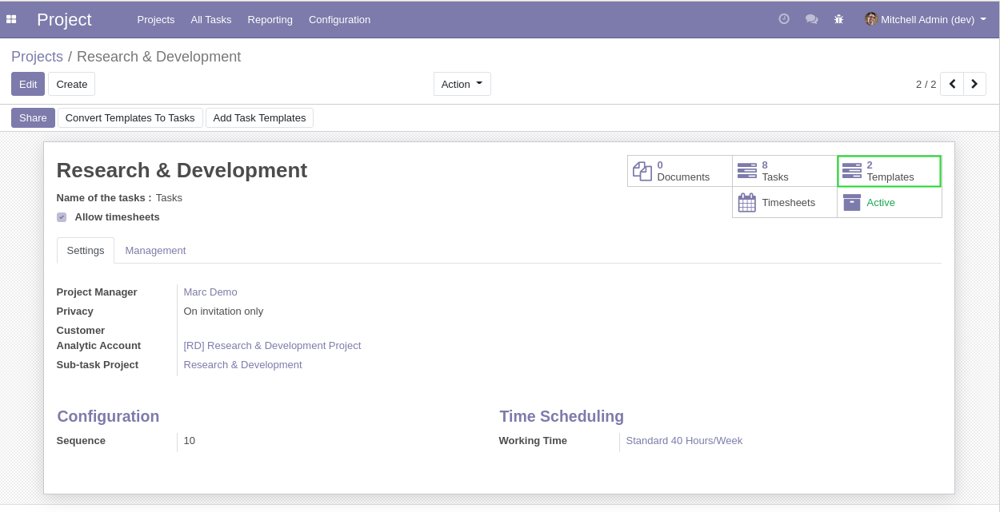
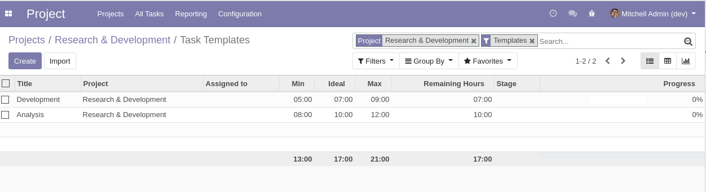
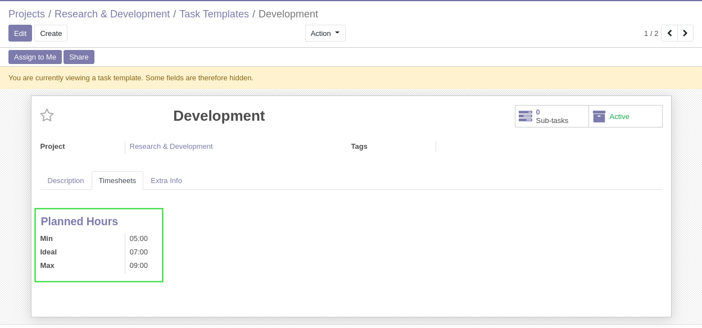
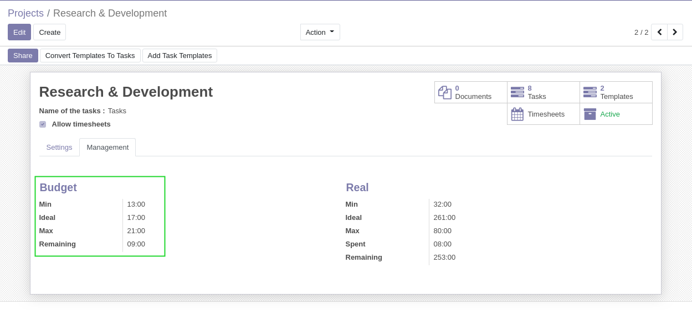
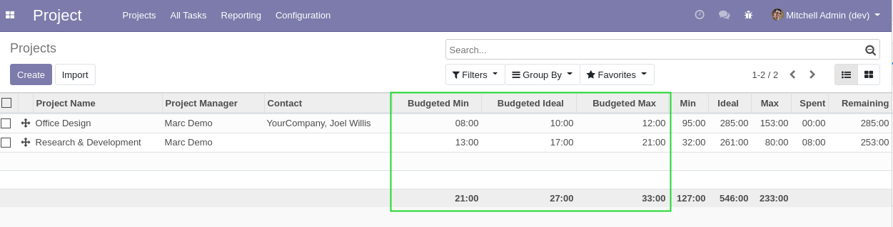
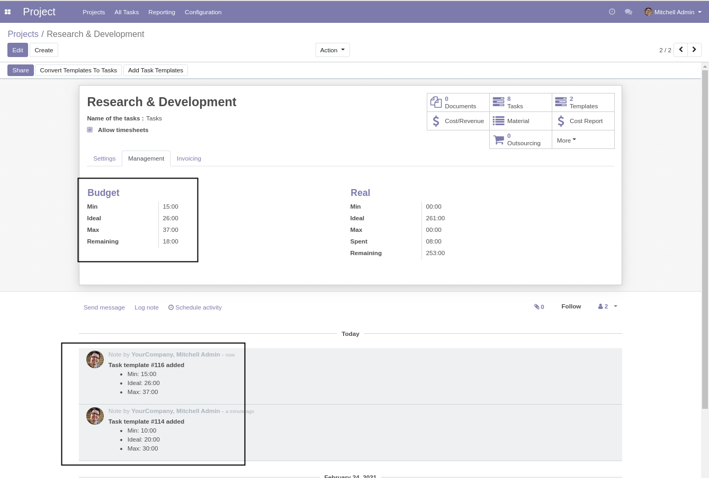

Project Time Budget
===================

.. contents:: Table of Contents

Context
-------
The module project_time_range adds ranges of time (Min / Ideal / Max) on projects and tasks.

The module project_template allows to create tasks from templates.

Overview
--------
This module uses the concept of a template task in the context of a budgeted project.

The template tasks under a project represent the initial estimations of the project.

The actual tasks represent the ongoing estimation of the project.

Usage
-----
In the form view of my project, I click the ``Templates`` button.

I see the list view of template tasks under the project.

In the form view of a template task, I notice that it has a time range.

In the form view of the project, In the ``Management`` tab, I notice a new section ``Budget``.

This section contains the sum of hours of template tasks under the project.

The ``Remaining`` field is computed based on the time ``Spent`` and the ``Budgeted Ideal``.

The fields ``Budgeted Min / Ideal / Max`` are also added to the list view of projects.

Project Chatter
---------------
When a task template is modified, removed or added to a project,
an entry is added to the chatter of the project.

This allows to easily track the evolution of the budgeted hours.

Contributors
------------
* Numigi (tm) and all its contributors (https://bit.ly/numigiens)
* Komit (https://komit-consulting.com)
