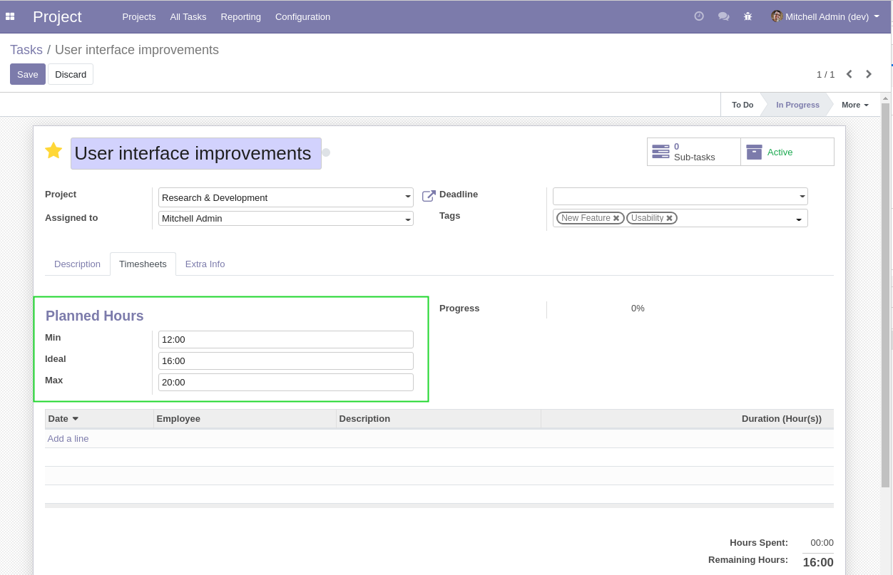
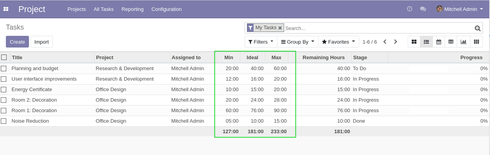
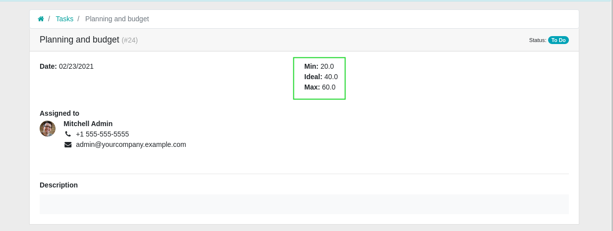
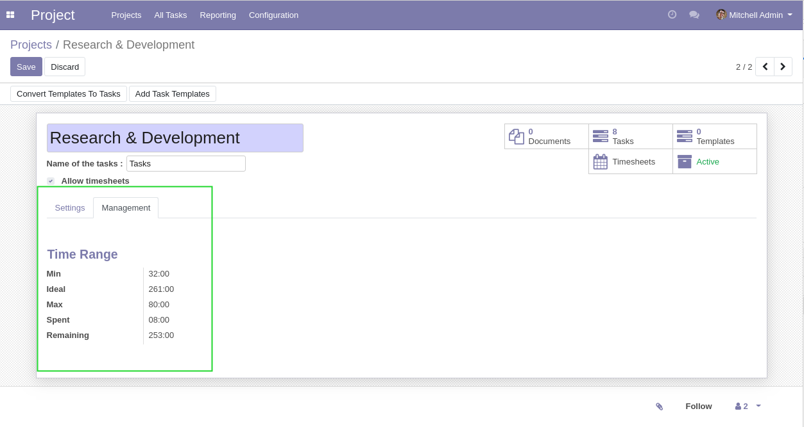
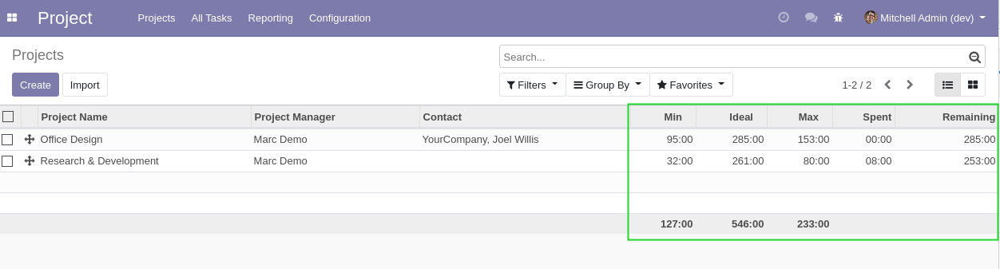

Project Time Range
==================

.. contents:: Table of Contents

Tasks
-----
The module adds the fields `Min` and `Max` under the `Timesheets` tab of a task.

These fields contain the minimum and maximum time initialy estimated on the task.
The field `Initially Planned Hours` is renamed `Ideal`.

The fields are also added to the list view of tasks.

They are also added to the portal view of a task.

Subtasks
--------
Also, if a task has subtasks, the sum of time estimated on subtasks is also displayed.

.. image:: static/description/task_form_with_subtasks.png

Projects
--------
On projects, a ``Management`` tab is added.

This tab contains the sum of hours of all tasks under the project.

The time ``Spent`` is the sum of hours on analytic lines.

The time ``Remaining`` is the ``Ideal`` time minus the time ``Spent``.

The fields are also added to the list view of projects.

Contributors
------------
* Numigi (tm) and all its contributors (https://bit.ly/numigiens)
