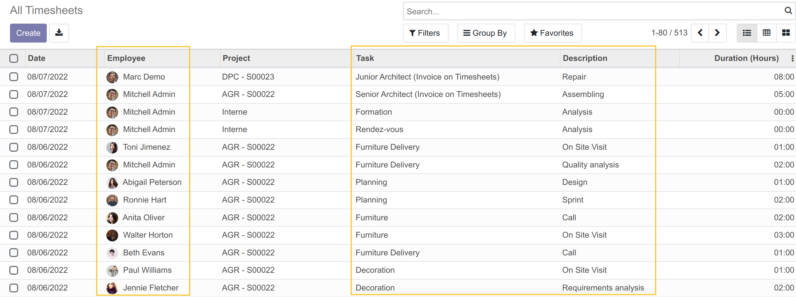
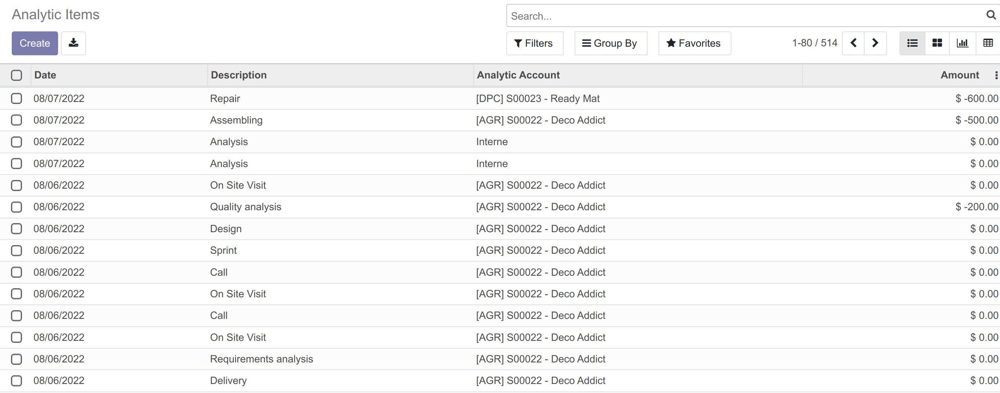
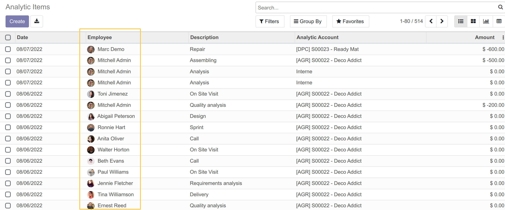
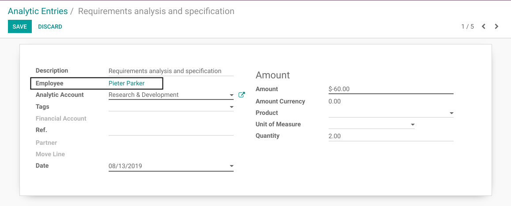
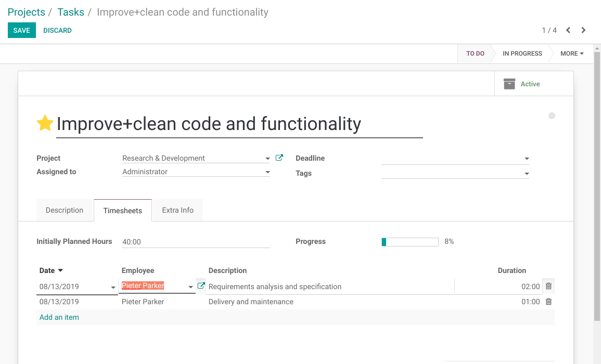

Analytic Line Employee
======================

.. contents:: Table of Contents

Odoo Context
------------
In Odoo, a timesheet line is an analytic line.

On timesheet lines, the following 3 extra fields are filled:

* Project
* Task
* Employee

These fields are visible on the list view of timesheet lines.

However, the ``Employee`` and the ``Task`` are not shown in the list view of analytic lines.

Summary
-------
This module adds the ``Employee`` to the list of analytic lines.

The field is also added to the form view of analytic lines.

The field is readonly because changing it would have undesired side effects.
If you need to change the employee on a line, you may do it from the form view of the task:

Contributors
------------
* Numigi (tm) and all its contributors (https://bit.ly/numigiens)

More information
----------------
* Meet us at https://bit.ly/numigi-com