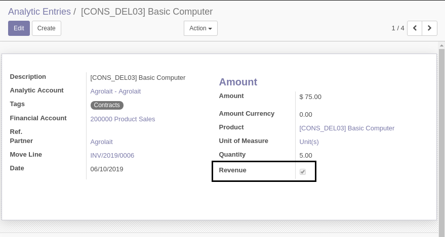
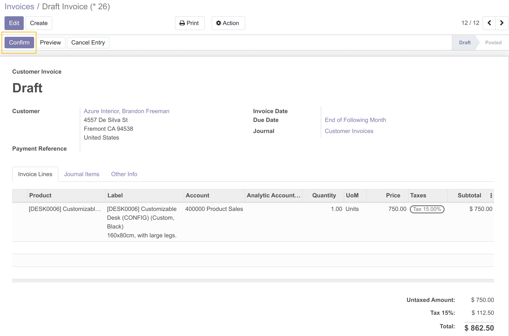
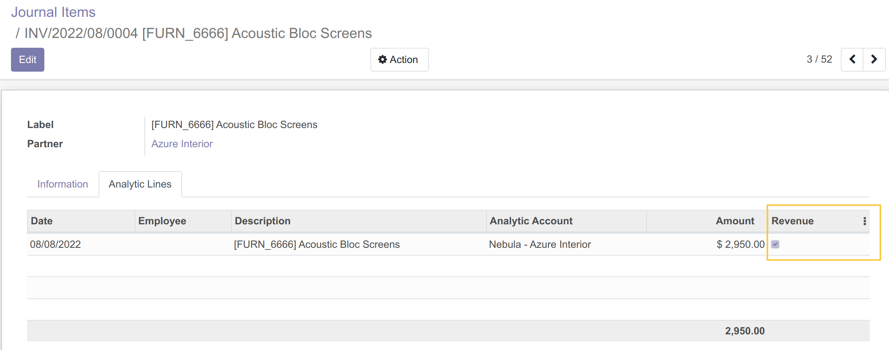
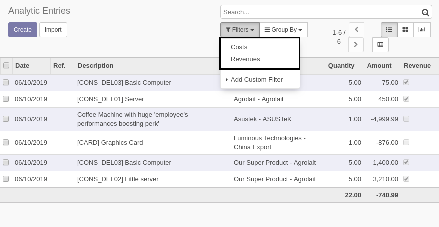
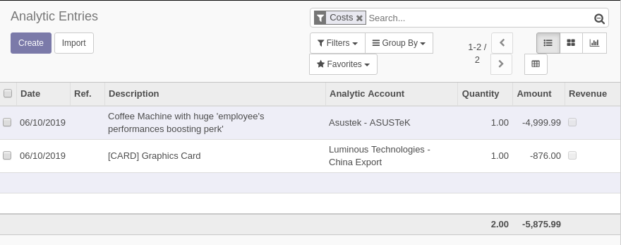
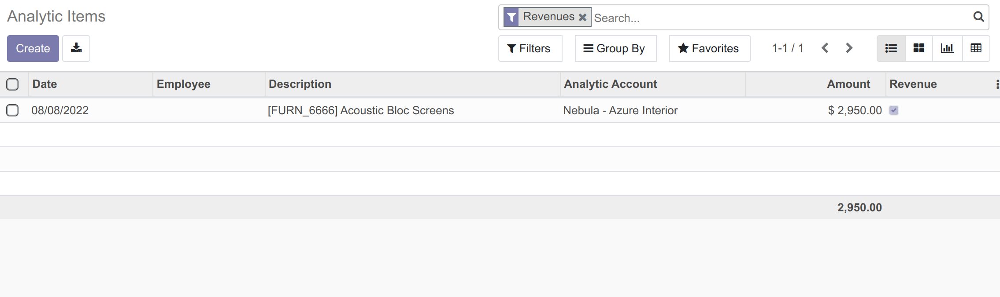

Analytic Line Revenue
=====================

.. contents:: Table of Contents

Context
-------
In vanilla Odoo, there is no distinction between analytic lines generated from expenses versus revenues.

The sign of the amount can not be used for this purpose.
For example, a supplier refund would be classified as a revenue.

Summary
-------
This module adds a boolean field `Revenue` on analytic lines.

When validating a journal entry, if a line has an account of type `Revenue`, the checkbox `Revenue`
will be checked on the analytic lines.

Any other analytic line is a cost by default.

Usage
-----
As member of the group `Sale / User`, I validate a customer invoice.

I notice that the generated analytic lines are revenues.

Filters
-------
In the list of analytic lines, I find 2 new filters `Costs` and `Revenues`.

If I check `Costs`, the list view will exclude analytic lines with `Revenue` checked.

If I check `Revenues`, the list view will exclude analytic lines with `Revenue` unchecked.

Contributors
------------
* Numigi (tm) and all its contributors (https://bit.ly/numigiens)
