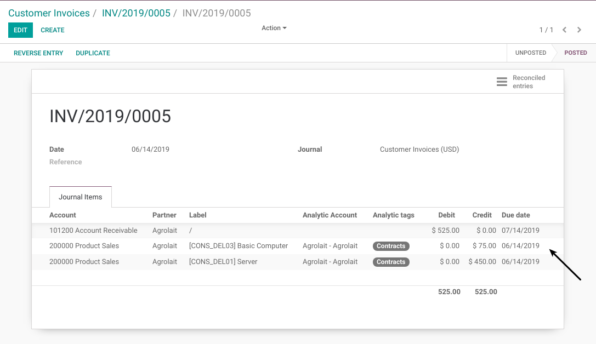
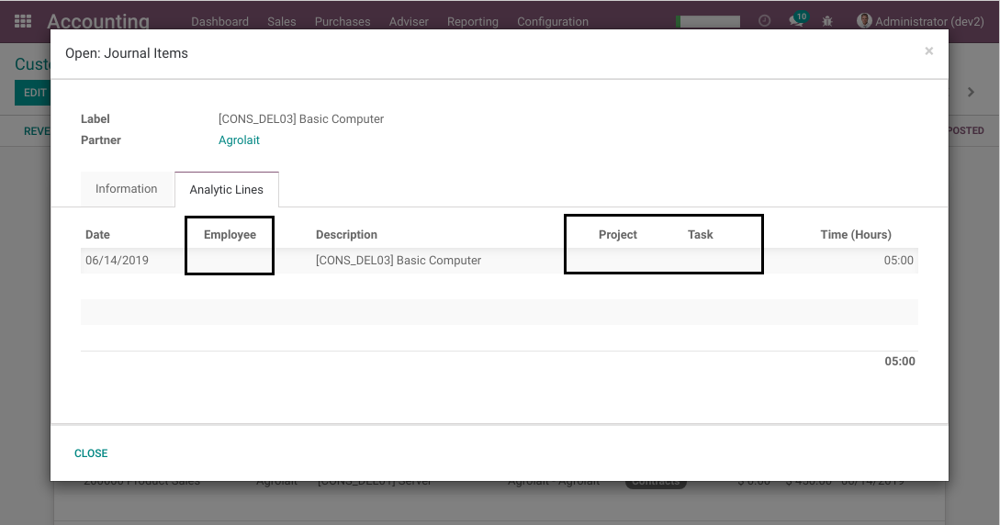
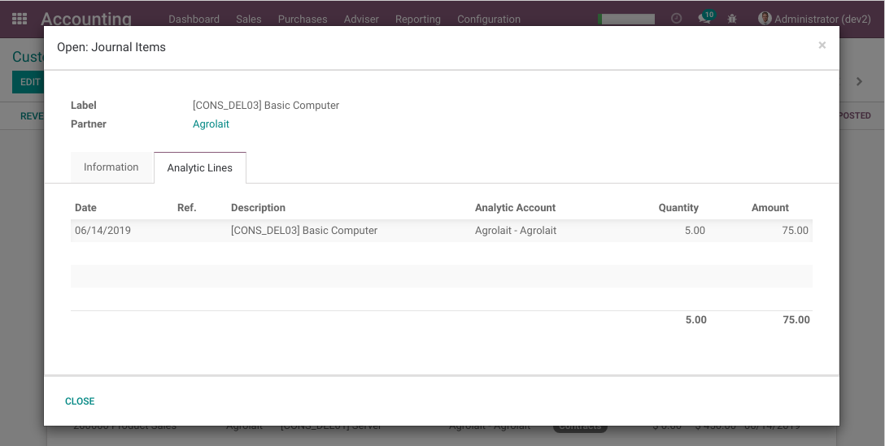

Project Task Analytic Lines
===========================

.. contents:: Table of Contents

Odoo Context
------------
In Odoo, a timesheet line is an analytic line (bound to a task).

When the Timesheets app is installed, the list and form views
of timesheet lines are prioritized versus the standard views of analytic lines.

This causes an unexpected behavior in the system when navigating to the list
of analytic lines.

For example, in the form view of a journal entry,
when clicking to see the analytic lines related to a journal item,
I expect to see the standard list of analytic lines.

But what I get is a view with timesheet columns.

Summary
-------
This module prioritizes the views of analytic lines over timesheet lines.

In the form view of journal entries I get the standard view of analytic lines
when clicking to see the analytic lines related to a journal item,

Contributors
------------
* Numigi (tm) and all its contributors (https://bit.ly/numigiens)
