Project Task Meeting Certificate
================================

.. contents:: Table of Contents

Context
-------
The module ``meeting_minutes_certificate`` defines the meeting minutes on tasks.

Overview
--------
This module adds a new tab ``Training Certificate`` on meeting minutes.

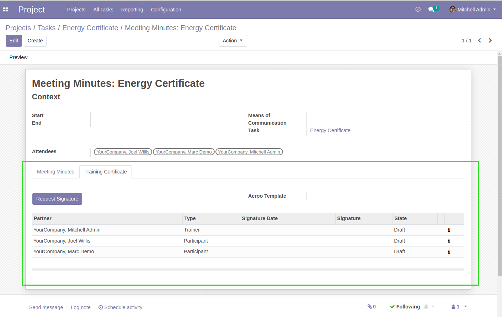

This tab allows to manage signatures of the training certificate for each attendee.

Aeroo Report
~~~~~~~~~~~~
In this tab, I must select the Aeroo template that will be used to render the certificate.

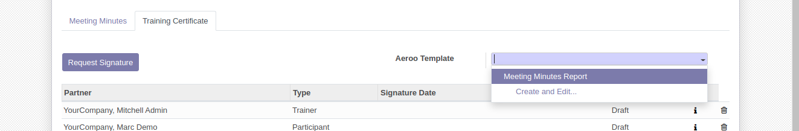

This field can be set automatically using a default value.

Attendees
~~~~~~~~~
When adding or removing an attendee, the list of signatures is updated accordingly.

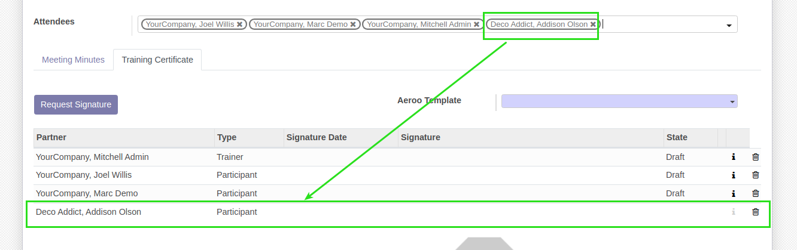

By default, when the meeting minutes is created, the list of signatures is already prefilled.

Trainer
~~~~~~~
The user assigned to the task is automatically defined as trainer.

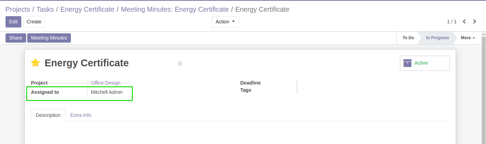

The column ``Type`` allows to distinguish between the trainer and the participants.

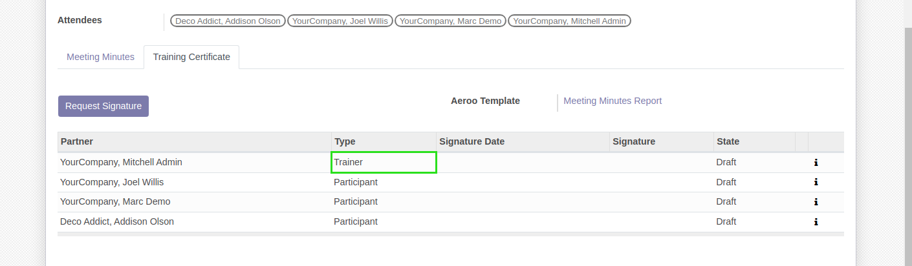

Also, the trainer is automatically defined as follower on the meeting minutes
(even if someone else initialized the meeting minutes).

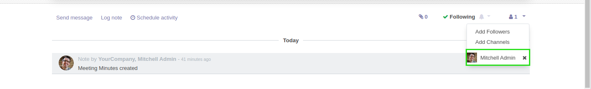

Signature Request
~~~~~~~~~~~~~~~~~
A button allows to send the signature requests.

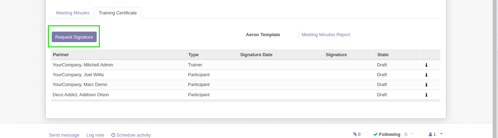

When clicking on the button, one email is sent to each attendee.

It is possible to resend the request to a single attendee.

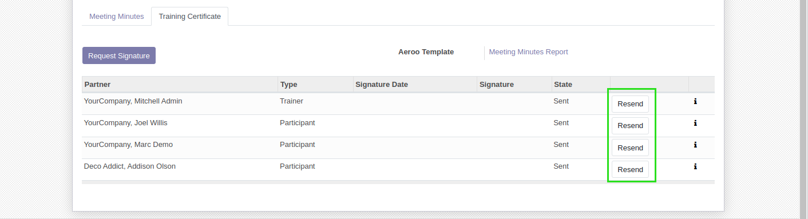

I can view the communication with a given attendee by clicking on the ``info`` icon.

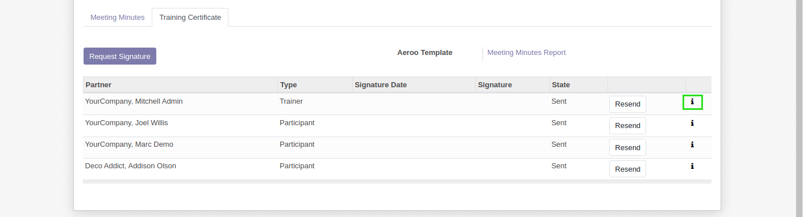

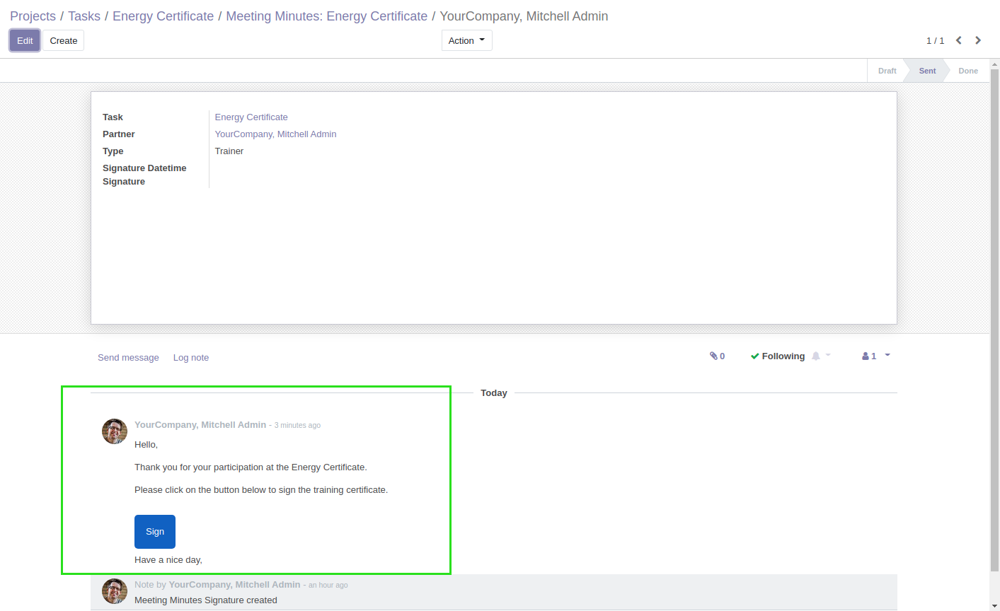

Portal
~~~~~~
In the email sent to the attendee, when clicking on the ``Sign`` button, the portal view
of the document to sign is opened.

The URL of the page contains the task ID and an access token.

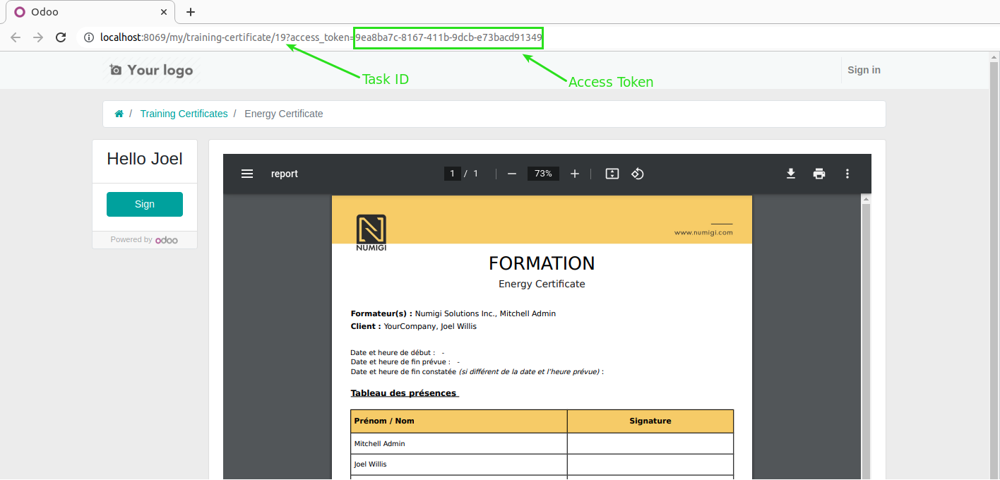

Using this access token, the page can be opened without signin in.

When the user is logged in, a new menu item allows to access his training certificates.

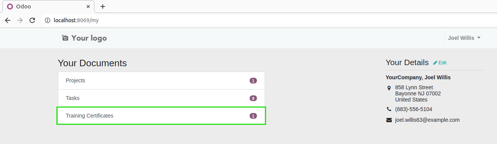

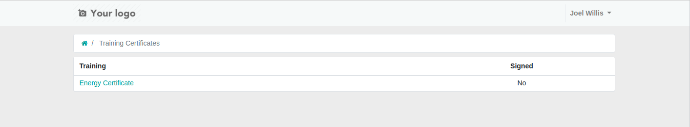

Signing The Certificate
~~~~~~~~~~~~~~~~~~~~~~~
From the page of the document to sign, I click on ``Sign``.

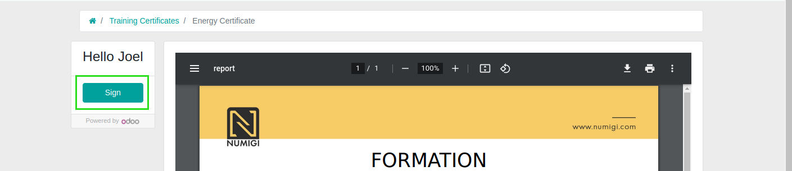

I fill my signature, then I click on ``Accept & Sign``.

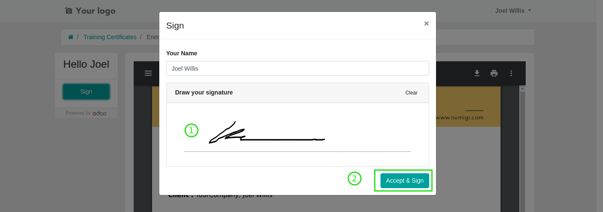

The document is updated with my signature.

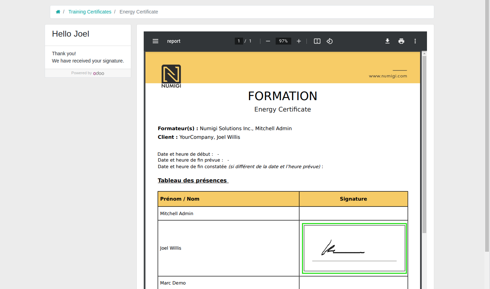

Signed Certificate
~~~~~~~~~~~~~~~~~~
When the certificate is signed by all attendees, an email containing the certificate is automatically
sent to each attendee individually.

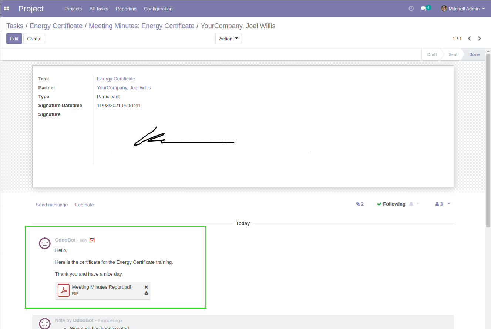

Contributors
------------
* Numigi (tm) and all its contributors (https://bit.ly/numigiens)

More information
----------------
* Meet us at https://bit.ly/numigi-com
