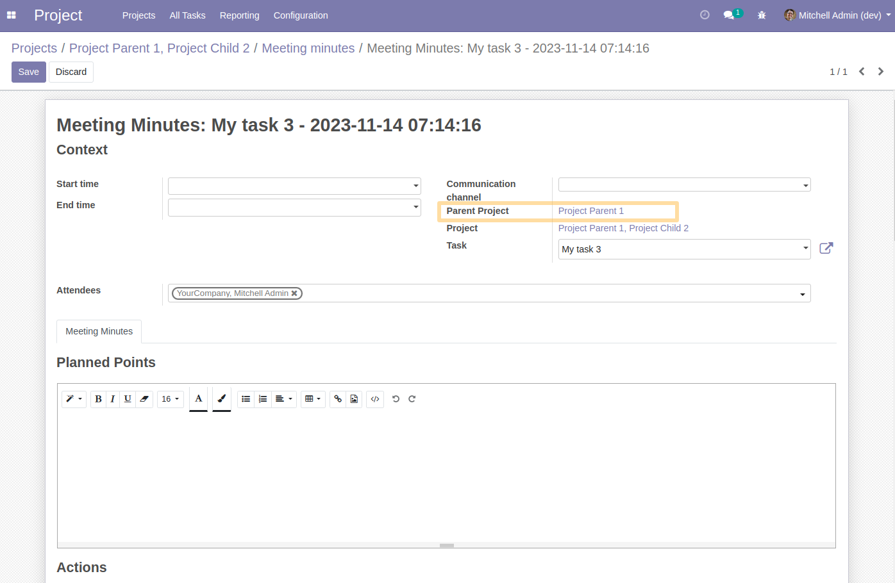
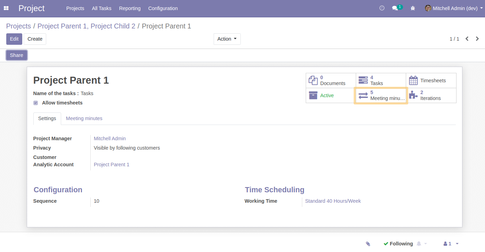
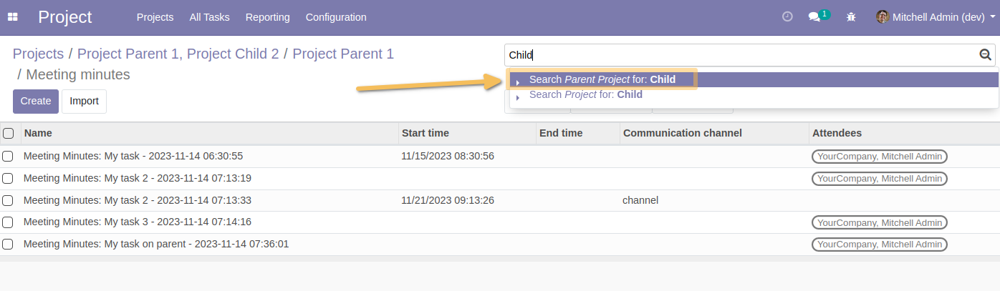

Meeting Minutes Project Parent
==============================
This module allows to have the following functionalities :

* The report linked to a task is automatically associated with its parent project
* From the list of reports, search and group the reports by parent project is available
* From the parent project, access all reports saved for the parent project is available

Usage
-----

* New Parent Project field on the report
As a user on a database in which the project_iteration module is installed, when I create a report from a task associated with a project having a parent project (parent_id on project.project), a new Parent Project field is automatically valued.
This field is a related field, from the project associated with the report, based on the parent_id field of the project.
This field is visible in the report form view, under the Means of communication field.

* Smart button from the project
*review the alternative solution in the detailed specification*
From the project form, the smart button behaves differently.
The smart button returns: the list of reports associated with the project, and the list of reports associated with the projects behind the Lots field (`child_ids`) of the project.

Likewise, the behavior of the `Number of reports`` field is modified. the calculation is now based on the number of reports associated with the project, and the list of reports associated with the projects behind the Lots field (`childs_ids`) of the project.

* Search report by parent project
From the list of reports, I am able, from the quick search, to search by parent project.

Contributors
------------
* Numigi (tm) and all its contributors (https://bit.ly/numigiens)
