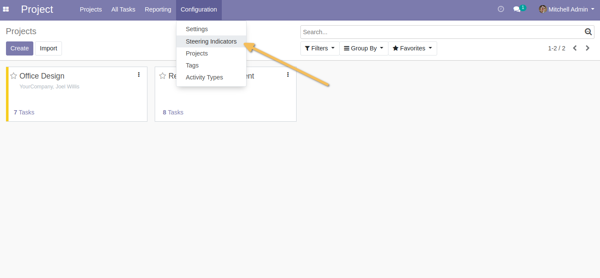
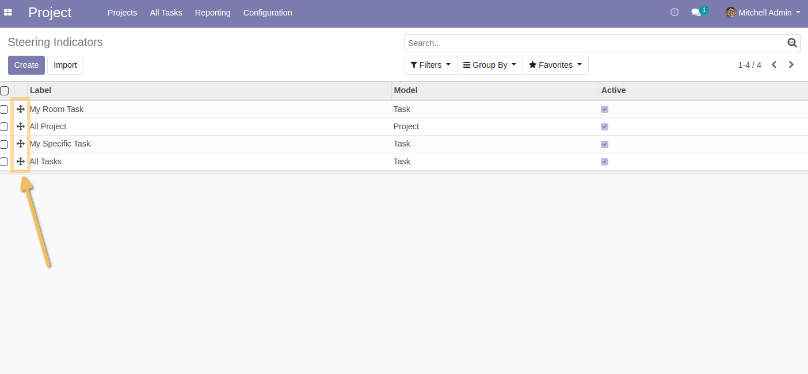
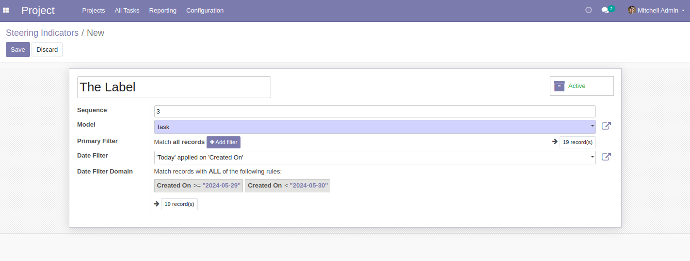
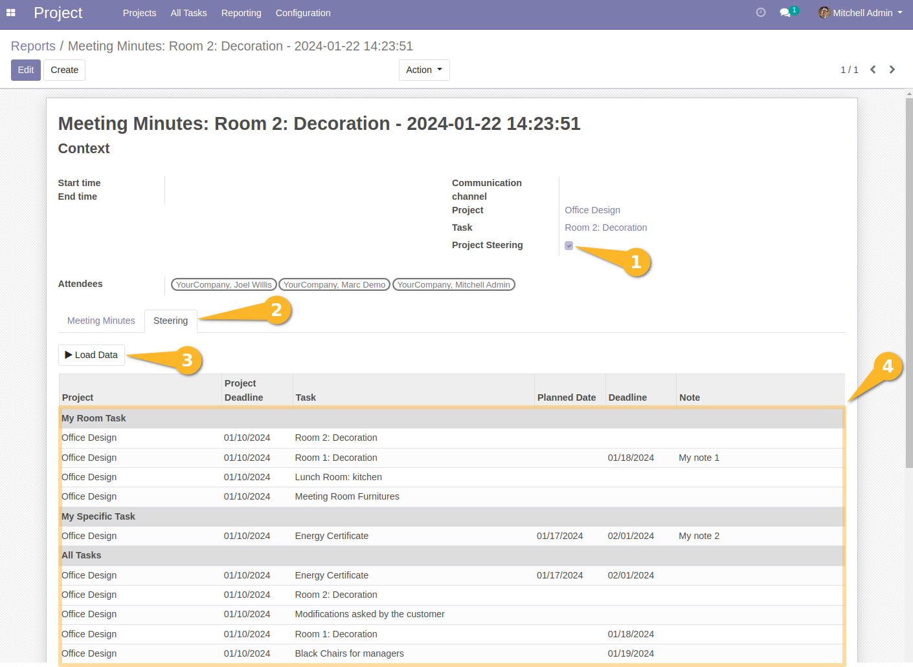

Meeting Minutes Project Steering
================================
This module helps project team for steering projects, using some parameters for KPI.

Usage
-----
*Configuring control indicators*
--------------------------------
As a user in the Projects/User group, I find a new menu `Projects > Configuration > Steering indicators`.

When I click on this menu entry, I arrive at a list view displaying the following fields:
-Sequence
-Label
-Model
-Active

The list view contains a handle component to order the rows and adjust the sequence from the list view.

When I click on the `Create` button, I arrive at a form view offering the following fields:
-Label
-Sequence
-Model
-Active
-Primary Filter
-Date Filter

Notice : `Model` field have only two possible options, `Project` and `Task`.
`Date Filter` will be applied after the `Primary Filter` to filter the records.

*New 'Steering' tab in the Meeting Minutes form*
------------------------------------------------

As a user who can access reports and create meeting minutes, if I create a meeting minutes associated with a task or a project,
a new checkbox field is available `Project Steering`.
This field is unchecked by default and visible only if the `Project` field is non-empty.

When I check the `Project Steering` box, a new tab is displayed `Steering`.

In the tab, a `Load Data` button is available at the top of the tab.
Below this button, a list view of the control lines is available. Lines are empty by default.

The lines contain the following fields:
-Project
-Project deadline
-Task
-Planned date
-Deadline
-Notes

When I click on the `Load data` button, a query is launched to find and load the lines for each active management indicator, with the following criteria:
¤ Records have the same project ID as the meeting minutes
¤ Records are included in the project indicator domain

The recording lines are grouped by `Steering Indicator`, and each group is ordered according to the sequence defined in the list of steering indicators, with a section line at the first line of each recording group.

*NB: This module is intended to work on a single project per meeting minute. 
Another module will be made to allow the notion of parent project to be used in project steering.*

Contributors
------------
* Numigi (tm) and all its contributors (https://bit.ly/numigiens)
