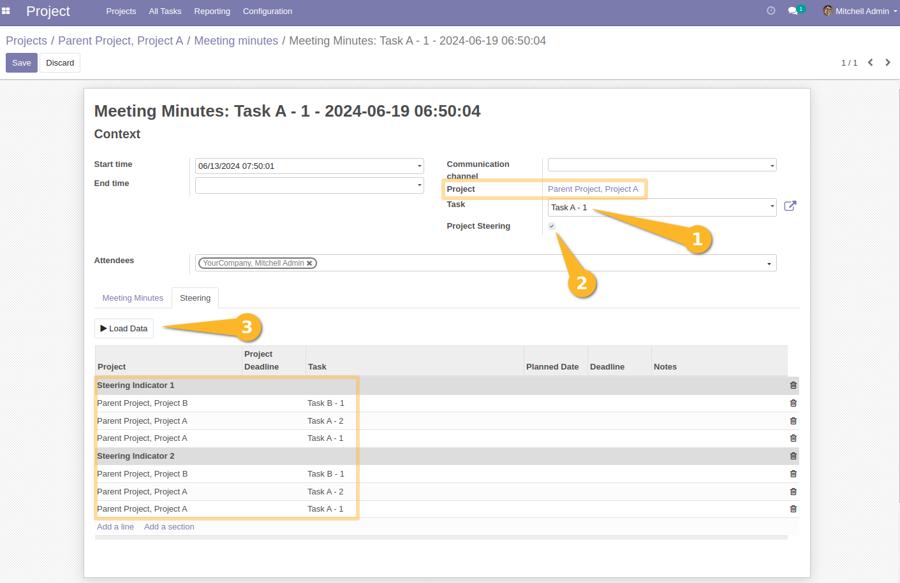

Meeting Minutes Project Steering Parent
=======================================
This module allows be able to extract data from a parent project and all its subprojects 
from the project steering form.

Usage
-----
As a Project user, I have a parent project `Parent Project`, which contains two child projects `Project A`, `Project B`. 
The 2 child projects contain tasks.

As a user who can access meeting minutes, I create a meeting minute, 
associate it with the `'Parent Project, Project A` project and a project task, then I check the `Project Steering` box.

When I click on the `Load Data` button, I see that the data is loaded 
based on all the subprojects (child projects) associated with the parent project defined on the meeting minute.

Contributors
------------
* Numigi (tm) and all its contributors (https://bit.ly/numigiens)
