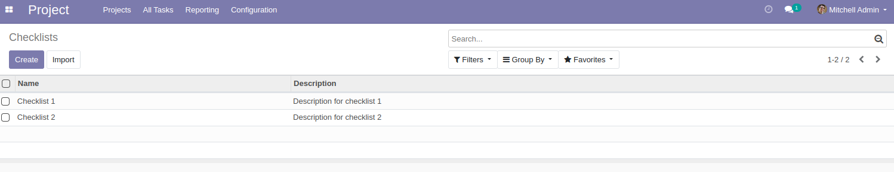
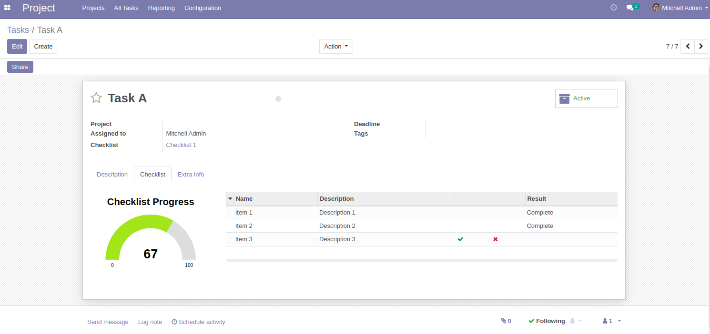
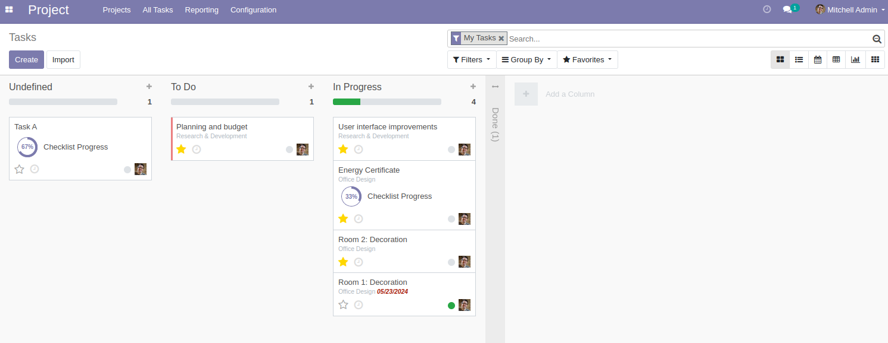
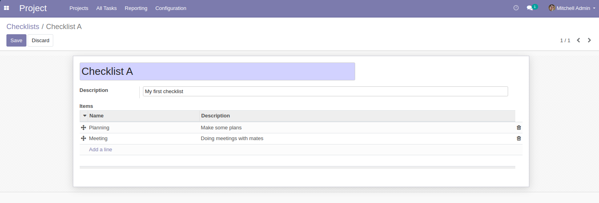
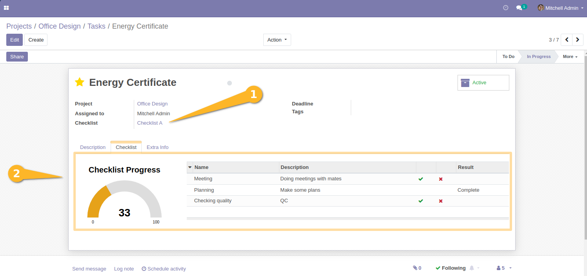
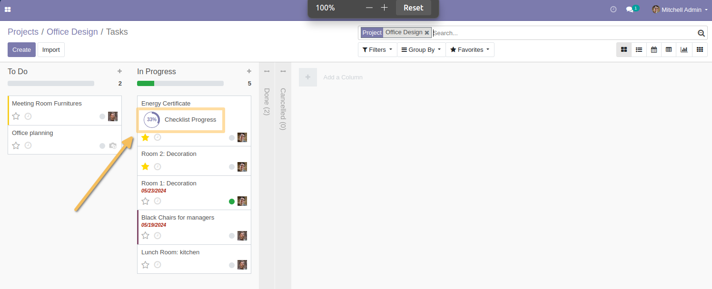

Project Advanced Checklist
==========================
This module allows to use advanced checklist in tasks.

Key Features
------------
**Unlimited number of checklist**

**Unlimited number of items in each checklist**

.. image:: static/description/feature_2.png

**Only the manager can add or modify the checklist in the task**

**Render in kanban view**

Usage
-----
As a project manager, I carry out checklists,

I create a new checklist that contains the following fields:
-Name
-Description
-Items

On the task, a new field `Checklist` is available.
By defining a checklist, a new tab is displayed, where the elements which constitute 
the checklist are displayed accompanied by a progress bar.

On the Kanban task view, the progress bar is displayed for tasks for which a checklist is defined.

Contributors
------------
* Numigi (tm) and all its contributors (https://bit.ly/numigiens)
