Project Cost Report
===================

.. contents:: Table of Contents

Summary
-------
This module adds a dynamic cost report to the `Project` application.

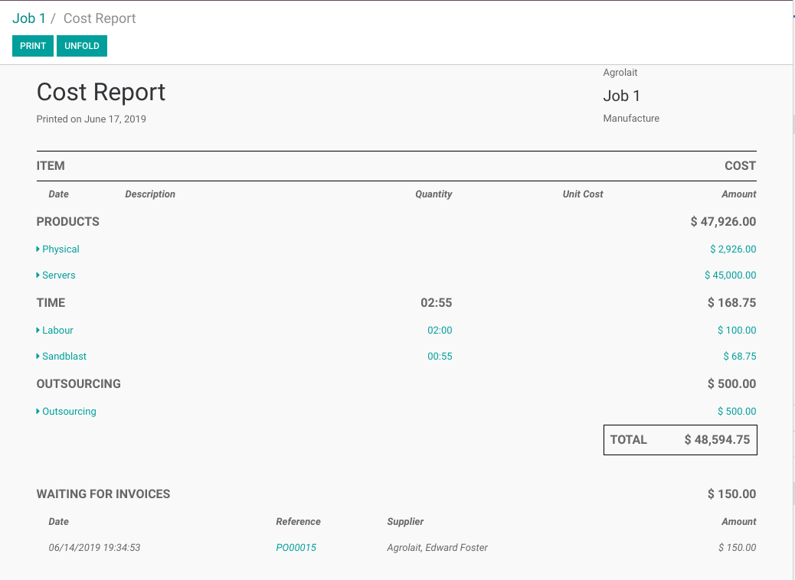

Usage
-----
To open the report, go to the form view of a project and click on the smart button `Cost Report`

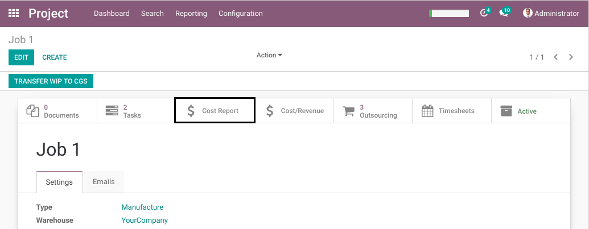

Header
------
The header of the report contains the following elements:

1. The print date
2. The name of the partner related to the project
3. The project name
4. The project type (see module project_type from the same repository)

Cost Sections
-------------
The body of the report is divided into 2 tables.

The first table contains the costs of the the project.
The amounts are aggregations based on analytic lines.

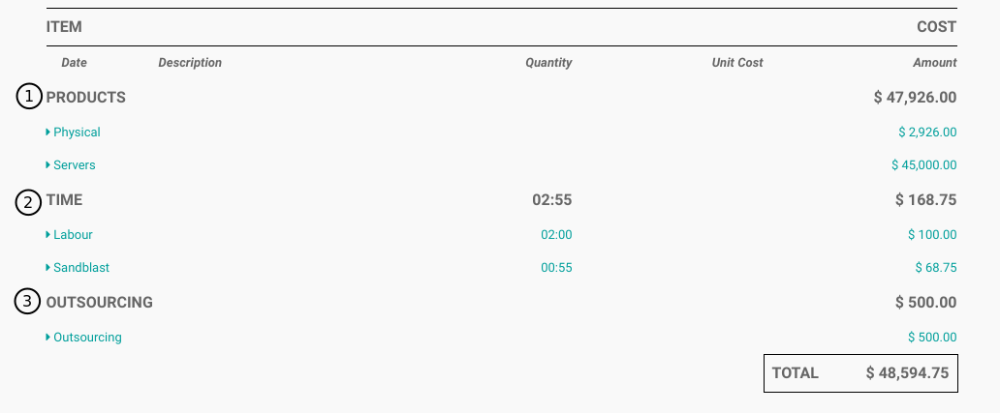

These costs are seperated into the following sections:

* Products
* Time
* Outsourcing

Each section contains subdivisions that can be folded / unfolded to show / hide the details (analytic lines).

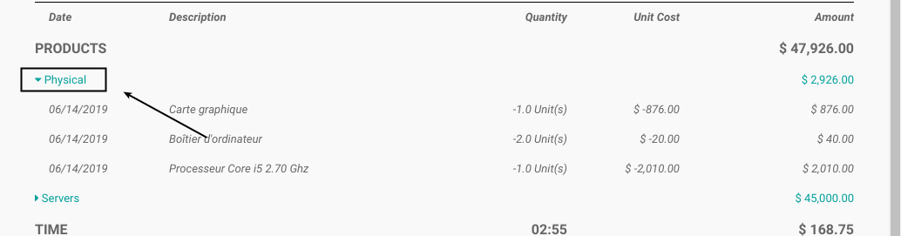

By clicking on the amount of a subdivision, the list of analytic lines related to this amount is displayed.

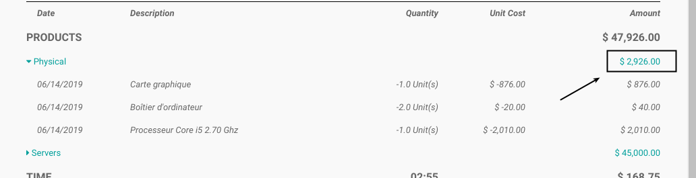

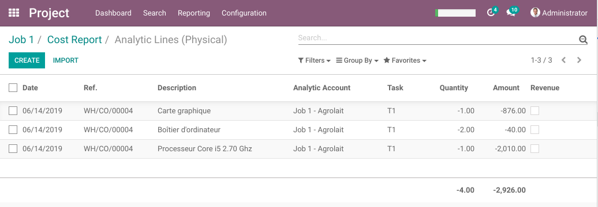

By clicking on an analytic line, the form view of the analytic line is opened.

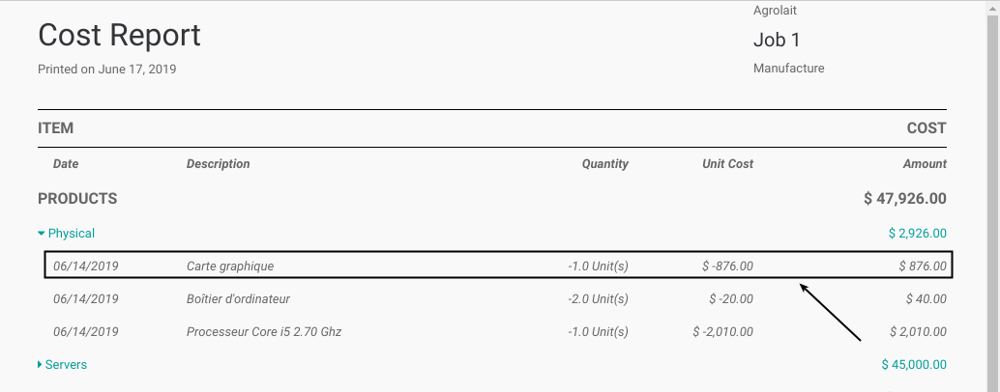

.. image:: static/description/analytic_line_form.png

Cost Subdivisions (Categories)
~~~~~~~~~~~~~~~~~~~~~~~~~~~~~~
The complete list of subdivision (categories) found in the report is available under ``Project / Configuration``.

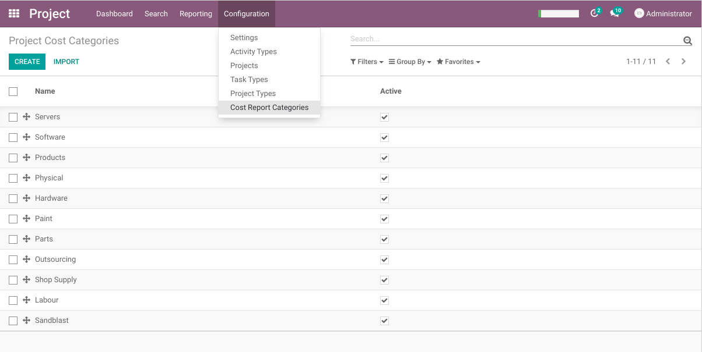

Products
~~~~~~~~
This section contains analytic lines with stockable or consumable products.

It is subdivided into cost categories.

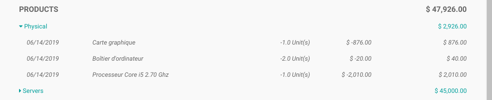

These cost categories are defined on product categories.

.. image:: static/description/product_category_form.png

..

	The subdivision `Products` is a default category. It includes all products not bound to a specific cost category.

Time
~~~~
This section contains analytic lines from timesheets.

It is subdivided into cost categories.

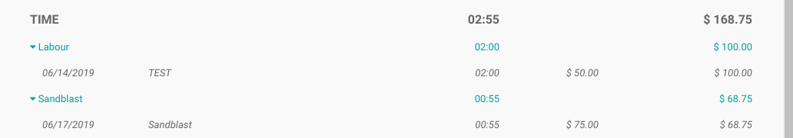

These categories are defined on task types (see module project_task_type from the same repository).

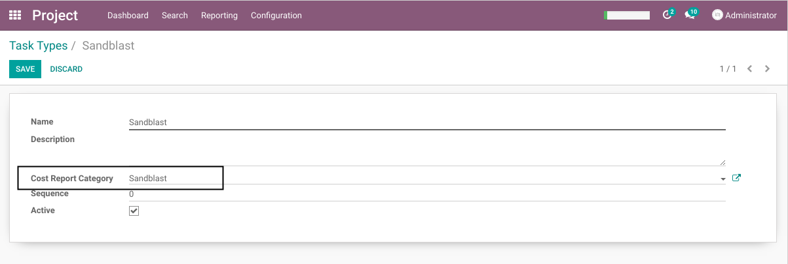

..

	The subdivision `Labour` is a default category. It contains all timesheet lines not bound to a specific category.

Employee Column
***************
Since version 1.1.0 of the module, the ``Employee`` is shown in the ``Time`` section.

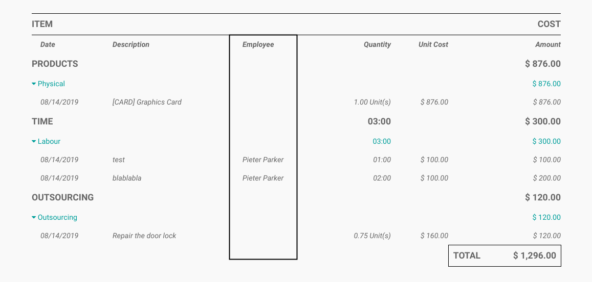

Outsourcing
~~~~~~~~~~~
This section contains analytic lines with products of type service that are not timesheets.

It contains only one subdivision with the same name.

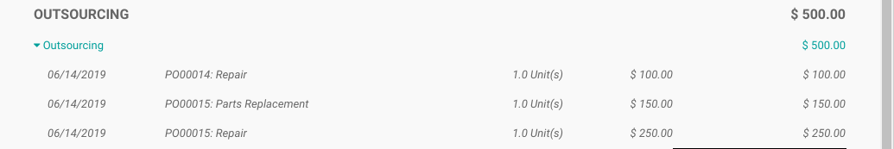

Unreceived Invoices
-------------------
The report contains a special section named `WAITING FOR INVOICES`.

This section contains a list of purchase orders related to the project
for which the supplier invoice has not been received.

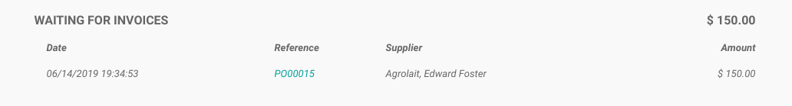

The amount displayed on each line is computed as follow:

..

    (Ordered Quantity - Invoiced Quantity) * Unit Price

By clicking on the PO number, the form view of the PO is opened.

.. image:: static/description/purchase_order_form.png

Fold / Unfold
-------------
You may fold or unfold every sections of the report by clicking on the
buttons in the control panel of the report.

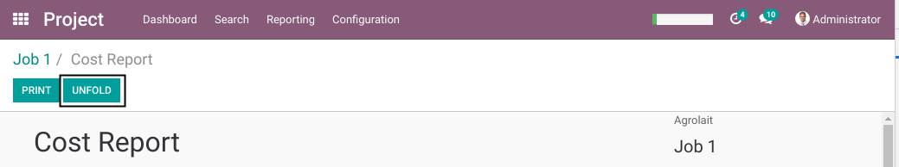

Target / Suggested / Profit
---------------------------
Since the version 1.3.0 of the module, 3 new columns are added to the report.

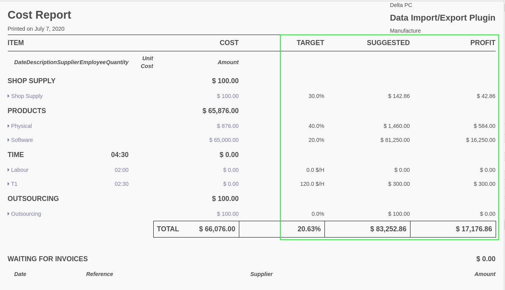

These columns show respectively:

* the target sale margin
* the suggested sale price based on the target margin
* the profit based on the suggested sale price

Target Ratios
~~~~~~~~~~~~~
Under each sections (except TIME), the target is a margin ratio.

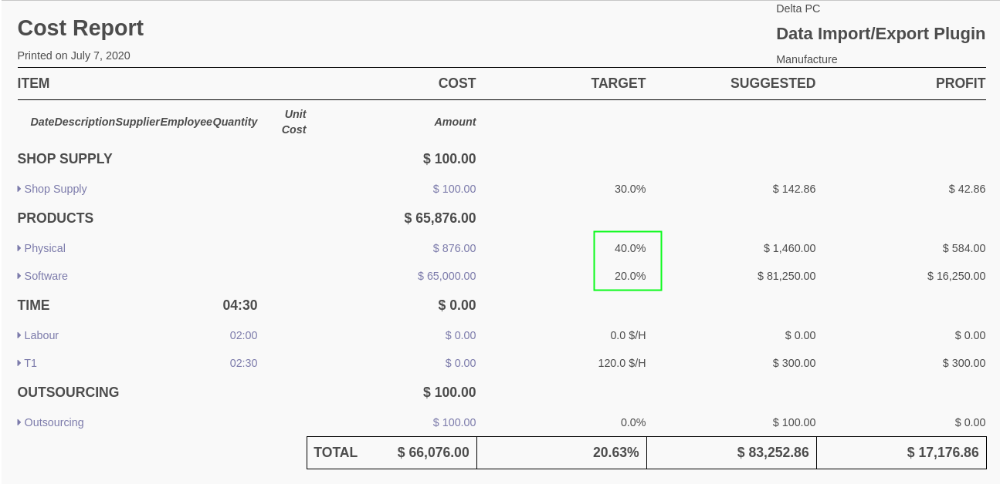

This ratio is defined on the cost category.

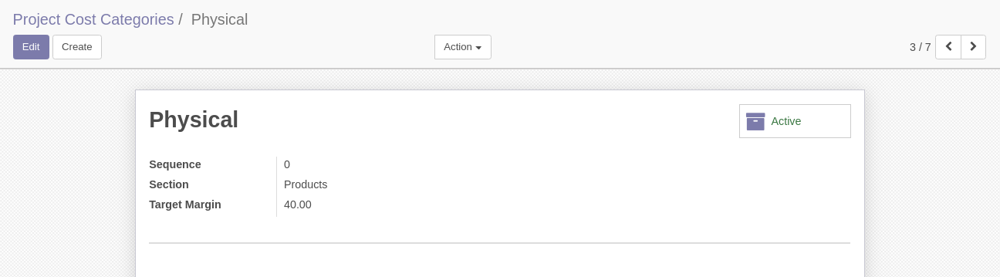

Target Hourly Rate
~~~~~~~~~~~~~~~~~~
Under the TIME section, the target is an hourly rate.

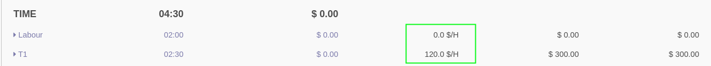

This hourly rate is defined on the cost category.

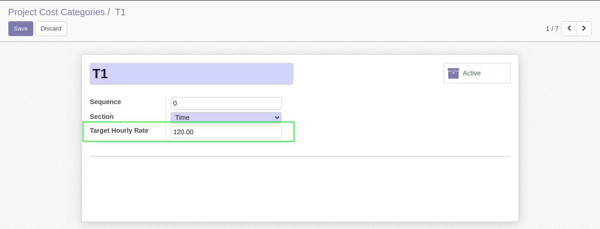

Since version 1.4.0 of the module, it is also possible to define a target in percentage
(instead of an hourly rate) for time categories.

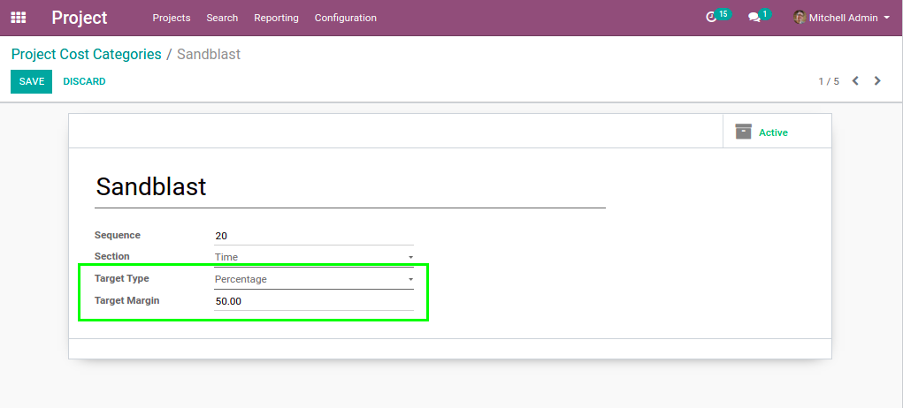

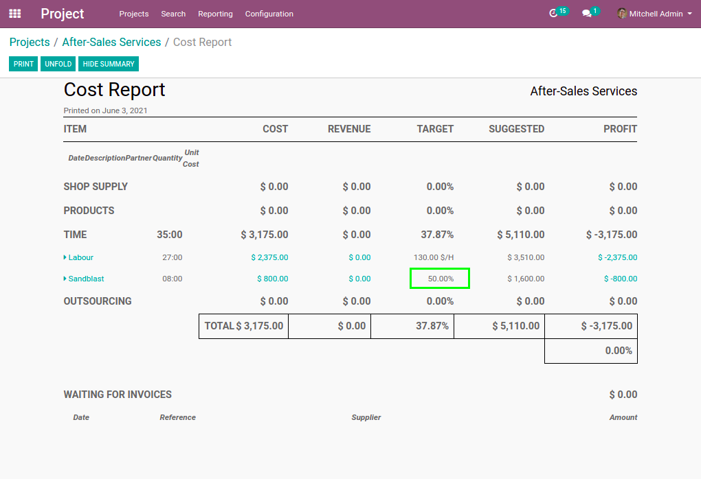

Hide / Show Summary
~~~~~~~~~~~~~~~~~~~
The 3 columns Target / Suggested / Profit can be hidden by clicking on ``HIDE SUMMARY``

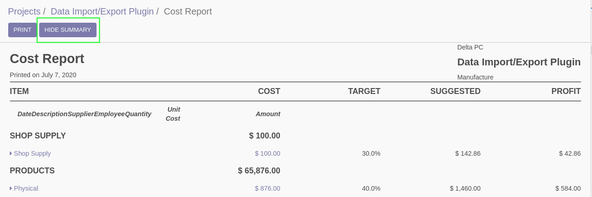

They can be displayed again by clicking on ``SHOW SUMMARY``.

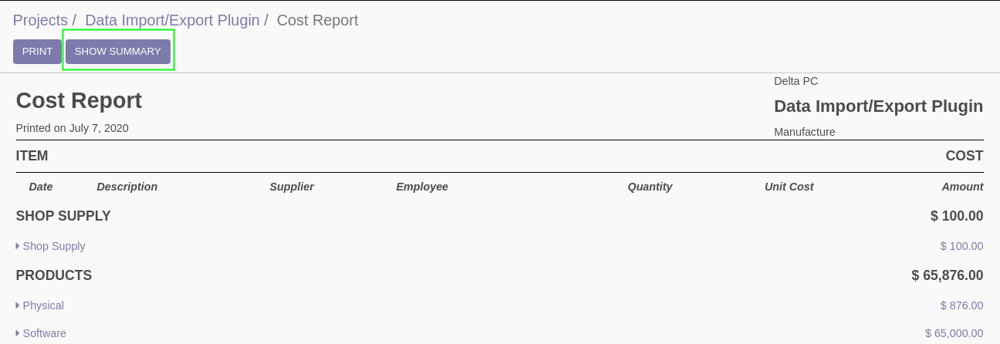

PDF Version
-----------
You may print or doaload a PDF version of the report by clicking on the `PRINT` button
in the control panel of the report.

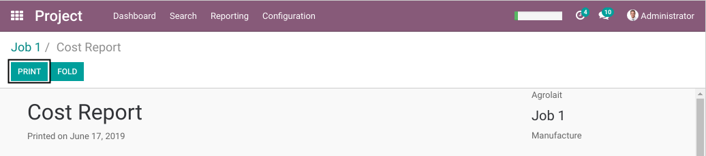

Contributors
------------
* Numigi (tm) and all its contributors (https://bit.ly/numigiens)
