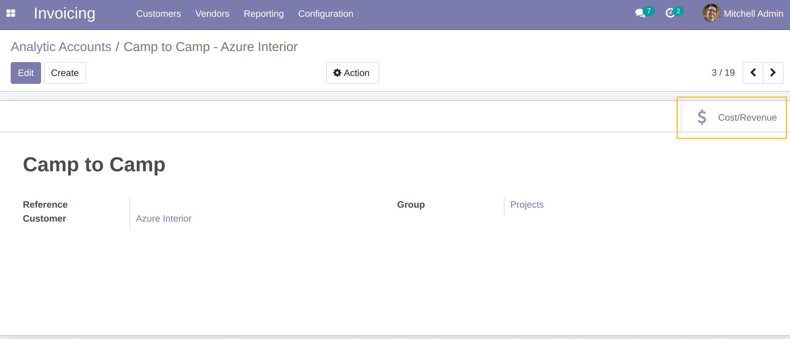
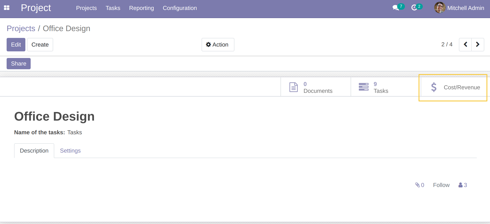
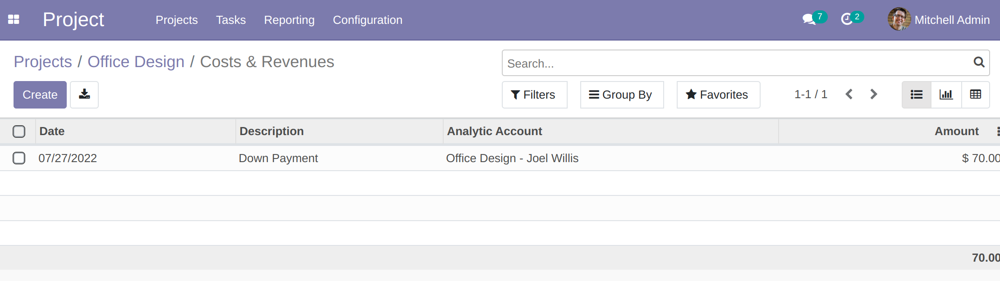

Project Cost Smart Button
=========================

.. contents:: Table of Contents

Overview
--------

In vanilla Odoo, a smart button is available on analytic accounts to display the list of analytic lines.

The module adds the same button on the form view of a project.

When clicking on the button, the list of analytic lines related to the project is displayed.

Contributors
------------

The `Numigi <https://numigi.com/r/home>`_ team is the contributor to this project. We help Quebec companies implement Odoo and Konvergo ERP.