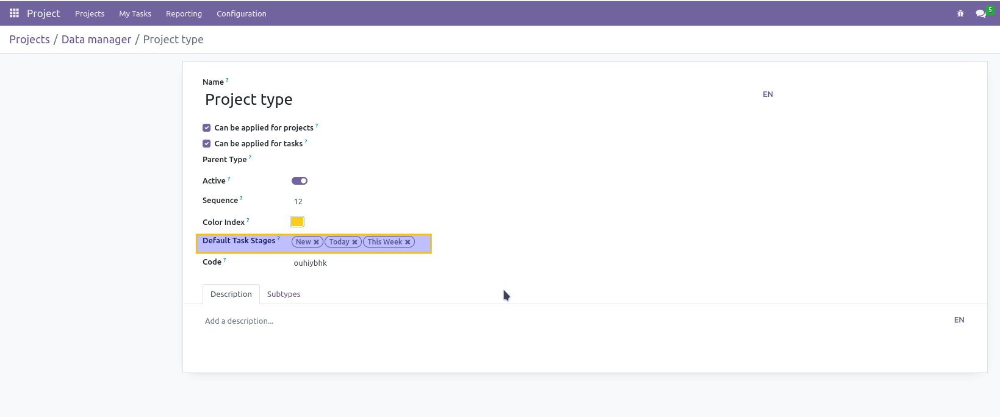
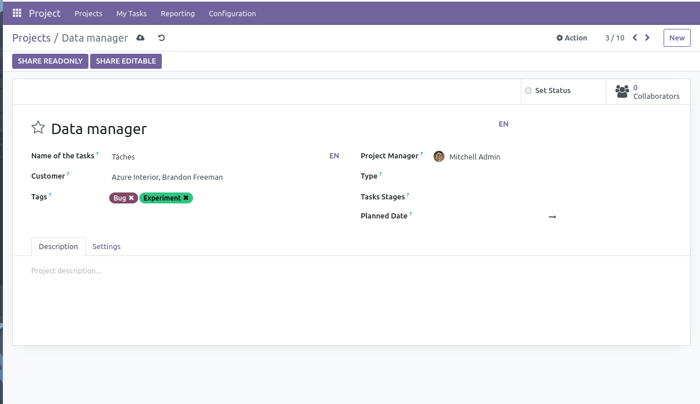
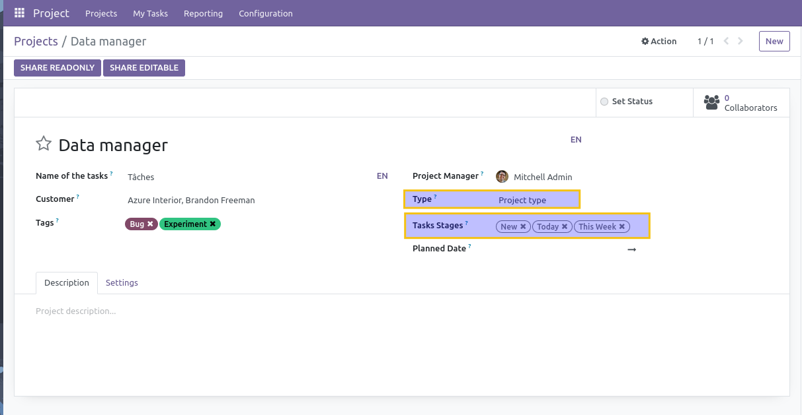

Project Default Task Stage
==========================
This module allows to define default task stages on projects.

Dependencies
------------
This module depends on modules ``project_type`` and ``project_stage_no_quick_create`` from the same repository.

Usage
-----
As member of ``Project / Manager``, I go to the form view of a project type.

I notice a new field ``Default Task Stages``. I select 3 stages in this field.

I create a new project.

I select my project type. I notice that the 3 previously defined stages are automatically filled.

Contributors
------------
* Numigi (tm) and all its contributors (https://bit.ly/numigiens)
