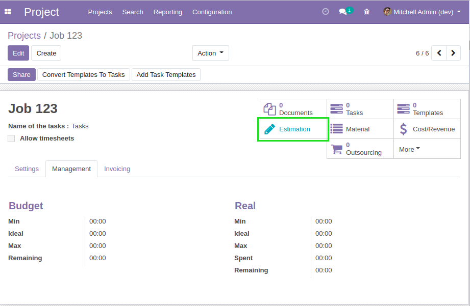
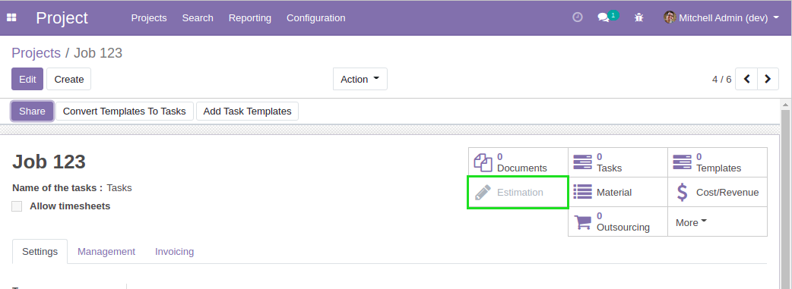
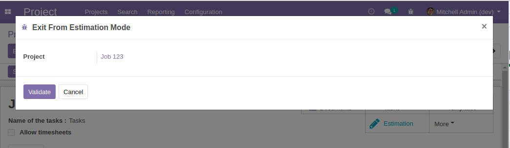
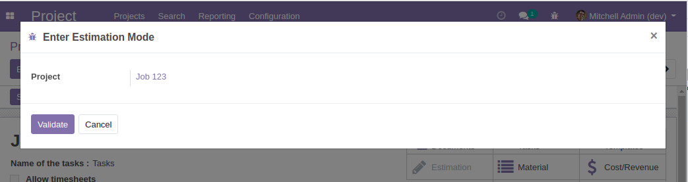
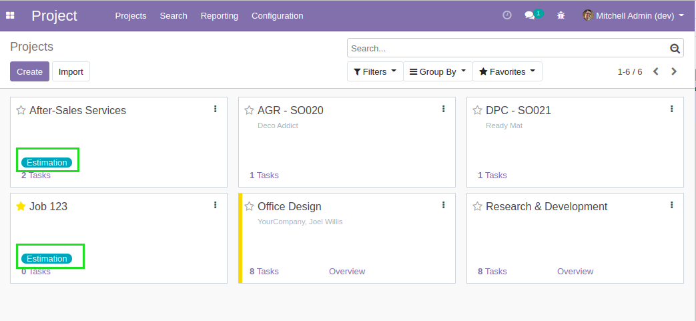
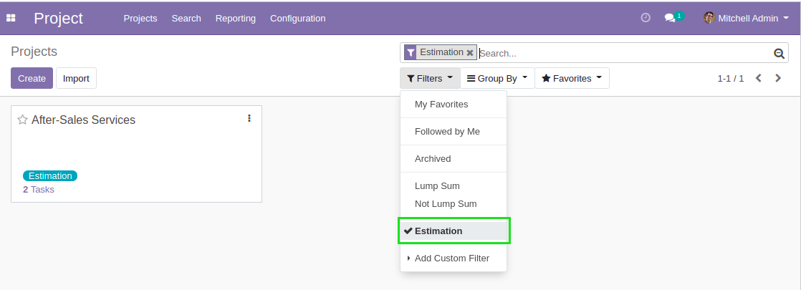
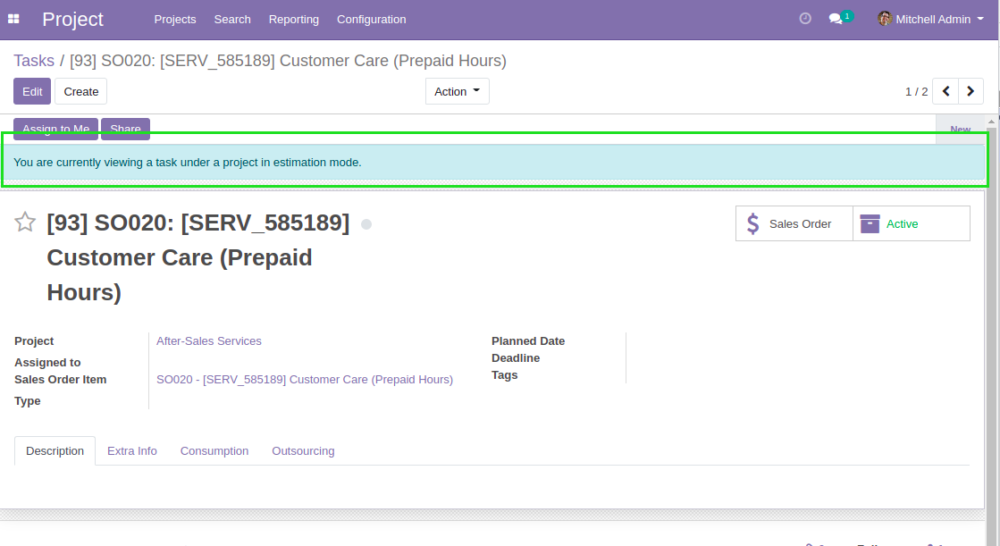
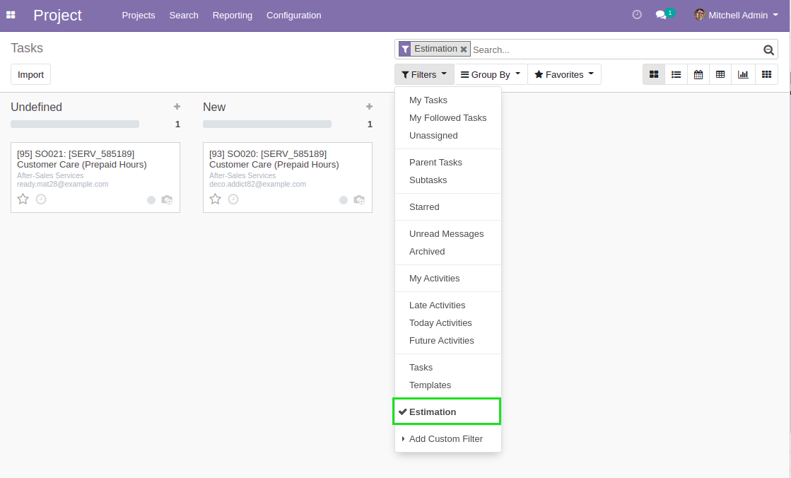
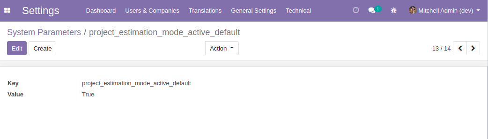

Project Estimation
==================
This module defines an ``Estimation`` mode on projects.

.. contents:: Table of Contents

Smart Button
------------
A smart button is added on projects.

When a project is in ``Estimation`` mode, the button is blue.

Otherwise, the button is gray.

When I click on the button, a confirmation wizard is opened.
This wizard allows to either enter or exit the estimation mode.

Kanban View
-----------
In kanban view of projects, a blue badge is added on projects in estimation mode.

Also, a filter allows to view only projects that are in estimation mode.

Tasks
-----
In form view of a task, if the task is related to a project in estimation mode, a message is displayed.

In list or kanban view of tasks, a filter allows to view tasks related to a project in estimation mode.

Configuration
-------------
By default, when creating or duplicating a project, the new project is NOT in estimation mode.

This prevents the module from breaking unit tests on other modules.
The estimation mode can be used to alter behavior on projects
(see module project_estimation_material).

It you desire new projects to be created in estimation mode by default, you may
define the following system parameter:

..

	project_estimation_mode_active_default = True

Contributors
------------
* Numigi (tm) and all its contributors (https://bit.ly/numigiens)
