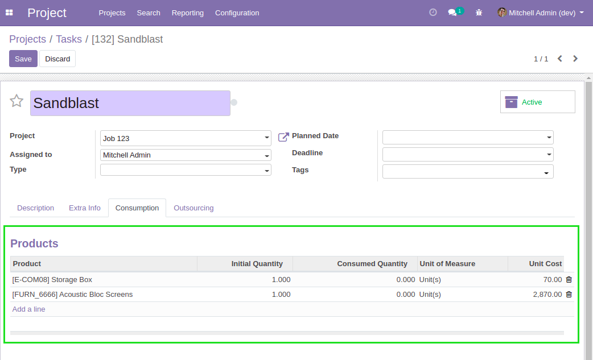
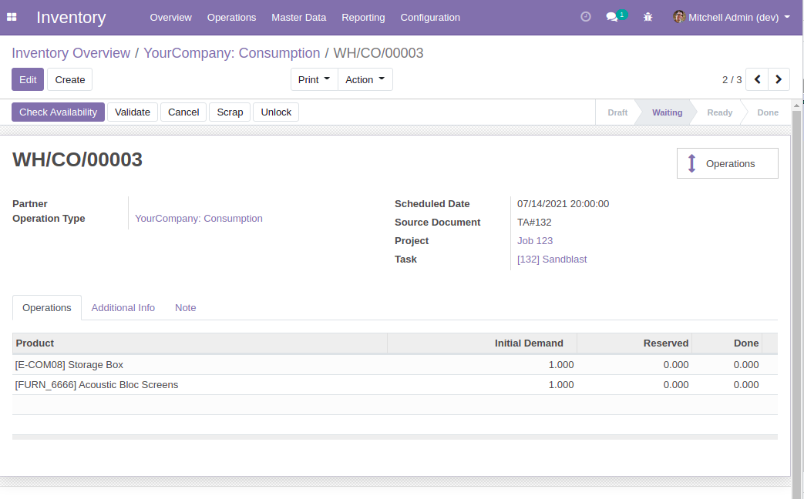
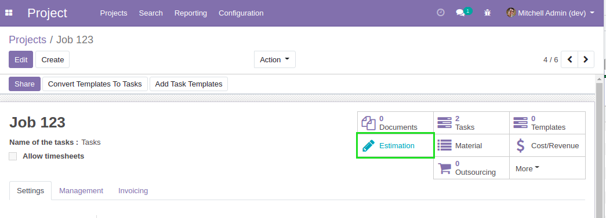
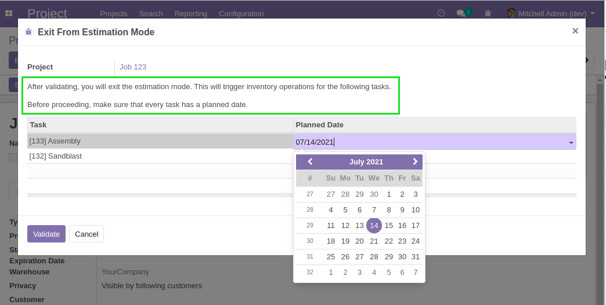
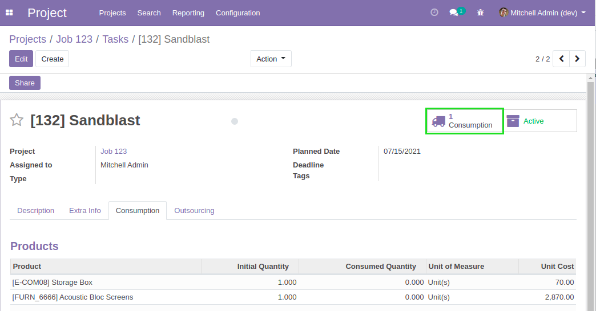

Project Estimation Material
===========================

.. contents:: Table of Contents

Context
-------
The module ``project_material`` allows to consume products on projects.

It allows you to define ``Material Lines`` on tasks.

By default, the module automatically generates inventory operations
when adding or modifying material lines.

However, in the context of a project in estimation mode, it is not
appropriate to generate inventory operations.

Overview
--------
After installing this module, when a project is in estimation mode,
material lines on the tasks will not generate stock operations.

Because stock operations are not generated, it will also be possible to define
material lines on a task without defining a planned date for the task.

When exiting the estimation mode, you will be asked to define a planned date on every task.

And after exiting the estimation mode, stock operations will be generated
for your project.

Contributors
------------
* Numigi (tm) and all its contributors (https://bit.ly/numigiens)
