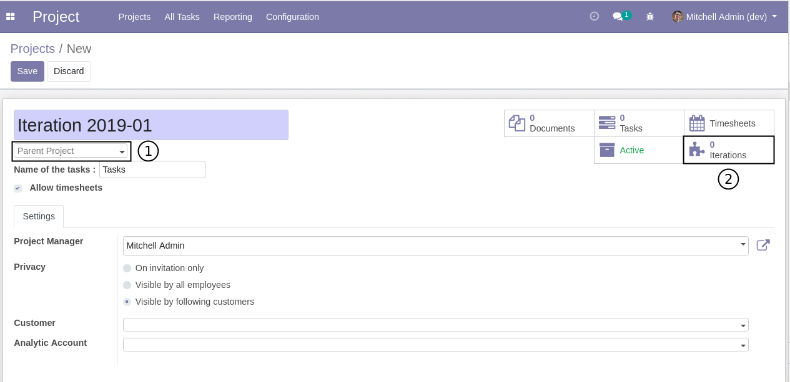
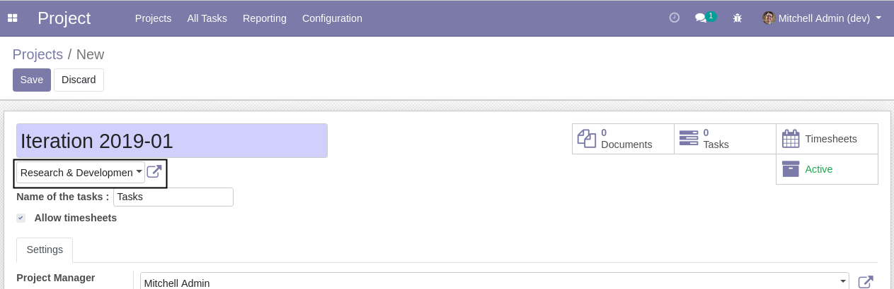
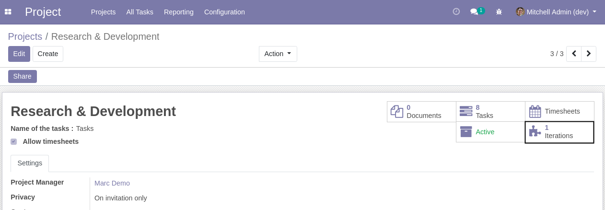
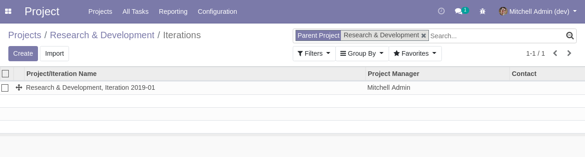
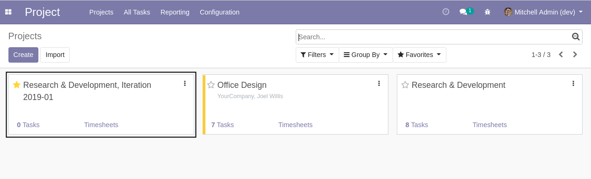
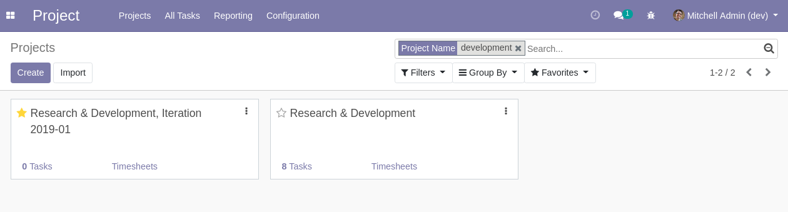
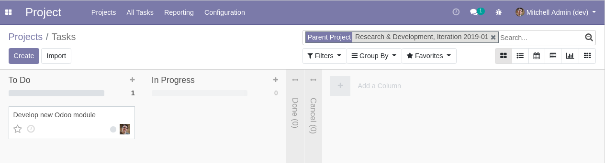
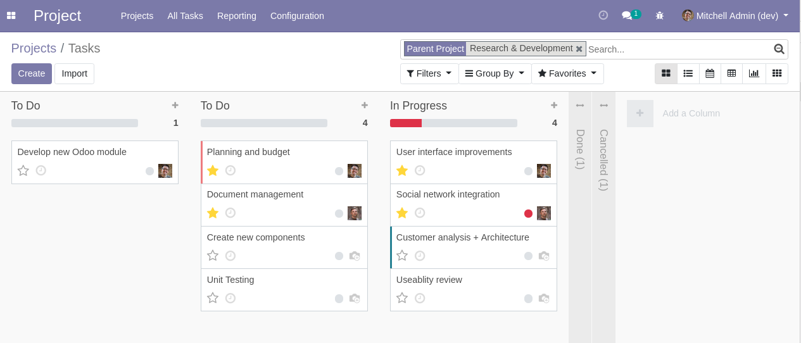

Project Iteration
=================
This module adds the concept of iterations to the project application.

An iteration is a sub-project under a parent project.
A project is either a parent project or an iteration. An iteration can not have children project.

Project Configuration
---------------------
As member of the group `Project / Manager`, I go to `Project / Configuration / Projects`.

In the form view of a project, I see 2 new elements:

1- a field `Parent Project`
2- A smart button `Iterations`

If I select a parent project, the smart button disappears.

This is because a project can either be a parent project or an iteration (a sub-project).

I go to the form of the parent project, then I click on the smart button.

The list of iterations for this project is shown.

Project Kanban
--------------
Parent projects and iterations appear in the same kanban view.

The name of the iteration always starts with the parent project name.

If I search a project by name, both the parent and its iterations will appear.

If I click on an iteration, I see only the task of the selected iteration.

However, If I click on the parent project, I see the task under the project, plus the tasks under its iterations.

Contributors
------------
* Numigi (tm) and all its contributors (https://bit.ly/numigiens)
