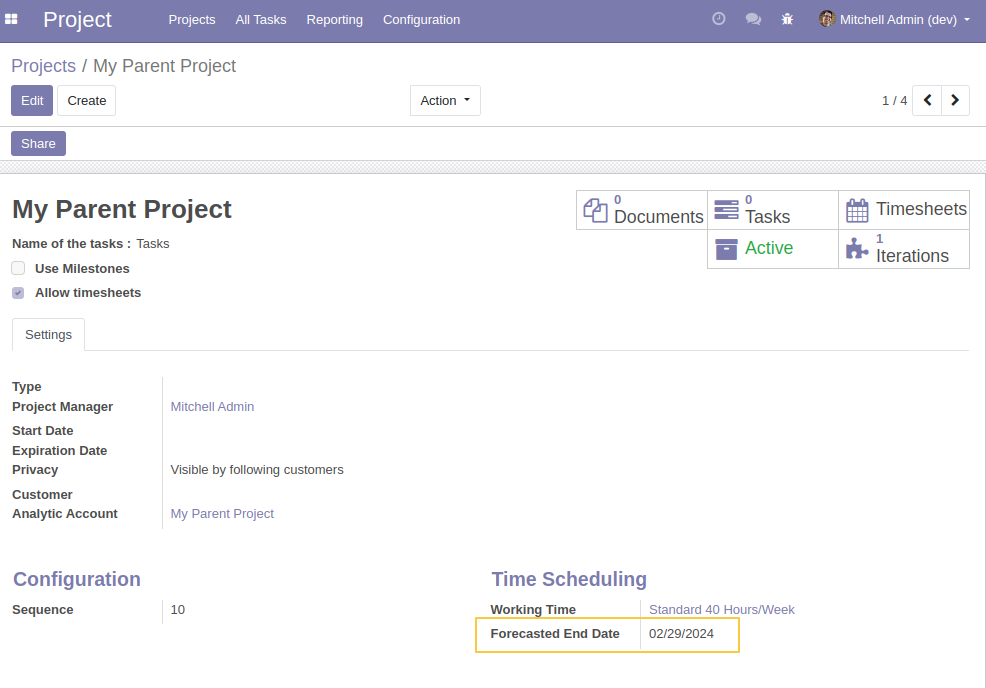
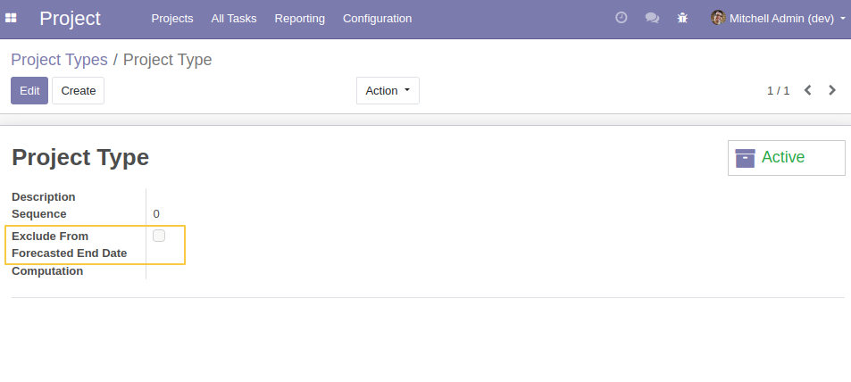

Project Iteration Forcasted End Date
====================================

This module allows you to automatically calculate the project end date from the end dates of the different iterations that constitute it.

Desccription
------------

After Installing this module, a new field is added to the project form view:

- *Forecasted End Date*: Takes the maximum end dates of the active iterations, visible only for parent project 

From `Project / COnfiguration / Project Type` Form View, I can see a new field added:

- *Exclude From Forecasted End Date*: a Boolean field allowing to exclude the project iteration of this type from `Forcasted End Date` calculation

Contributors
------------
* Numigi (tm) and all its contributors (https://bit.ly/numigiens)
