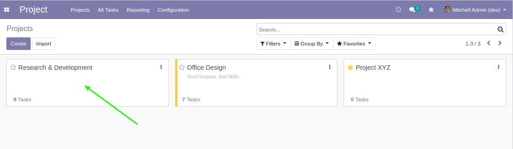
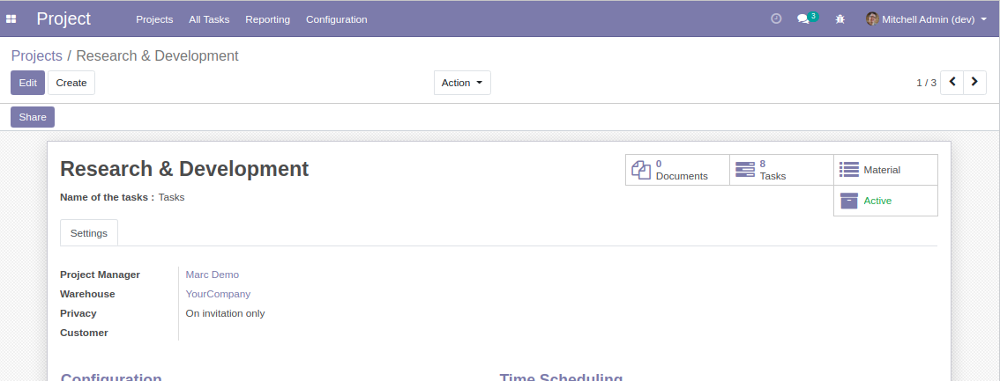

Project Kanban To Form
======================

.. contents:: Table of Contents

Context
-------
In Odoo, when you click on a kanban card, you are redirected to the kanban view of the tasks.

Description
-----------
This module changes this behavior so that the user is redirected to the form view of the project.

Contributors
------------
* Savoir-faire Linux
* Numigi (tm) and all its contributors (https://bit.ly/numigiens)
