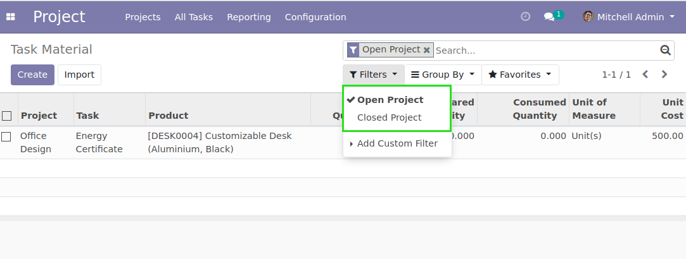

Project Material Stage Closed
=============================

.. contents:: Table of Contents

Context
-------
The module ``project_material`` allows to consume products on tasks.

The module ``project_closed`` allows to close a project without archiving it.

Overview
--------
In the list view of material lines, two new filters are available.

* Open Project: shows material lines of projects with an open stage
* Closed Project: shows material lines of projects with a closed stage

By default, the ``Open Project`` filter is selected.

Contributors
------------
* Numigi (tm) and all its contributors (https://bit.ly/numigiens)
