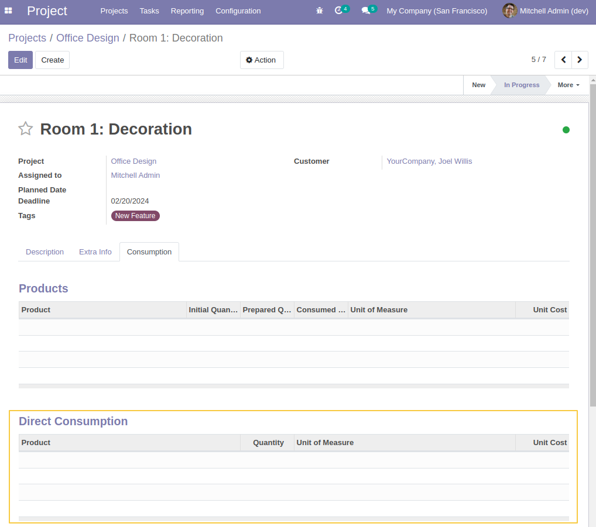
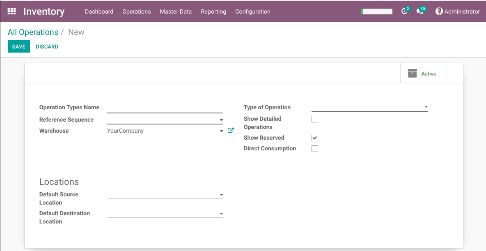
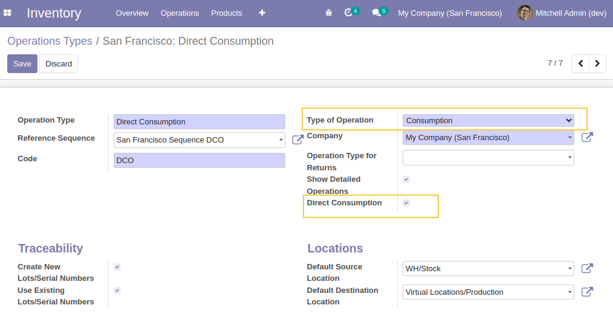
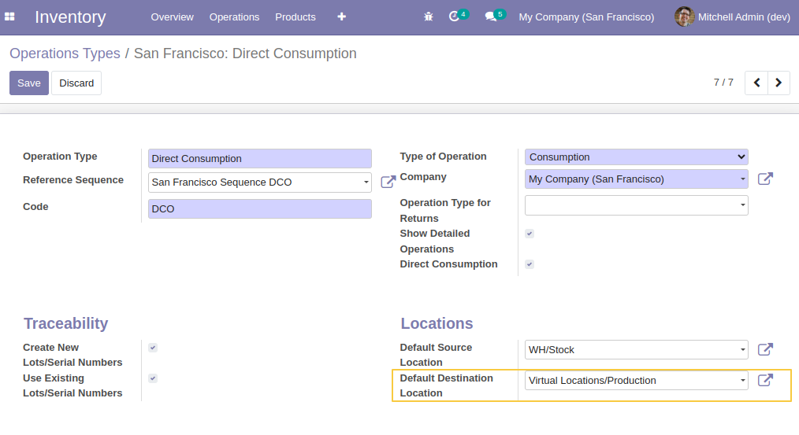
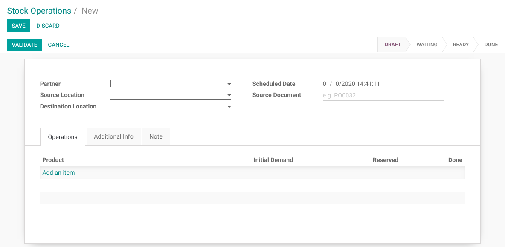
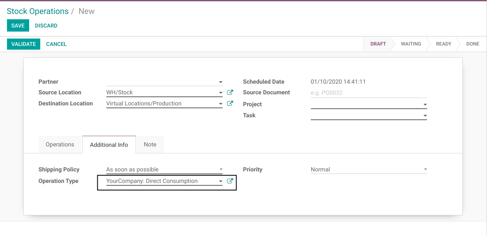
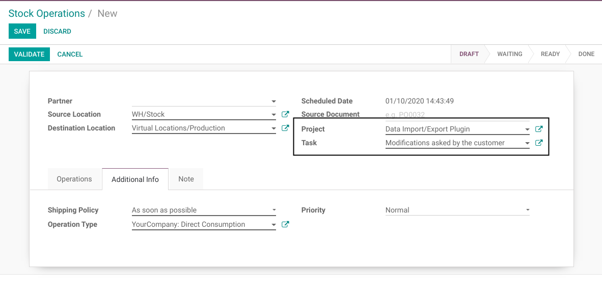
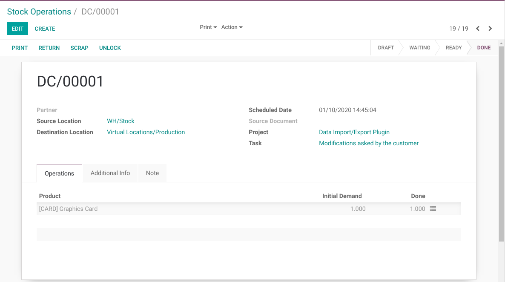
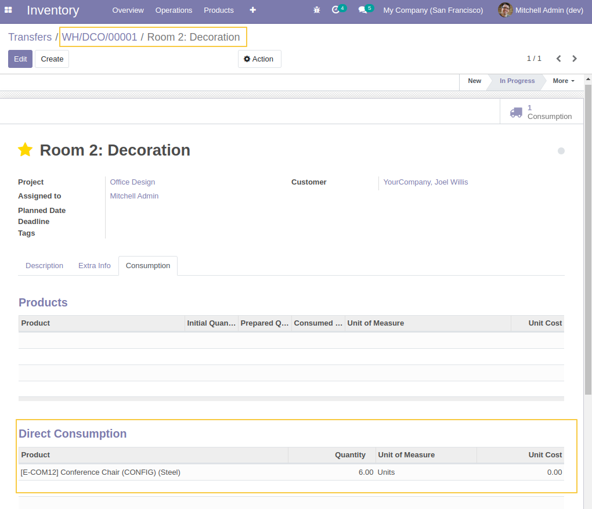
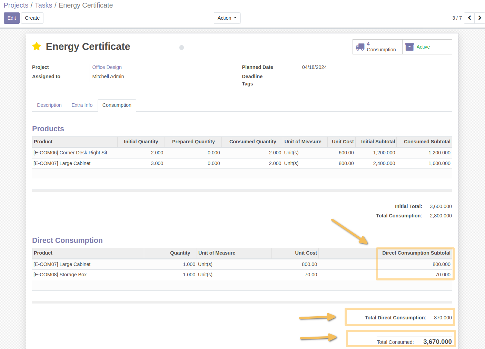

Project Material Direct Consumption
===================================
This module enables to consume products for a project directly from a stock picking.

.. contents:: Table of Contents

Context
-------
The module ``project_material`` allows to consume products on a task.
The a stock picking is created and linked to the task.
This mecanism works similarly to a sales order.

However, sometimes, it is convenient to consume material without going to the whole process.

Module Design
-------------
Instead of adding a line of material on the task, which creates a stock picking,
this module allows to do the opposite.

When validated, a stock picking (of type ``Direct Consumption``) generates a material line on the task.

This material is separated into a distinct list inside the form view of a task.

Configuration
-------------
To use this module, a picking type (``Direct Consumption``) must be defined manually for each warehouse.

As member of ``Stock / Manager``, I create a new picking type.

I select ``Consumption`` as type of operation and I check the box ``Direct Consumption``.

As source location, I select the main stock location of my warehouse.

As destination location, I select ``Virtual / Production``.

Usage
-----
As member of ``Stock / User``, I create a new picking.

I select the type of operation ``Direct Consumption``.

I select my project and my task.

I select my product, the quantity and validate the picking.

In the form view of my task, I notice that the product was added to the list of consumed material.

Since version ``1.1.1`` of the module, I can see three new fields :
*Direct Consumption Subtotal* (a new column in the section of `Direct Consumption`)
*Total Direct Consumption*
*Total Consumed* (which is the sum of `Total Consumption` and `Total Direct Consumption`)

!!! IMPORTANT !!!
-----------------
The field `Total Consumption` on project task is only available since the version `1.3.3` of the module ``project_material``.
It will occur an error if you try to use the module `project_material_direct` (version `1.1.1` or newer) , without the version `1.3.3`, or newer, of the module `project_material`.

Contributors
------------
* Numigi (tm) and all its contributors (https://bit.ly/numigiens)
