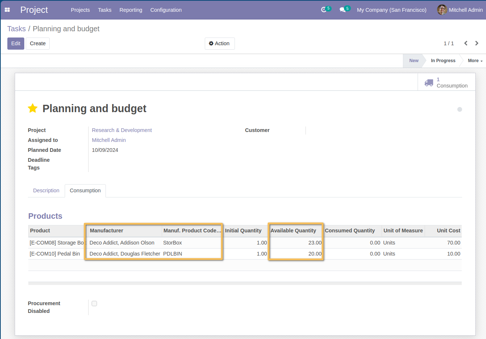

=========================
Project Material Enhanced
=========================
This module adds on the consumption tab the manufacturer reference of the item,
the manufacturer and the available quantity (unreserved quantity).

Usage
=====
As a user with access to the project, I go to the form view of a task, consumption tab I notice new read-only columns.
When I select an item, then the manufacturer, the product name from the manufacturer and the available quantity are automatically displayed.

Contributors
------------
* Numigi (tm) and all its contributors (https://bit.ly/numigiens)
