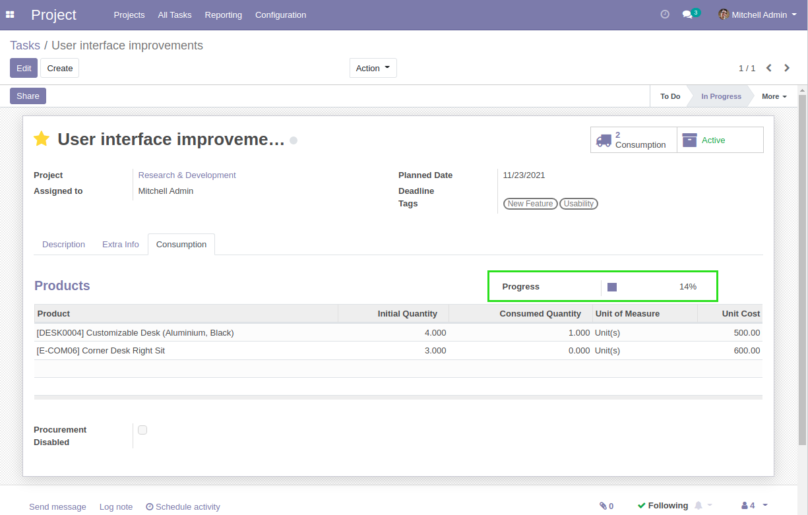
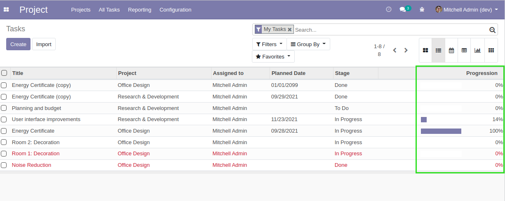
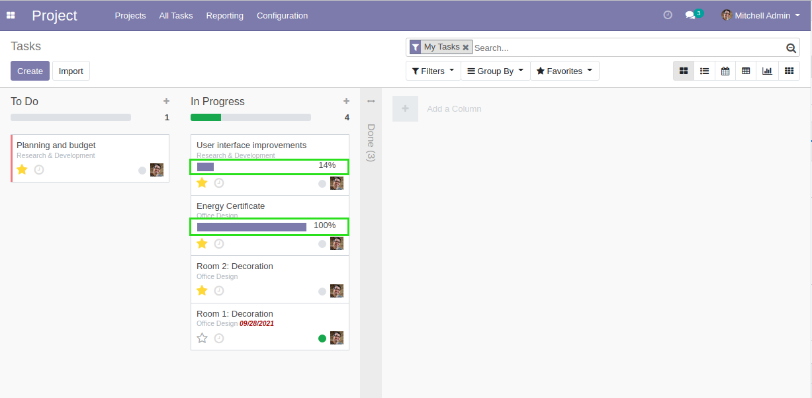
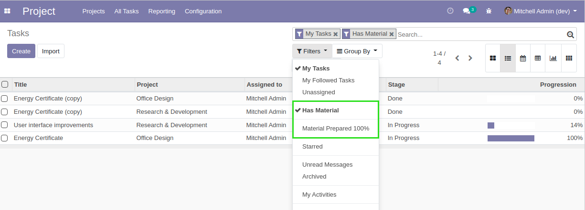

Project Material Progress
=========================

.. contents:: Table of Contents

Overview
--------
This module adds a progress bar on tasks.

This bar shows the percentage of the products that have been prepared (or consumed).

Kanban / List Views
-------------------
This progress bar is also visible on list and kanban views of tasks.

In the kanban view, if a task has no material line, the progress bar is hidden.

Filters
~~~~~~~
Two new filters are added on tasks by the module.

* ``Has Material``: show only tasks with at least one material line
* ``Material Prepared 100%``: show only tasks with material prepared at 100%

Contributors
------------
* Numigi (tm) and all its contributors (https://bit.ly/numigiens)
