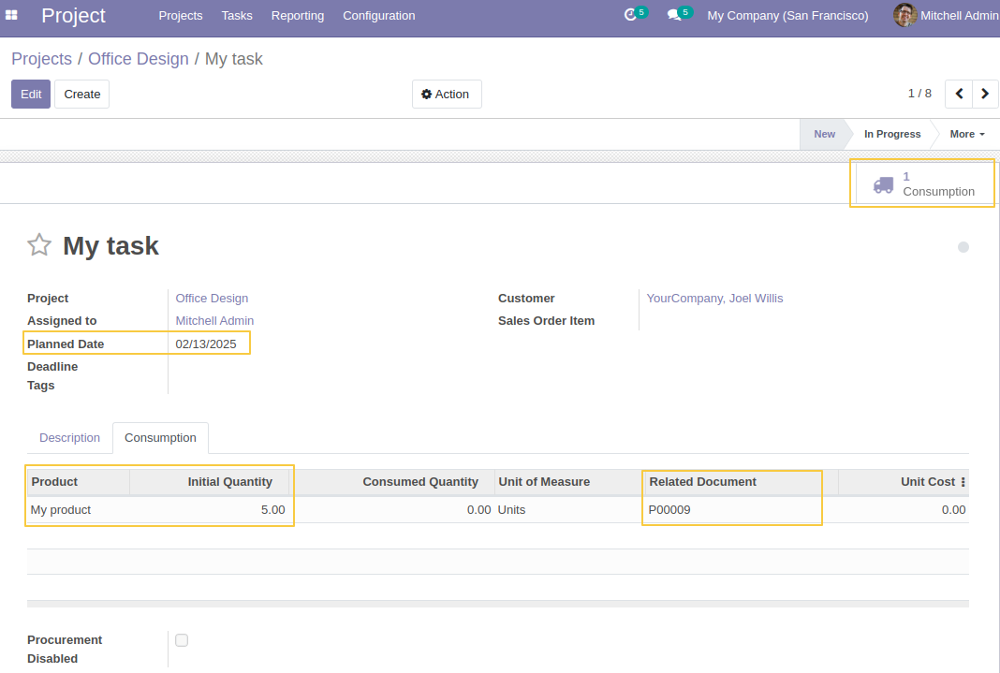
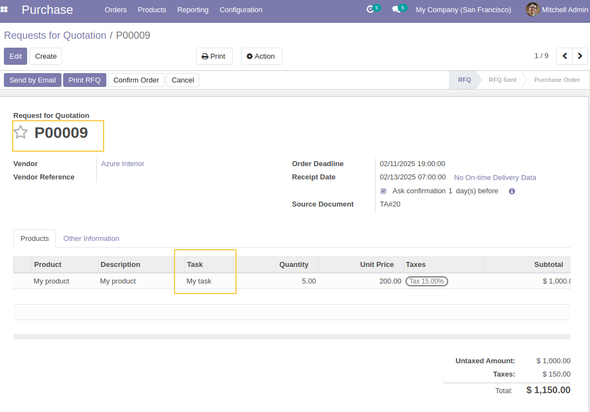
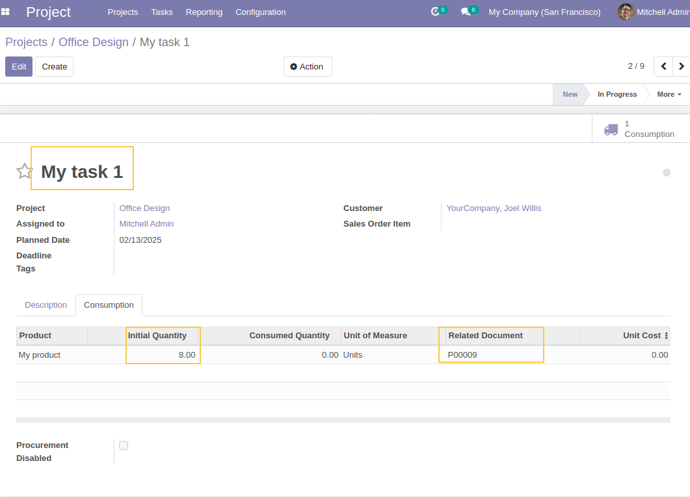
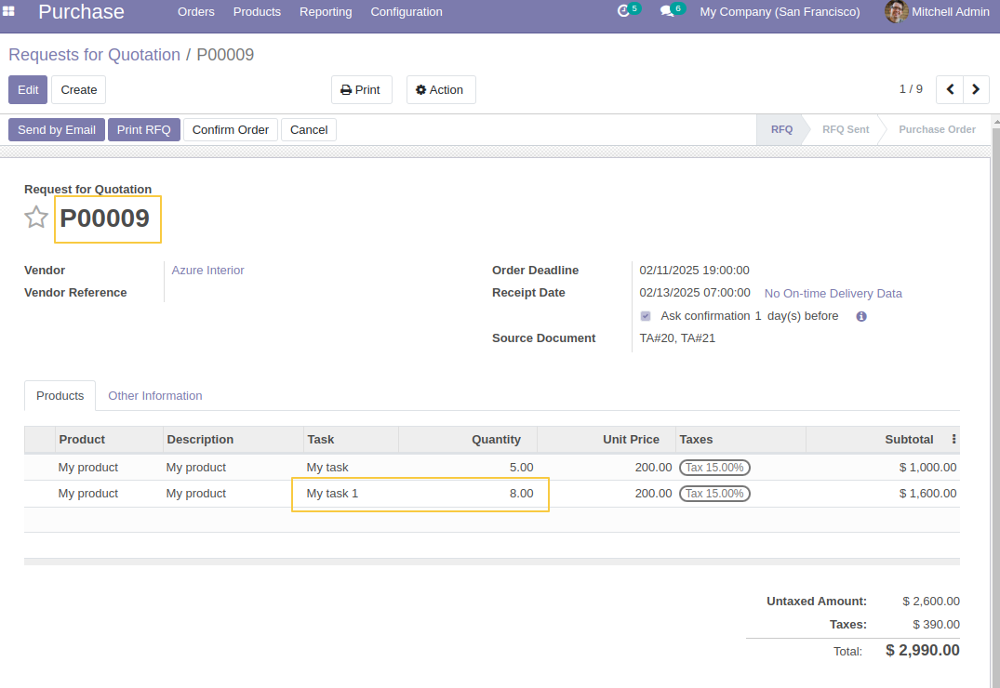
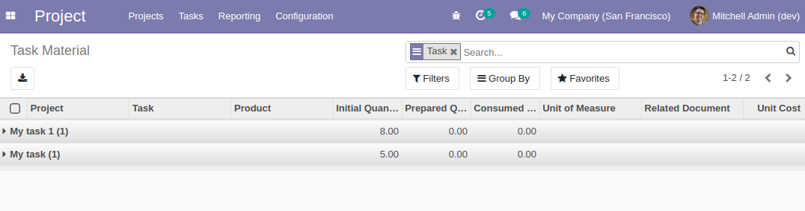

Project Material Purchase Link
==============================

This module adds task information to purchase order lines generated from procurement and links purchase order information to task material lines.

It works only for products with the "Replenish on Order (MTO)" route configured in inventory operations.

This module depends on `purchase_line_procurement_no_grouping <https://github.com/Numigi/odoo-purchase-addons/tree/14.0/purchase_line_procurement_no_grouping>`_ to prevent the grouping of purchase order lines when they are linked to different procurements.

Description:
============

This module adds a `Task` field to purchase order lines, which is automatically populated when purchase order lines are generated from consumption procurement on tasks.
It also introduces a `Related Document` field in task consumption lines, linking them to the corresponding purchase order generated from the task.

How it works:
=============

Create a new product:

.. image:: static/description/storable_product.png

Set a vendor for the product:

.. image:: static/description/product_vendor.png

Enable the `Replenish on Order (MTO)` route (This route is archived by default, so make sure to activate it.):

.. image:: static/description/product_mto_route.png

From the Project app, go to a project and create a new task. Add a planned date and the product to consume.
A consumption order is generated for the task.
The `Related Document` field is automatically filled with the PO reference generated for this consumption.

In the Purchase app, open the generated purchase order. The `Task` field is populated with the original task that triggered the purchase order.

Create and save another task. A new consumption order is generated, and the material line is linked to the same previously created purchase order:

In the previously created purchase order, a new line is added for the new consumption, referencing the second task.

In Task Material list view, it's possible now to search and fieltre by task.

Contributors
------------

The `Numigi <https://numigi.com/r/home>`_ team is the contributor to this project. We help Quebec companies implement Odoo and Konvergo ERP.
