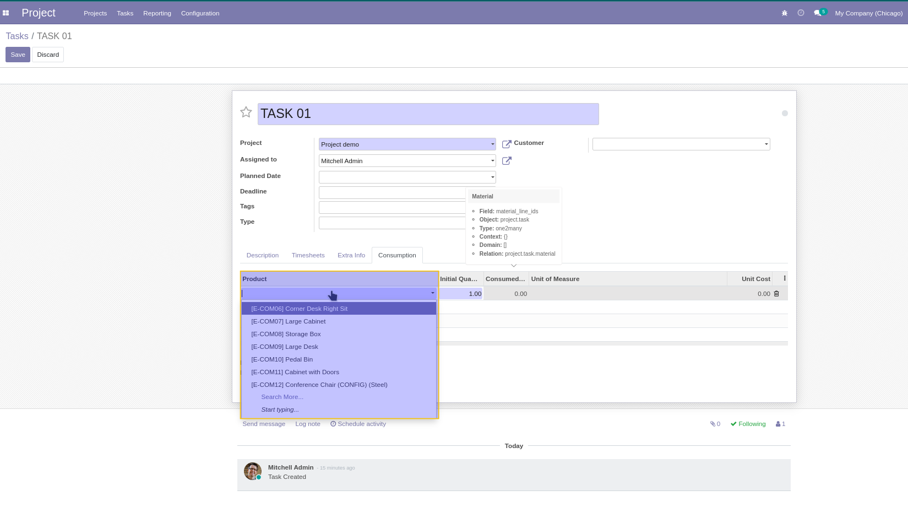
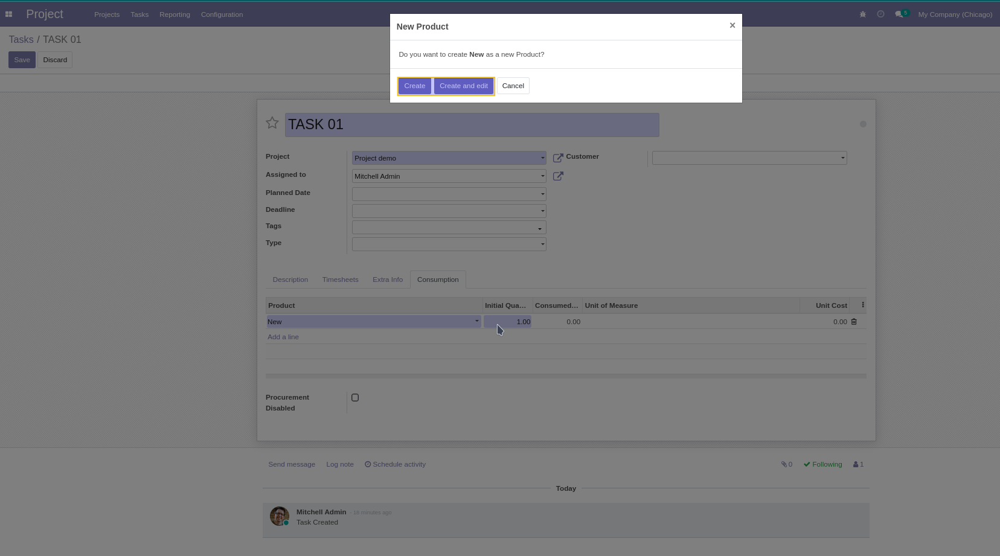
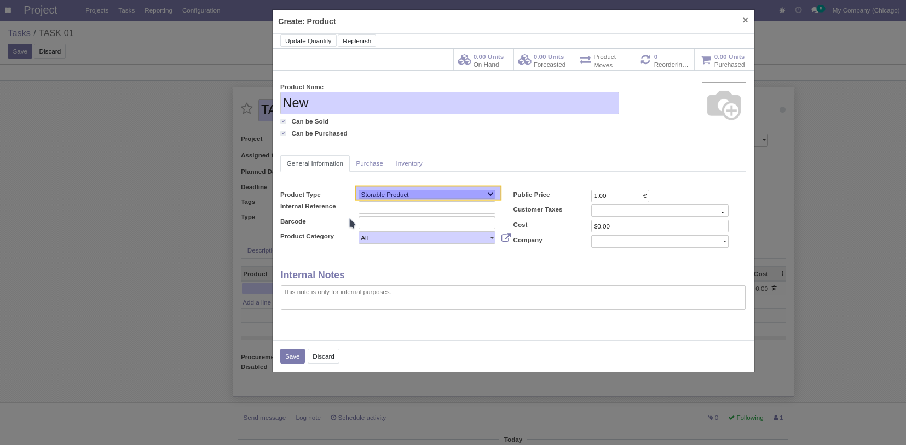

Project Material Stock Product Only
===================================
Restrict task consumption lines to stockable products (type = 'product') *
and ensure newly created products default to stockable.

#. Open a Project Task form.
#. In Material Consumption, add or create a product.
#. Only stockable products appear; new products are created as stockable.

Contributors
------------

The `Numigi <https://numigi.com/r/home>`_ team is the contributor to this project. We help Quebec companies implement Odoo and Konvergo ERP.
