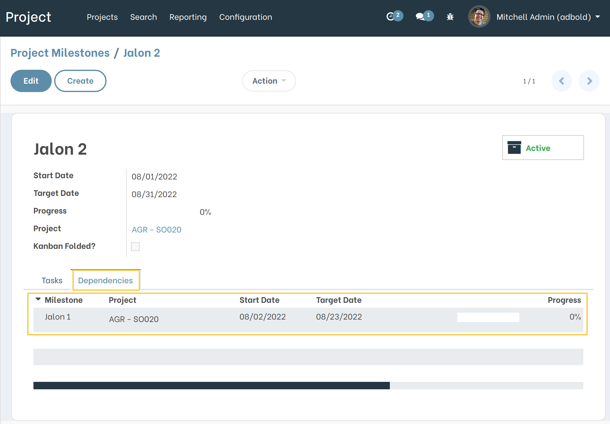
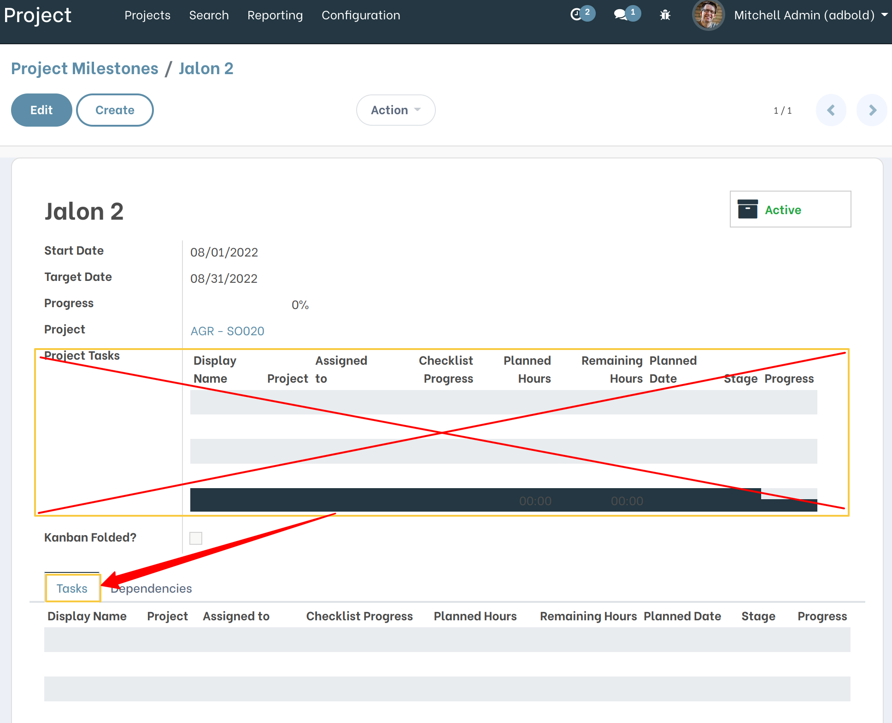
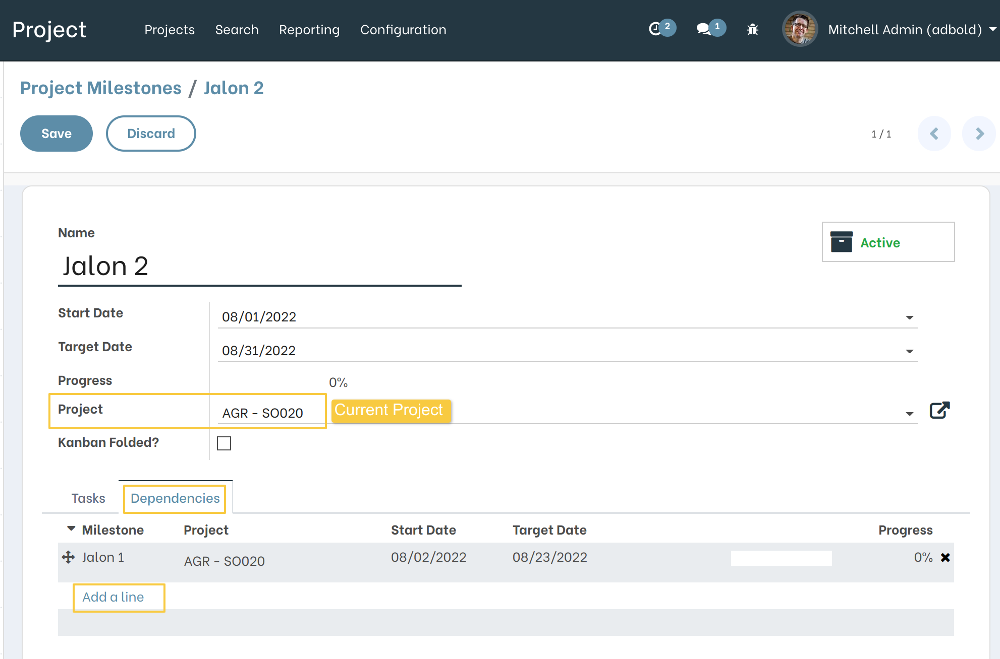
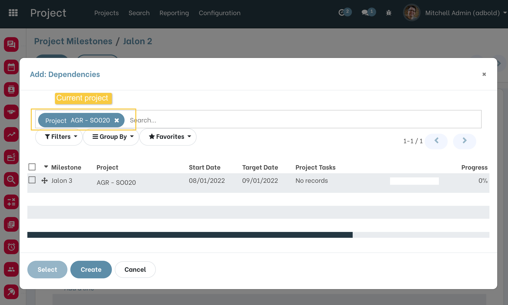
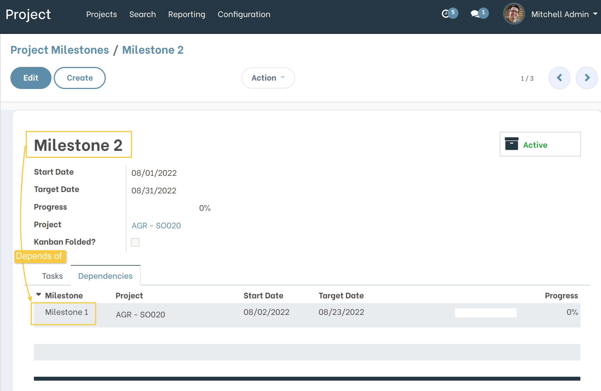
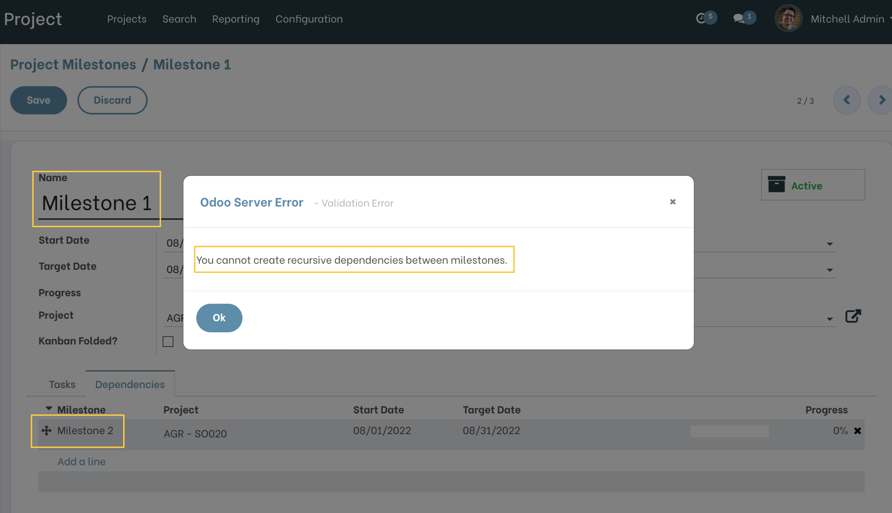

Project Milestone Dependencies
==============================

.. contents:: Table of Contents

Description
-----------
This module allows to manage Milestone Dependencies.

Overview
--------
As a user who can manage Milestones, I open the form view of a Milestone, I notice a new tab ``Dependencies``.

I also notice that the field ``Project Tasks`` is moved into a new tab ``Tasks``.

Usage
-----

As a user who can manage Milestones, I go to the form view of a Milestone and I click on ``Add line`` from the ``Dependencies`` tab:

I notice that the Milestones are filtered on the Project assigned on the current Milestone.

It is impossible to have recursion on dependencies. If this is the case, a blocking message is displayed.

Example:
~~~~~~~~
- If ``Milestone 1`` depends of ``Milestone 2``

- When user tries to add ``Milestone 2`` in ``Milestone 1`` dependencies, the blocking message is displayed.

Contributors
------------
* Numigi (tm) and all its contributors (https://bit.ly/numigiens)

More information
----------------
* Meet us at https://bit.ly/numigi-com
