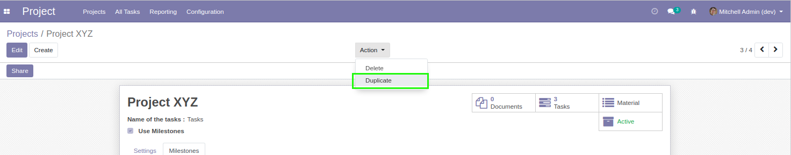

Project Milestone Enhanced
==========================

.. contents:: Table of Contents

Context
-------
The module `project_milestone <https://github.com/OCA/project/tree/12.0/project_milestone>`_ allows to define milestones for a project.

Multiple tasks in the project can be linked to a given milestone.

When a project is copied, its milestones and tasks are copied as well.

The problem is that the copied tasks are linked to milestones
in the old project instead of the new one.

Description
-----------
This module links copied tasks to the copied milestones when duplicating a project.

Overview
--------
I open the form of a project with milestones and tasks.

.. image:: static/description/project_form.png

I duplicate the project.

I notice that the milestones where copied and
that the new tasks are linked to these milestones.

.. image:: static/description/new_project.png

Contributors
------------
* Numigi (tm) and all its contributors (https://bit.ly/numigiens)
