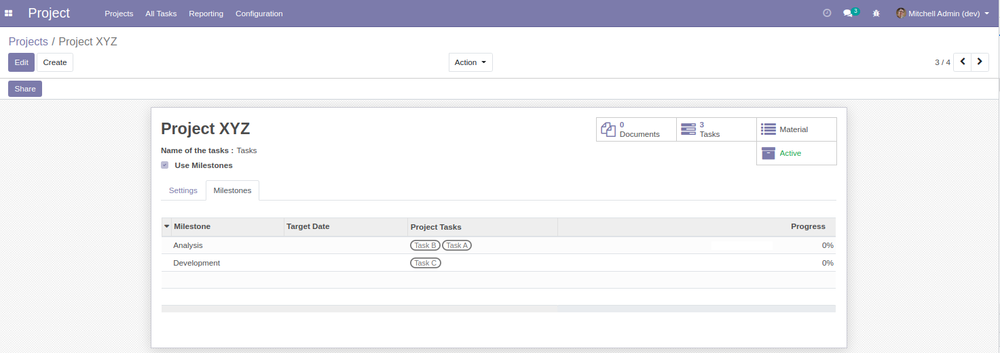
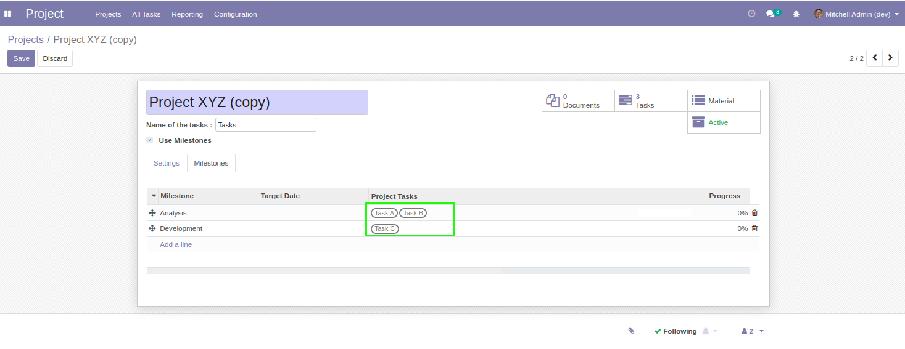
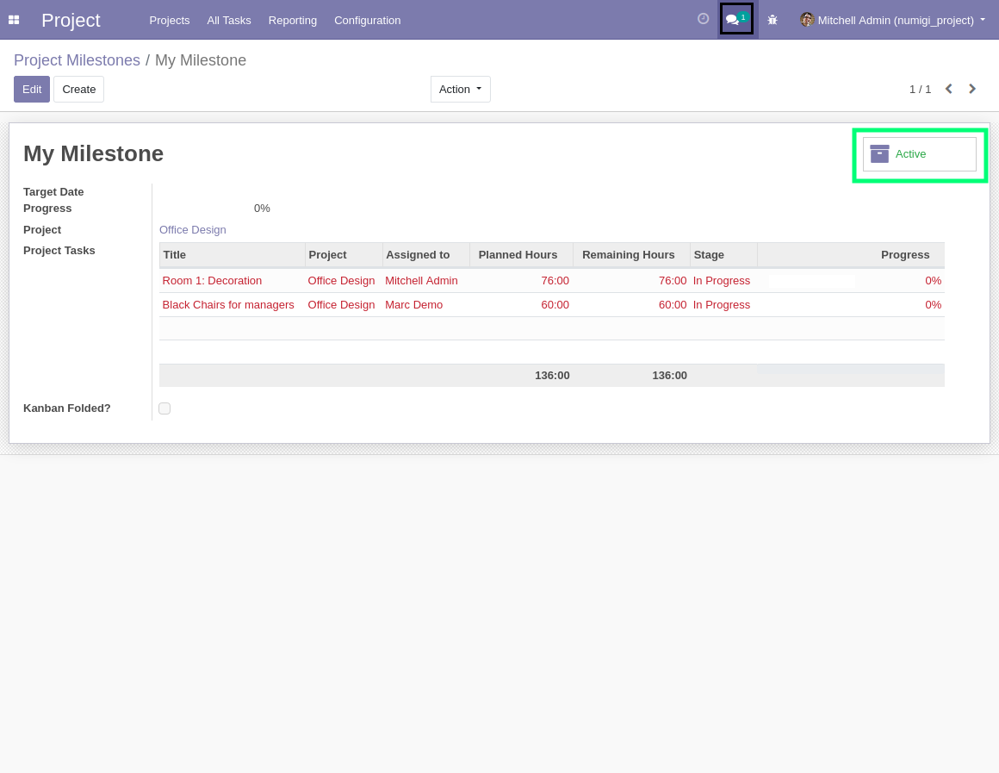
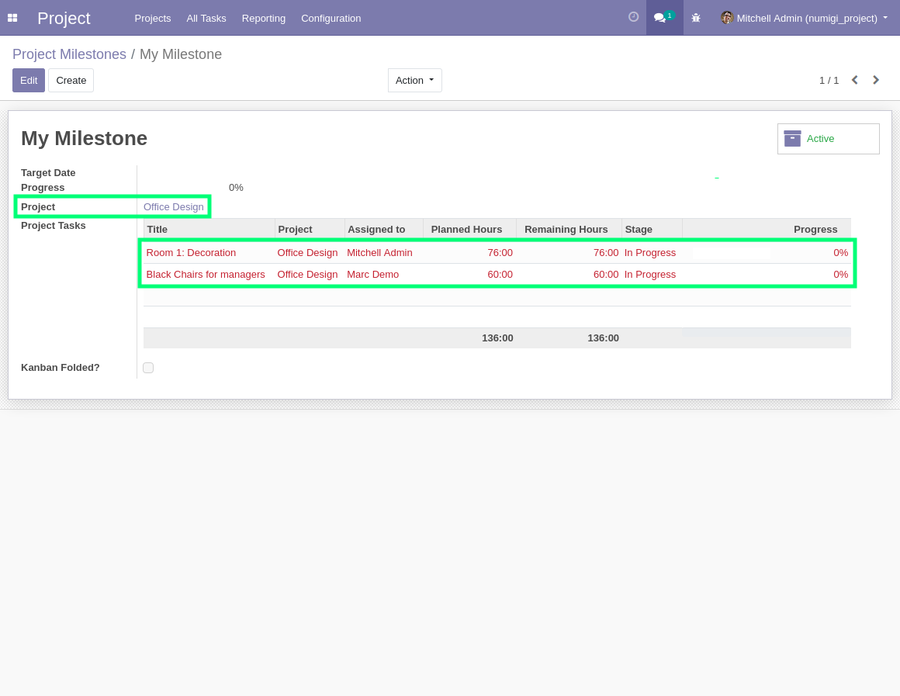
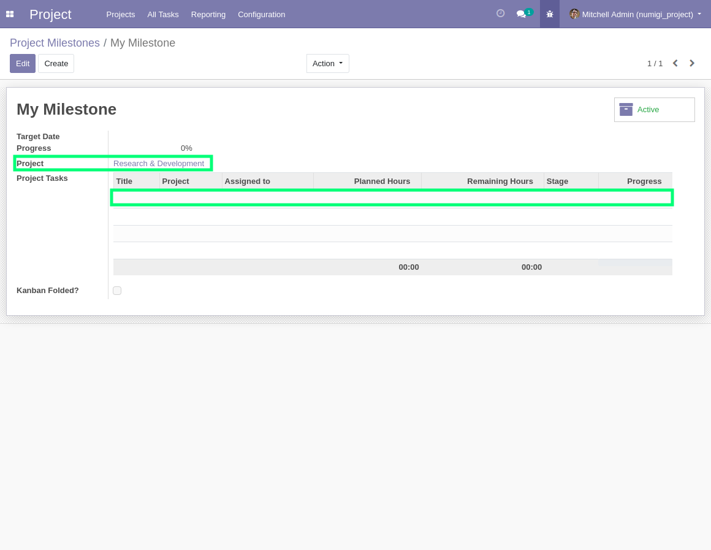
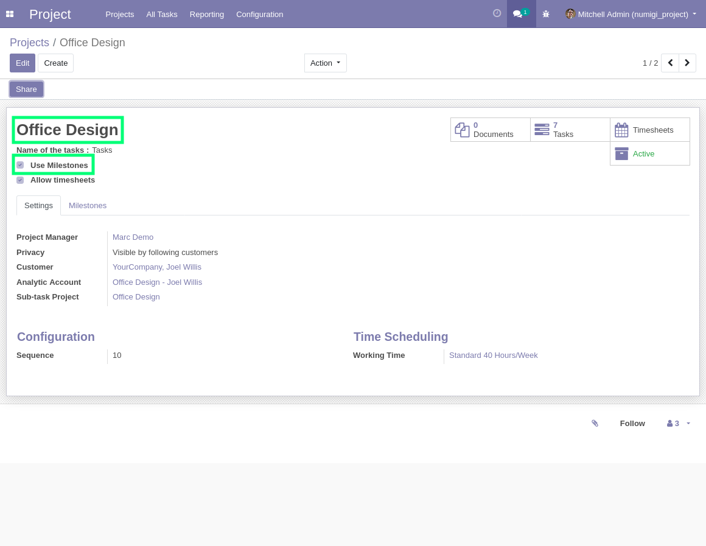
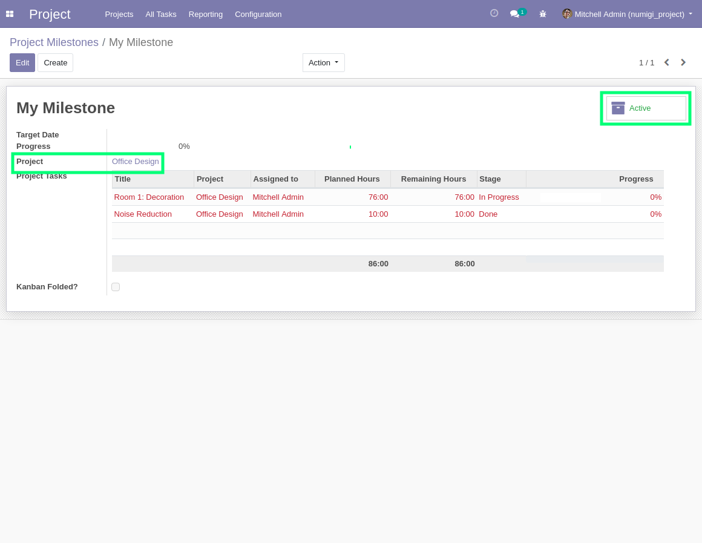
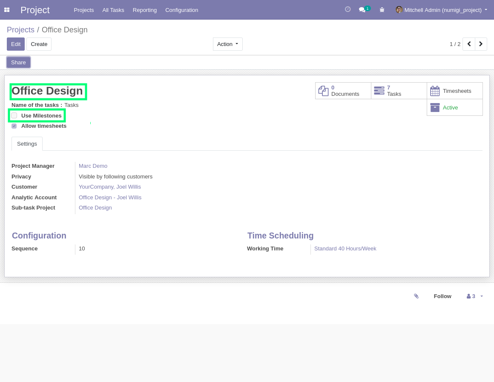
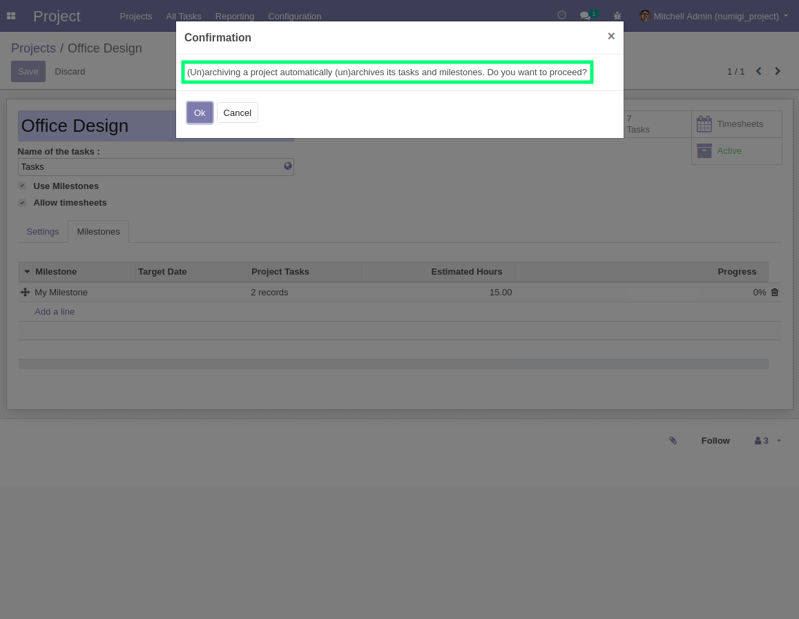

Project Milestone Enhanced
==========================

.. contents:: Table of Contents

Context
-------
The module `project_milestone <https://github.com/OCA/project/tree/12.0/project_milestone>`_ allows to define milestones for a project.

Multiple tasks in the project can be linked to a given milestone.

When a project is copied, its milestones and tasks are copied as well.

The problem is that the copied tasks are linked to milestones
in the old project instead of the new one.

Technique
---------

Add possibility to not copy by default milestones of a project using a the key "milestones_no_copy" set to True in context.

Description
-----------
In this module :

Copied tasks are linked to the copied milestones when duplicating a project.

Add the field active on milestones and a button is displayed on form view

When a milestone has his project modified, all his associated tasks not associated to this new project are dissociated.

when a project change field "Use milestones", milestones are set to same value.

When a project is (de)activated, milestones too.

Overview
--------
I open the form of a project with milestones and tasks.

I duplicate the project.

.. image:: static/description/project_form_copy.png

I notice that the milestones where copied and
that the new tasks are linked to these milestones.

I open the form of a milestone, I see button "Active"

I open the form of a milestone, with a project and tasks of this project associated

I change the project of the milestone, previous displayed tasks are dissociated

A project with field "Use milestones" set to True, has its milestones active

Milestone associated to the project is active

I uncheck field "Use milestones" on the project

Milestone associated to the project is now inactive

.. image:: static/description/milestone_not_use_milestones.png

If I (de)activate a project, its associated milestones too 

Contributors
------------
* Numigi (tm) and all its contributors (https://bit.ly/numigiens)
