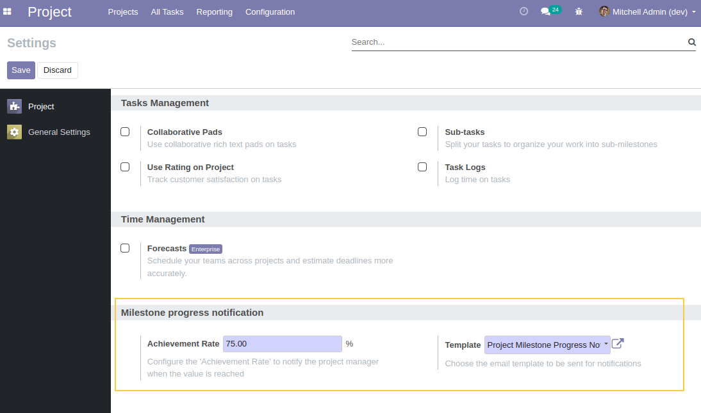
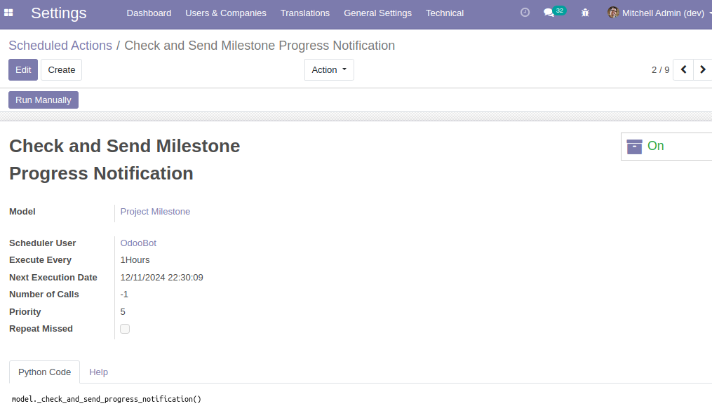
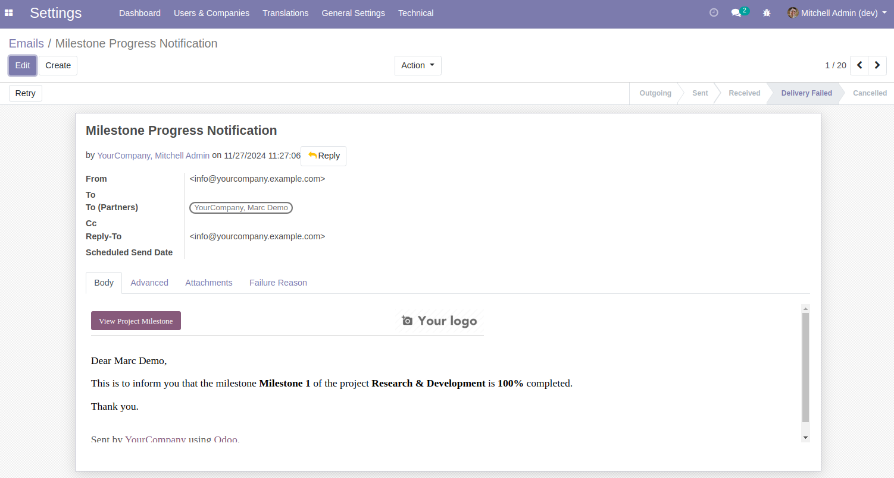

=======================================
Project Milestone Progress Notification
=======================================

This module extends the functionality of the `project_milestone` module by adding automated notifications for milestone progress.

It enables project managers to receive email notifications when a milestone reaches a specified progress rate.

Key Features
============

- Allow configuration of the **Achievement Rate** and the **Email Template** to be used for notifications.
- Automatically send email notifications to project managers through a cron job when a milestone's progress reaches or exceeds the configured rate.
- Reset notifications if the progress drops below the configured rate.

Configuration
=============

1. Go to **Settings > Project** and locate the **Milestone Progress Notification** section.
2. Configure the following settings:
   - **Achievement Rate**: The progress rate (in percentage) at which the notification will be sent.
   - **Template**: The email template to be used for notifications.

Usage
=====

- The module will monitor milestone progress and send notifications through a cron job based on the configured rate.

- Notifications will be reset if the progress falls below the rate, allowing for subsequent notifications when the progress reaches the threshold again.

Use Cases
=========

- Notification Triggered on Progress Increase

*Scenario 1*: The initial notification rate is configured at 75%.

A project has a milestone associated with four tasks.

After completing three tasks and marking them as closed, the milestone's progress increases to 75%.

A scheduled task (Cron Job) runs hourly to send notification emails to the project manager when the progress threshold is reached.

When all tasks are completed, and the milestone's progress reaches 100%, no further emails are sent since the notification has already been triggered.

If the milestone's progress later drops to 60% due to extra changes, and subsequently increases back to 75% or greater, another notification email will be sent after the next scheduled job execution.

- Dynamic Notification Rate Changes

*Scenario 2*: Initially, the notification rate is set to 33%. An email notification is triggered when the milestone's progress reaches 33.33%. 

If the notification rate is later updated to 90%, a final notification email is sent if the milestone's progress subsequently reaches 100%, as it now surpasses the updated threshold.

Contributors
============
* Numigi (tm) and all its contributors (https://bit.ly/numigiens)
