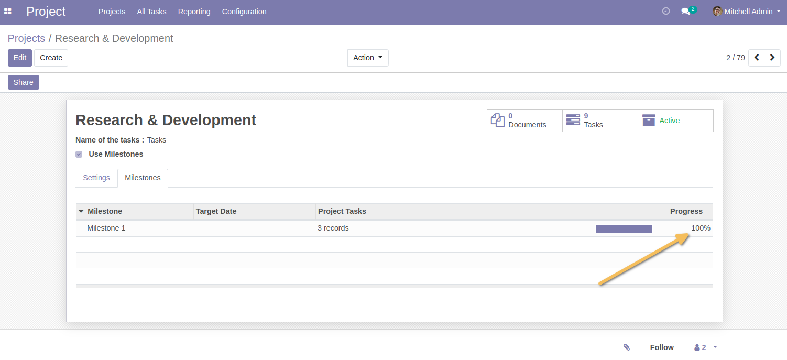

=======================================
Project Milestone Progress Notification
=======================================
This module allows you to send email notifications to the project manager when a project milestone percent is reached.

Usage
-----
To use this module, you need to:
* Go to `Project > Configuration > Settings` and enable the option "Milestone progression notification" (by default enabled) in `Notifications` section.
* By default, a mail template is created with the subject "Milestone Progress Notification" and set by default. You can customize it as needed.
* Set the rate limit of milestone to notify the project manager when the progression is reached.

.. image:: static/description/milestone_notification_configuration.png

When the milestone progress reaches the rate limit, an email is sent to the project manager.

.. image:: static/description/mail_notification.png

Use cases
---------
1. Initial rate for notification configured is 60%.
I have a project with a milestone. The milestone have 2 tasks : 1 task is closed and the another one is open.
The milestone is having progress of 50%.
I create a new task for the milestone, make it closed, to increase the progress.
Now, milestone progress reaches 67%, a notification email is sent.

If all tasks are closed, the milestone progress should be 100%, and no additional email is sent.
But if I reopen all tasks, this make the progress to 0%.
But if the milestone progress is back to 67% or greater by closing 2 tasks or more, another notification email is sent.

2. If I change the notification rate to 33% and all tasks are kept open.
I close one task, the milestone progress should be 33.33%, triggering another notification email.
But after that I change the notification rate to 90%, close all tasks, and the milestone progress should be 100%, triggering a final notification email.

Contributors
------------
* Numigi (tm) and all its contributors (https://bit.ly/numigiens)
