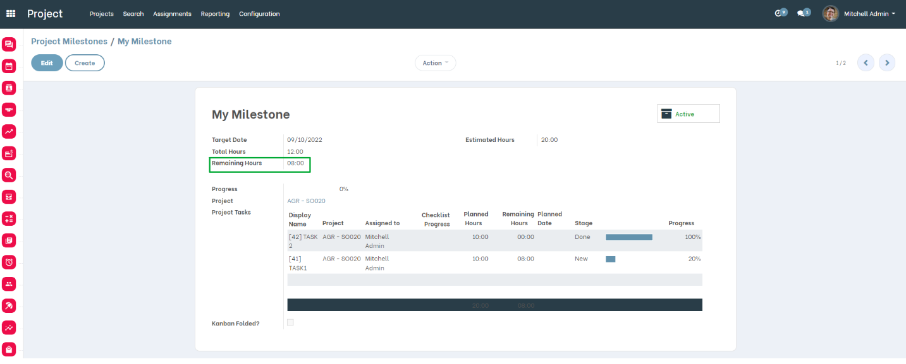
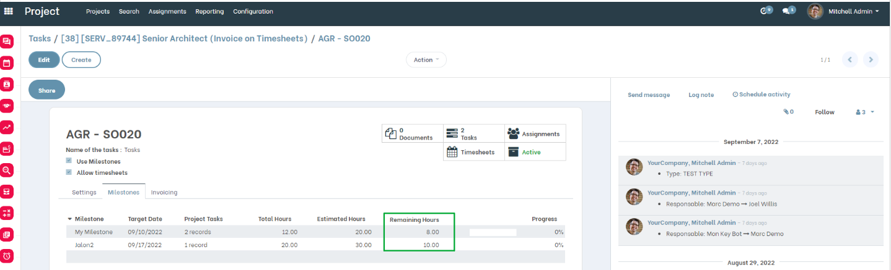
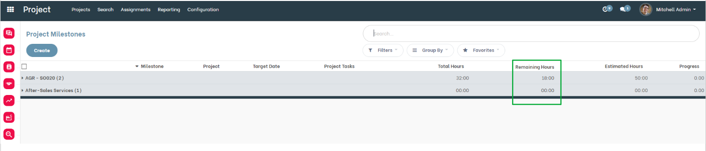

Project Milestone Remaining Hours
=================================
This module allows to compute the ``Remaining Hours`` of a Project Milestone.

.. contents:: Table of Contents

Context
-------
The module `project_milestone_estimated_hours <https://github.com/Numigi/odoo-project-addons/tree/12.0/project_milestone_estimated_hours>`_
allows to define ``Estimated Hours`` for a Project Milestone.

The module `project_milestone_spent_hours <https://github.com/Numigi/odoo-project-addons/tree/12.0/project_milestone_spent_hours>`_
adds a new computed field ``Total Hours`` which represents the sum of timesheets of active tasks associated to the milestone.

This module adds the field ``Remaining Hours`` which is computed based on the ``Estimated Hours`` and ``Total Hours`` fields.

Overview
--------
As a user with access to Project Milestones, I go to the form view of a Milestone.

I notice that a new ``Remaining Hours`` field is available.

This field is read-only and is calculated according to the following formula:

``Estimated Hours`` - ``Total Hours`` = ``Remaining Hours``

Project Milestone List View
---------------------------

From the Project form, under the Milestones tab, I see that the ``Remaining Hours`` field is displayed in the Milestones List View.

From the menu Project > Configuration > All Milestones, I see that the ``Remaining Hours`` field is displayed in the Milestones List View.

Contributors
------------
* Numigi (tm) and all its contributors (https://bit.ly/numigiens)

More information
----------------
* Meet us at https://bit.ly/numigi-com

