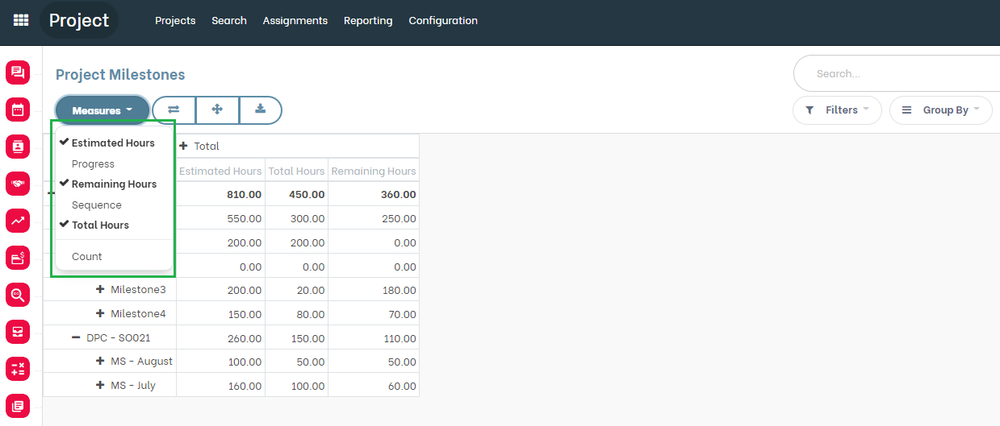
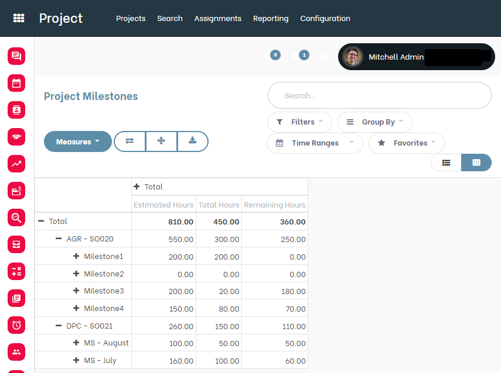

Project Milestone Time Pivot
============================
This module adds a Pivot view for a Project Milestone.

.. contents:: Table of Contents

Context
-------
The module `project_milestone_estimated_hours <https://github.com/Numigi/odoo-project-addons/tree/12.0/project_milestone_estimated_hours>`_
allows to define ``Estimated Hours`` for a Project Milestone.

The module `project_milestone_spent_hours <https://github.com/Numigi/odoo-project-addons/tree/12.0/project_milestone_spent_hours>`_
adds a new computed field ``Total Hours`` which represents the sum of timesheets of active tasks associated to the milestone.

The module `project_milestone_spent_hours <https://github.com/Numigi/odoo-project-addons/tree/12.0/project_milestone_remaining_hours>`_
adds a new computed field ``Remaining Hours`` which is computed based on the ``Estimated Hours`` and ``Total Hours`` fields.

This module provide a pivot view for analysing project milestone time using estimated hours and total hours and remaining hours

Overview
--------
As a project manager user, I go to Projects --> Configuration --> All Milestones .

I notice that a new pivot view is available.

.. image:: static/description/milestone_pivot.png

Measures in this view are :

``Estimated Hours``
``Hours spent``
``Remaining Hours``

By default, this view displays the list of milestones with the following measures:

``Estimated Hours``
``Hours spent``
``Remaining Hours``

Contributors
------------
* Numigi (tm) and all its contributors (https://bit.ly/numigiens)

More information
----------------
* Meet us at https://bit.ly/numigi-com