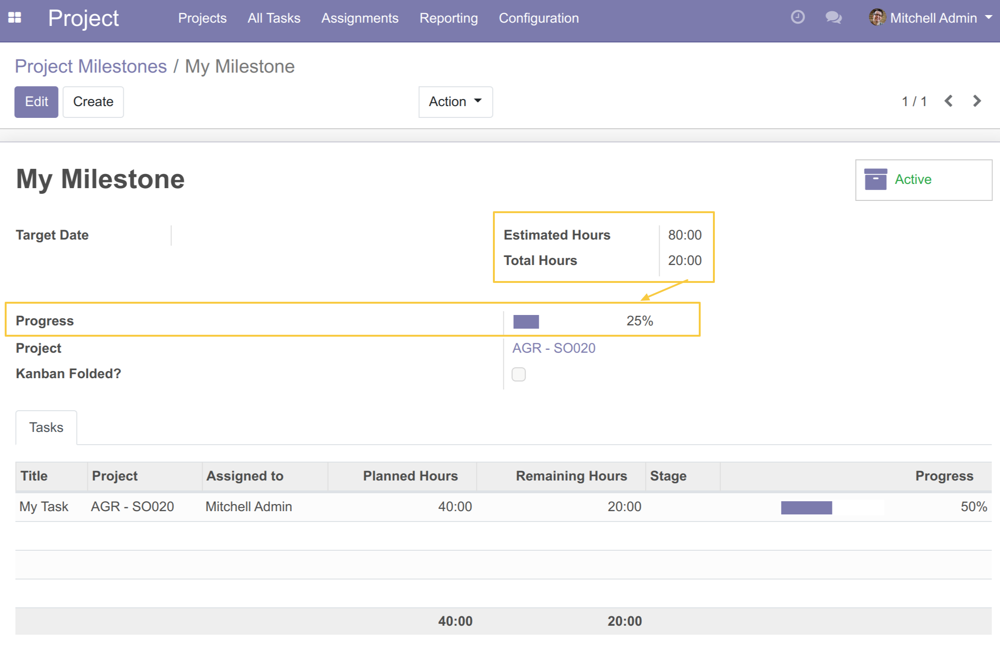

Project Milestone Time Progress
===============================

.. contents:: Table of Contents

Context
-------
In the vanilla version of the `project_milestone <https://github.com/OCA/project/tree/12.0/project_milestone>`__  module, there is a concept of
progress percentage but the latter is calculated according to a ratio of the
number of “Completed” tasks versus the number of total tasks linked to the Milestone.

This module changes the way the progress field is calculated on the milestone,
based on past and estimated hours.

Usage
-----

As a user with read access to milestones, I go to the form or list view of a milestone.

I notice that the `Progress` field no longer displays the progress according to the status
of the tasks but rather according to the `Hours spent / Estimated Hours` of the Milestone

- If the `Estimated Hours` field at “0:00”, In this case,
we hide the Progress field and display the following message:

"Please enter Estimated Hours to show Progress %."

.. image:: static/description/show_progress_info_message.png

Contributors
------------
* Numigi (tm) and all its contributors (https://bit.ly/numigiens)

More information
----------------
* Meet us at https://bit.ly/numigi-com
