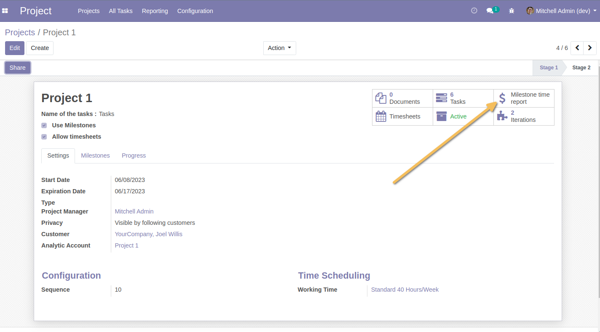
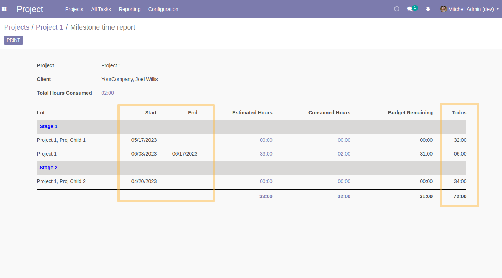
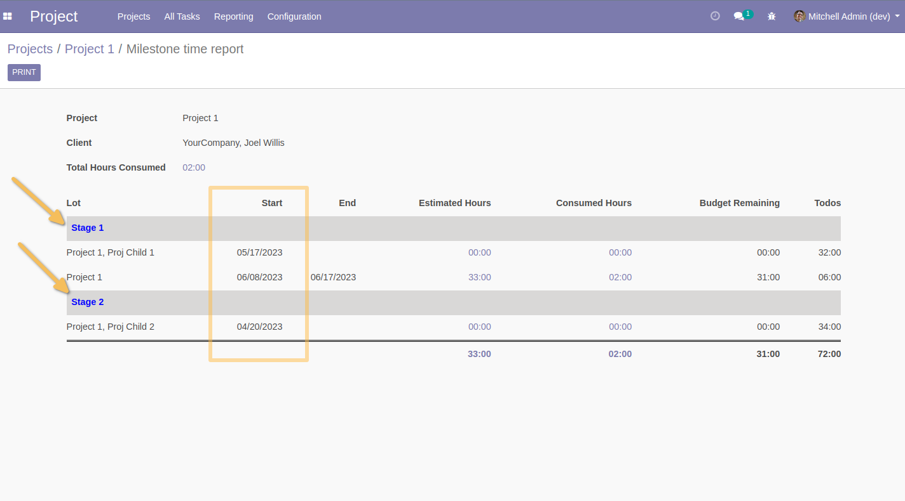
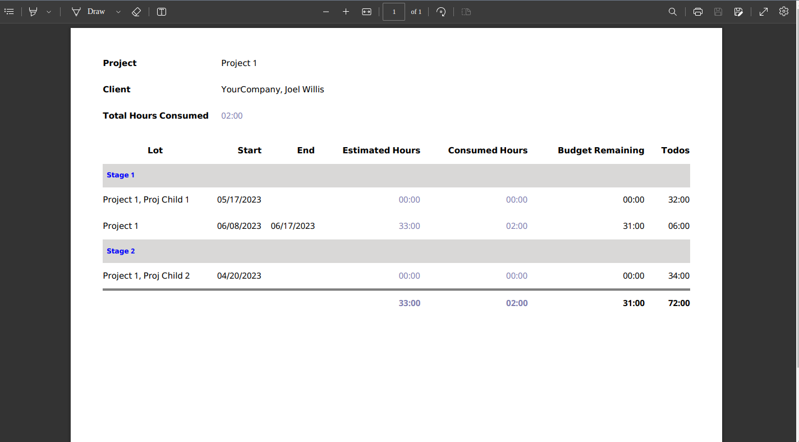

Project Milestone Time Report Advanced
======================================
This module allows on Projects module, when editing time report by Milestones, from the Smart button [Milestones time report], 
to see the following information (also available on PDF report):
* Project status
* Start date
* End date
* Todos

Usage
-----
As a user, when I view the time by milestone report from a project form, the following additional columns are displayed:
* Project status
* Start date
* End date
* Todos

The lines of each project are grouped by stage (project_id.stage_id) and the groups are sorted in ascending order according to the sequence associated with the stages of the projects (project_id.stage_id.sequence).
Within each of the groupings, the batch lines are sorted by start date.

When I print the report to pdf, the report has these new columns, sorting and grouping.

Contributors
------------
* Numigi (tm) and all its contributors (https://bit.ly/numigiens)
