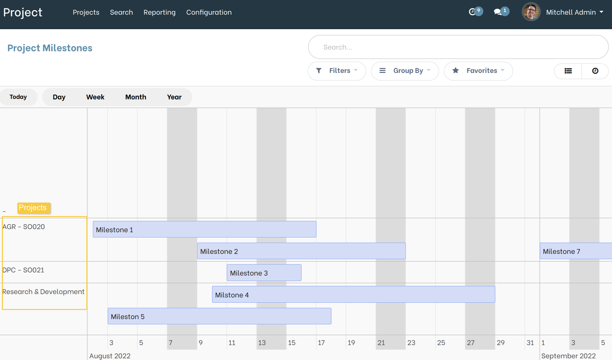

Project Milestone Timeline
==========================

.. contents:: Table of Contents

Description
-----------
This module adds a ``Timeline View`` to Project Milestone object.

This module is base on the OCA module `web_timeline <https://github.com/OCA/web/tree/12.0/web_timeline>`__

Overview
--------
As a project manager, I go to Project / Configuration / All Milestones,
I see that a timeline view of the milestones is available.

.. image:: static/description/Milestone_timeline_view.png

* When I select this view, I see that the milestones are grouped by project and
  that they are represented on the Timeline according to the ``Start date`` and
  the ``End date`` indicated on the milestone.

* When I click on one of the milestones in the Timeline view, I can move it by drag & drop.
  This action updates the start and end dates on the milestone.

* When I double click on the milestone from the timeline view,
  the milestone form view opens in edit mode.

.. image:: static/description/Milestone_timeline_view.png

Contributors
------------
* Numigi (tm) and all its contributors (https://bit.ly/numigiens)

More information
----------------
* Meet us at https://bit.ly/numigi-com