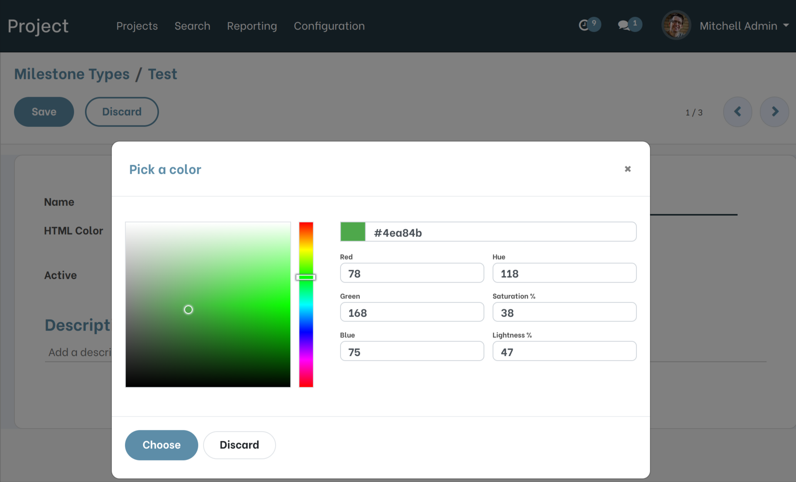
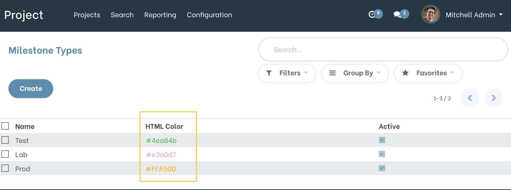
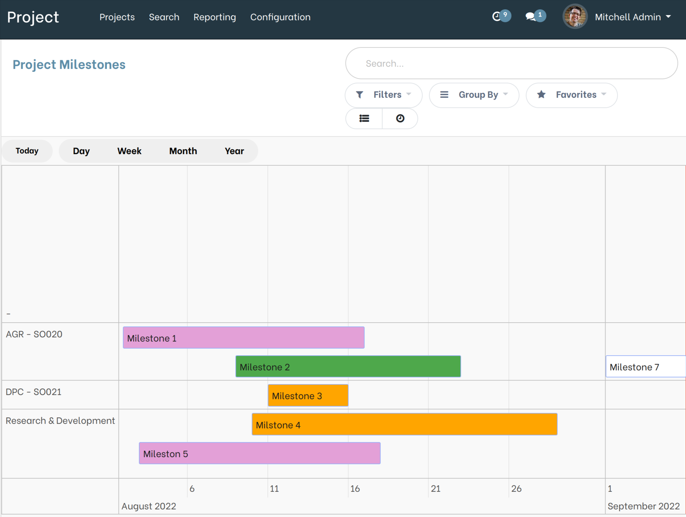

Project Milestone Timeline Color
================================

.. contents:: Table of Contents

Description
-----------
This module displays milestones in the color assigned to the milestone type.

Overview
--------
As a Projects / Manager user, I go to the form view of Milestone Types.
I see that a new ``HTML Color`` field is present and it contains the #FF0000 placeholder.

.. image:: static/description/field_html_color_form_view.png

When I click in the field, I see that I can select a color thanks to the ``Widget Color``.

From the Milestone Types list view, I see that the new ``HTML Color`` field
is present and that a preview of the color is also displayed.

As a user who can view milestones, I go to the Milestones Timeline View.

I see that the milestones are displayed in the color assigned to the type of the milestone.

If `no color is defined` on the type of milestone associated to the milestone,
the milestone is displayed in white (#FFFFFF) in the ``Timeline View``.

In case `the milestone is not associated with a milestone type` or if `the milestone is associated with an inactive milestone type`,
the milestone is displayed in white (#FFFFFF) in the ``Timeline View``.

Contributors
------------
* Numigi (tm) and all its contributors (https://bit.ly/numigiens)

More information
----------------
* Meet us at https://bit.ly/numigi-com