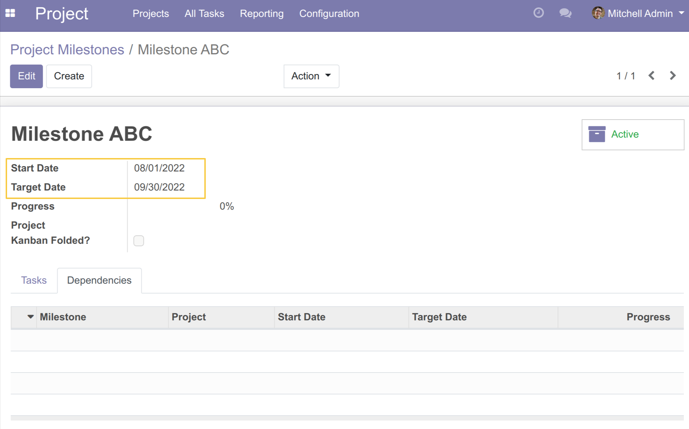
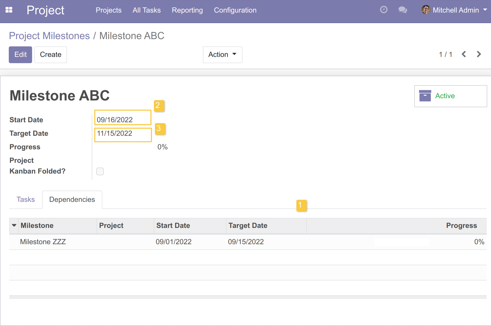
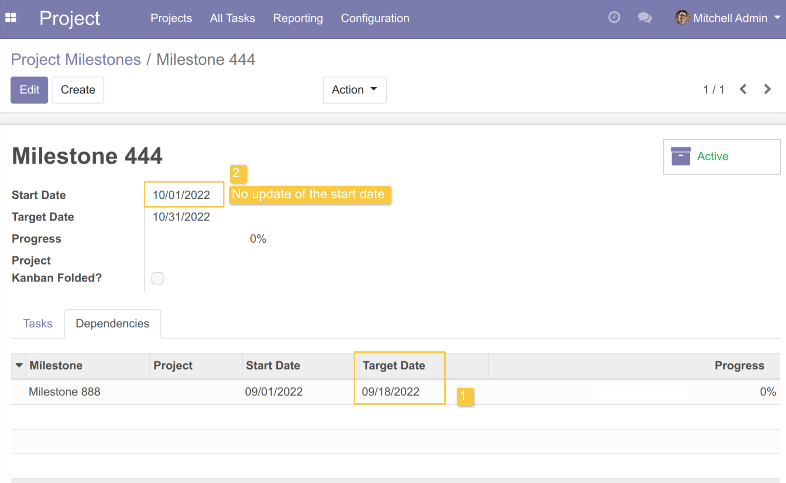
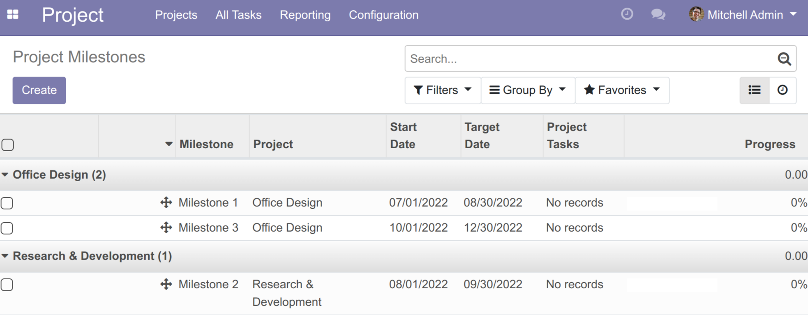
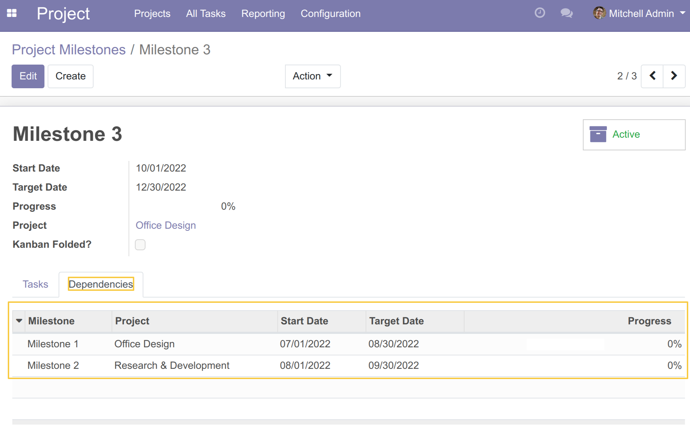
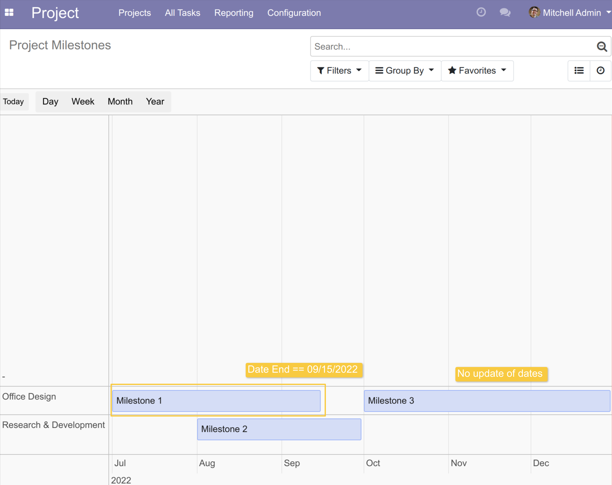
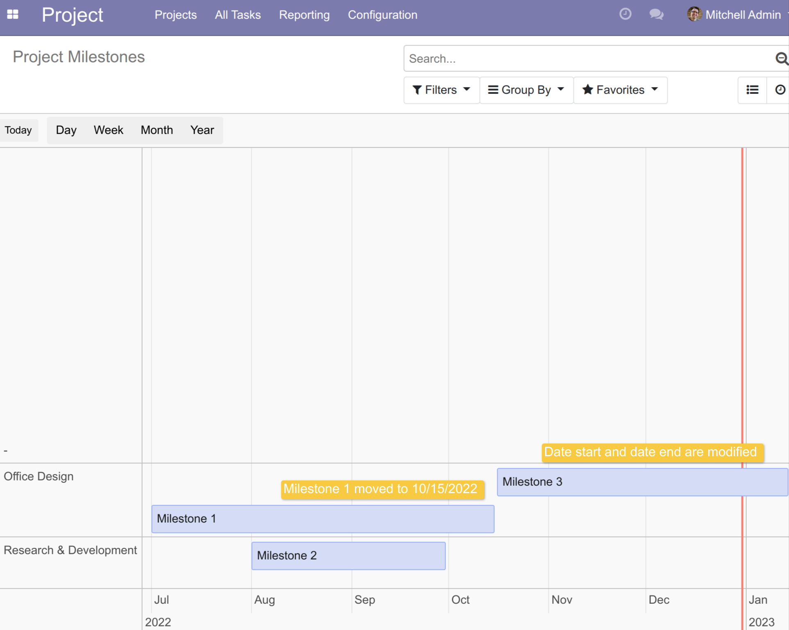
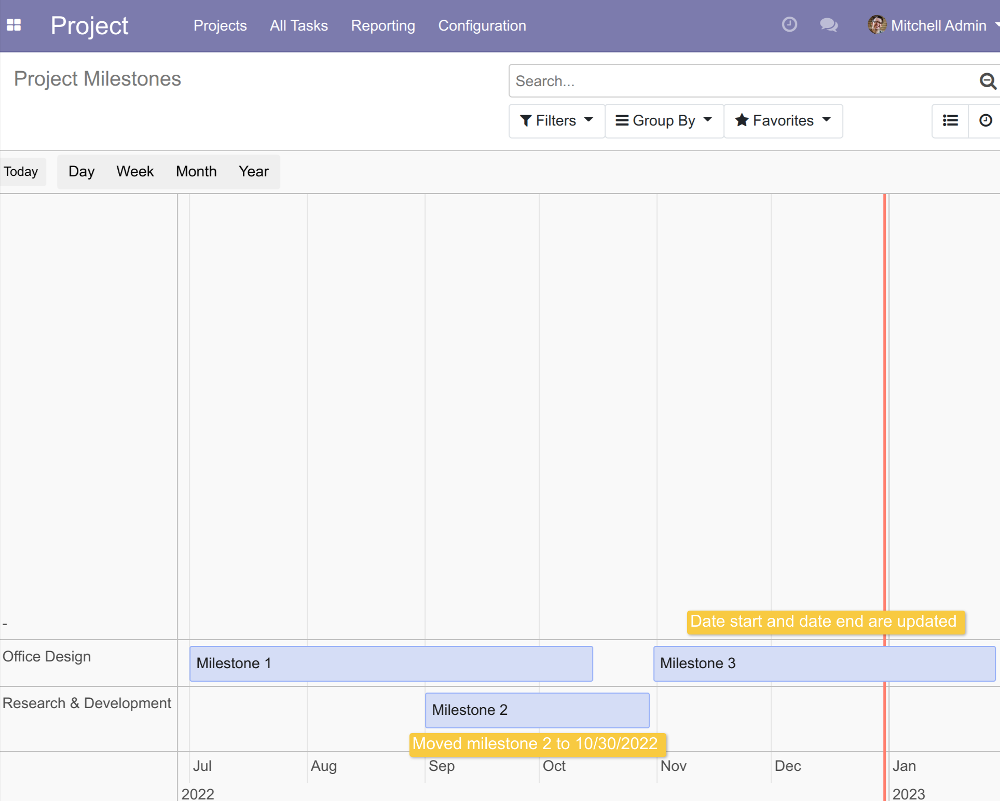

Project Milestone Timeline Dynamic
==================================

This module makes the ``Milestones Timeline View`` dynamic.

.. contents:: Table of Contents

Context
-------

Notion of overlap: Overlap is observed when two milestones linked by a dependency have a period
(total or partial) of completion which is common.

Example :
    - Milestone 1 : Start : 07/01/2022 | End : 09/30/2022
    - Milestone 2 : Start : 09/15/2022 | End : 12/30/2022

In this context, the principle of Gantt planning with constraints is that a step cannot start before
another step on which it depends.

Therefore, the addition of a milestone in the dependencies of another milestone should trigger an automated
update if there is an overlap in the period of achievement of the 2 milestones concerned.

Similarly, if on a milestone is dependent on another milestone, the end date is changed such that the end date
of the dependent milestone is later than the start date of the dependent milestone, then the start will be
updated automatically on D+1 of the end date of the dependent milestone.

Description
-----------
As a user who can modify a milestone and its dependencies, if for a milestone dependent on one or
more other milestones, the most recent (future) end date of the dependent milestones is modified
and exceeds the start date of the milestone, then the change is propagated on the start date of
the milestone.

The end date is automatically recalculated keeping the same number of days between the pre-existing
start date and end date.

This module depends on these modules:

* `project_milestone_timeline <https://github.com/Numigi/odoo-project-addons/tree/12.0/project_milestone_timeline>`_
* `project_milestone_dependency <https://github.com/Numigi/odoo-project-addons/tree/12.0/project_milestone_dependency>`_

Usage
-----

Selection of dependency(ies) on a milestone and consequence on the dependent milestone
~~~~~~~~~~~~~~~~~~~~~~~~~~~~~~~~~~~~~~~~~~~~~~~~~~~~~~~~~~~~~~~~~~~~~~~~~~~~~~~~~~~~~~~

As a user, I have a ``Milestone ABC`` with the following dates:
- Start: 08/01/2022
- End: 09/30/2022

If on the milestone ``Milestone ABC`` I select in the dependencies the milestone ``Milestone ZZZ`` whose end date is 09/15/2022,
then the start date of the milestone ``Milestone ABC`` is automatically updated with the date 09/16/2022, or D+1 of
the end date of the milestone ``Milestone ZZZ`` which is dependent.

Similarly, the end date of the ``Milestone ABC`` milestone is updated, in a calculated way, to keep the number of days
of achievement of the milestone, here: New end date = 11/15/2022.

As a user, for a milestone ``Milestone 444`` whose start date is 01/10/2022, if I select in the dependencies a milestone
``Milestone 888`` whose end date is 18/09/2022, then no update of the start date of the milestone ``Milestone 444`` is not observed,
because there is no overlap in the period of achievement of the milestones.

End date modification on milestones dependent on another milestone
~~~~~~~~~~~~~~~~~~~~~~~~~~~~~~~~~~~~~~~~~~~~~~~~~~~~~~~~~~~~~~~~~~

As a user who can create and edit milestones, I have the following 3 milestones:
- ``Milestone 1`` Start date: 07/01/2022 End date: 08/30/2022
- ``Milestone 2`` Start date: 08/01/2022 End date: 09/30/2022
- ``Milestone 3`` Start date: 01/10/2022 End date: 30/12/2022

I go to the form view of ``Milestone 3``, under the Dependencies tab,
I add ``Milestone 1`` and ``Milestone 2`` as dependencies and I save.

From the Milestones Timeline view, I move ``Milestone 1`` to change the End Date to 09/15/2022.
I note that ``Milestone 3`` is not modified.

From the Milestones Timeline view, I move ``Milestone 1`` to change the End Date to 10/15/2022.
I see that the Start date and End date of ``Milestone 3`` are modified.

From the Milestones Timeline view, I move ``Milestone 2`` to change the Start Date to 09/01/2022 and the End Date to 10/30/2022.
I see that the Start date and End date of ``Milestone 3`` are modified.

``Note that the behavior described above also applies if I modify the Start date or the End date from the Milestone form view.``

Contributors
------------
* Numigi (tm) and all its contributors (https://bit.ly/numigiens)

More information
----------------
* Meet us at https://bit.ly/numigi-com
