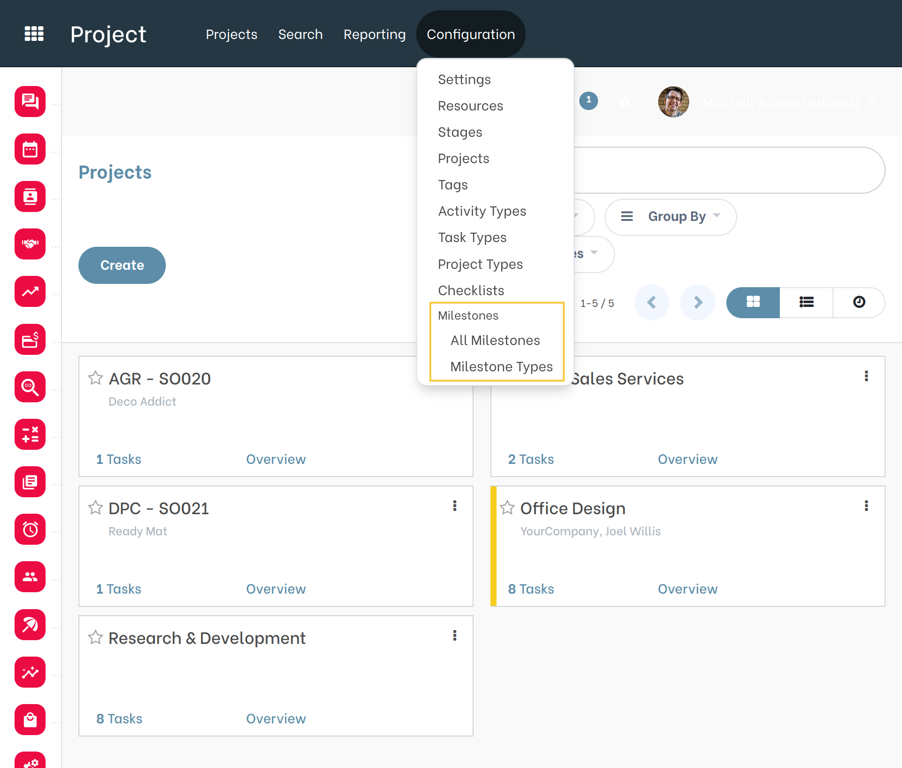
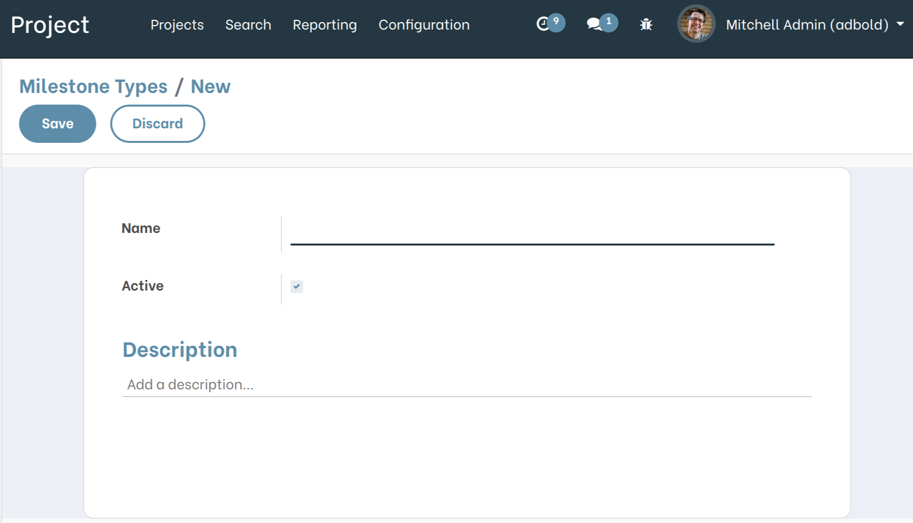
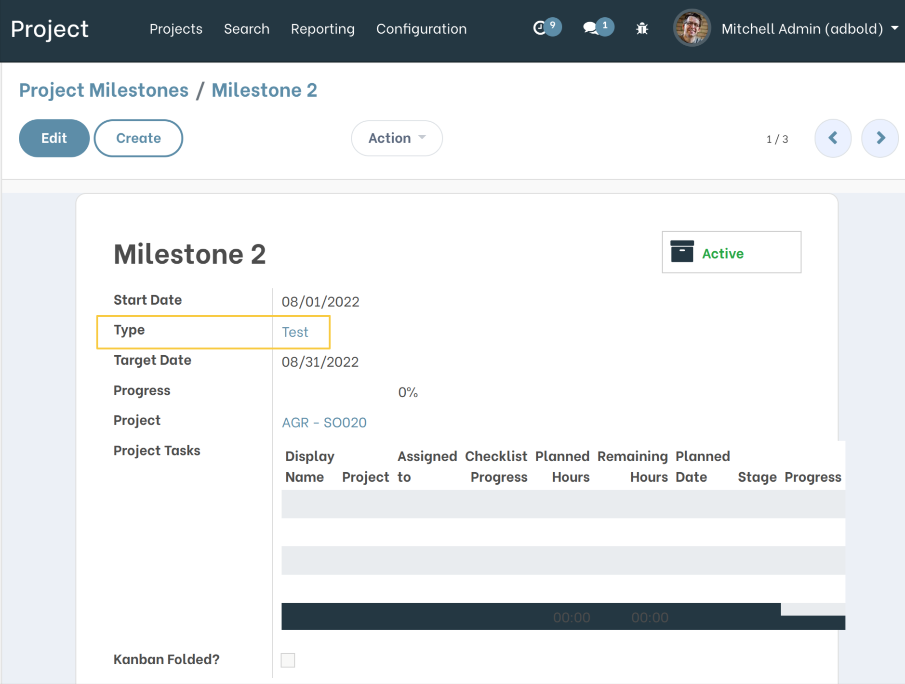

Project Milestone Types
=======================

.. contents:: Table of Contents

Description
-----------
This module adds ``Types`` to Project Milestones.

Overview
--------
As a member of the group ``Projects / Manager``, I go to Project > Configuration.

I notice that a new section ``Milestones`` is available and that it contains the new menu ``Milestone Types`` with the existing menu ``All milestones``.

I click on the menu ``Milestone Types``. The List View of Milestone Types is displayed.

.. image:: static/description/Milestone_types_list_view.png

I click on the ``Create`` button. The Milestone Types Form View is displayed.

I click on the menu ``All Milestones``, then I click on a milestone line.

I see that the new field ``Type`` is available in the Milestone Form View.

Contributors
------------
* Numigi (tm) and all its contributors (https://bit.ly/numigiens)

More information
----------------
* Meet us at https://bit.ly/numigi-com
