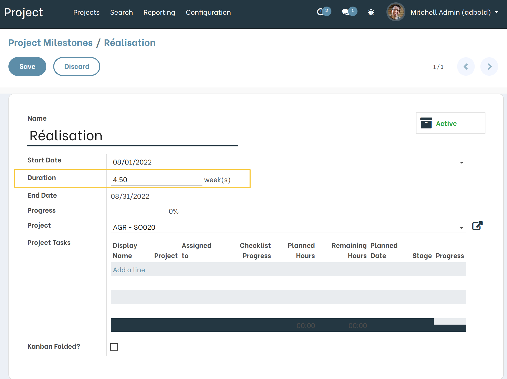
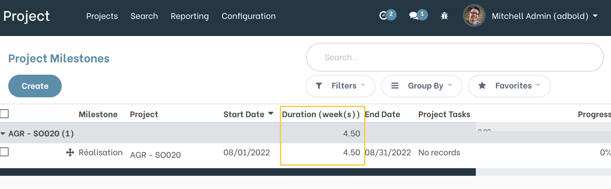
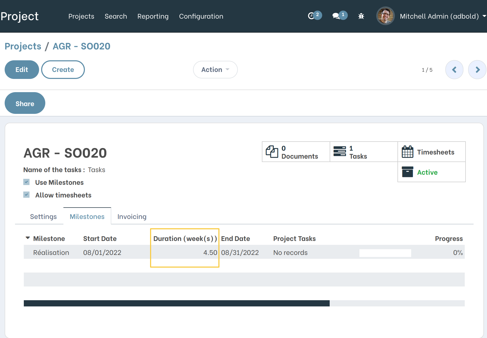
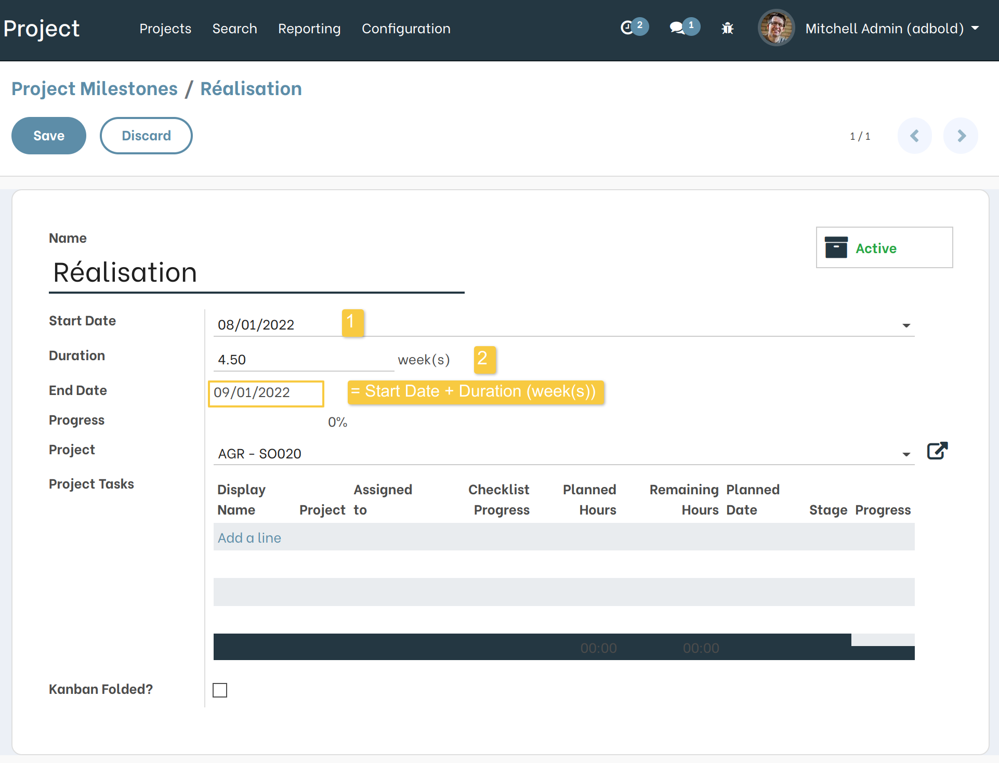

Project Milestone Week Duration
===============================

.. contents:: Table of Contents

Description
-----------
This module adds a ``Duration`` field to the Project Milestones.

It changes the ``Target Date`` field to ``End Date`` field calculated automatically by ``Start Date`` and ``Duration``

Context
----------
The module `project_milestone_start_date <https://github.com/Numigi/odoo-project-addons/tree/12.0/project_milestone_start_date>`_
allows to define a ``Start Date`` for a Project Milestone.

Overview
--------
As a user who can manage Milestones, I open the Form View of a Milestone.

I notice the new field ``Duration``.

The same field is added to the list view of a Milestone.

Project Form View
---------

From a Project Form View with ``Use Milestone`` activated, I see that the new field ``Duration`` is displayed in the Milestones Tab Lines.

Target Date / End Date
----------

From the Milestone Form View, I notice that the ``Target Date`` is now named ``End Date`` and that it is now ``Readonly``.

The field is calculated automatically by the system as following :

1- Select a ``Start Date``;

2- Add a ``Duration`` (number of weeks);

3- The ``End Date`` is calculated automatically.

Contributors
------------
* Numigi (tm) and all its contributors (https://bit.ly/numigiens)

More information
----------------
* Meet us at https://bit.ly/numigi-com
