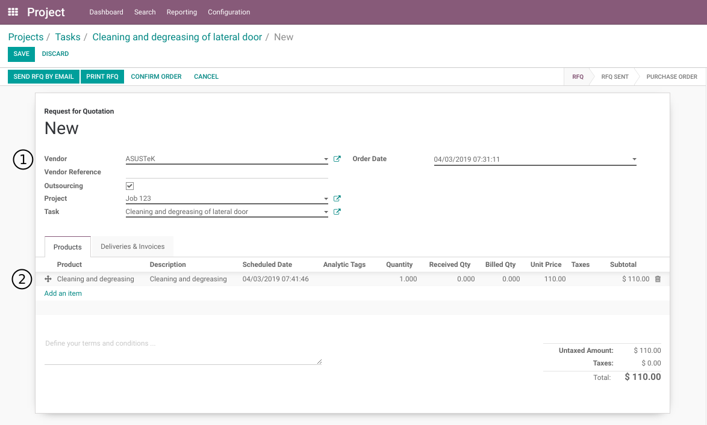

Project Outsourcing
===================

.. contents:: Table of Contents

Context
-------
In vanilla Odoo, it is not possible to bind a purchase order with a task.

It is possible to set an analytic account on a purchase order line.
However, this is error prone, because there are no restrictions on how and
when to set an analytic account on a PO line.

Summary
-------
This module allows to generate a purchase order from a task.

It adds a new tab in the form view of tasks to view purchase orders
and a smart button on the form view of project.

It inherits from the module project_task_analytic_lines which adds an integration between tasks and invoices.

Create A New PO
---------------
As member of the groups `Project / User` and `Purchase / User`, I go to the form view of a task.

In the `Outsourcing` tab, I see a list of purchase orders.

.. image:: project_outsourcing/static/description/project_task_form.png

I click on the button `Create PO`.

The form view of a new PO is opened.

.. image:: project_outsourcing/static/description/new_purchase_order.png

The following fields are filled automatically.

* Outsourcing

..

    This box is checked to indicate that the purchase order is an Outsourcing PO.

* Project

..

    This field is visible because the `Outsourcing` box is checked.
    
    It indicates which project is bound to the PO.
    
    One outsourcing PO can not be bound to more than one project.

* Task

..

    This field is visible because the `Outsourcing` box is checked.

    It indicates which task is bound to the PO.

    It allows only to select a task from the selected project.

I select my supplier, then I add a new line to the PO.

Analytic Account
~~~~~~~~~~~~~~~~
I notice that the analytic account on the PO lines is invisible.
This is because the `Outsourcing` box is checked.

Behind the scene, the analytic account is automatically set based on the selected project.

Stockable Products
------------------
Stockable (or consummable) products may not be added to an outsourcing PO.

This is because the accounting is very different between outsourcing and material.

If you need to add stockable products to a project, you will likely need the `Work In Progress` module
(see project_wip_material).

List Of Purchase Lines
----------------------
Back to the task, in the outsourcing tab, I notice the new PO in the `Purchase Order` table and one line in the `Order Lines` table.

.. image:: project_outsourcing/static/description/project_task_form_with_po.png

Supplier Invoice
----------------
As member of the group `Accounting / Billing`, I create a new vendor bill from my PO.

.. image:: project_outsourcing/static/description/vendor_bill.png

I notice that the task was automatically selected on the invoice line.

Changing The Project
--------------------
If a task is moved from a project to another, any outsourcing PO linked to the task will be moved to the destination project.

.. image:: project_outsourcing/static/description/task_with_new_project.png

.. image:: project_outsourcing/static/description/purchase_order_with_new_project.png

If any PO is already confirmed, a blocking message will be displayed.

.. image:: project_outsourcing/static/description/task_change_project_error_message.png

Project Smart Button
--------------------
When confirming a purchase order, journal entries are not created.
The journal entries and analytic lines are only created when validating the supplier invoice.

The supplier invoice for an outsourcing task may not be received before the job is finished.
Therefore, that cost needs to be included in the customer invoice.

For this purpose, a smart button is added on the project.

.. image:: project_outsourcing/static/description/project_smart_button.png

The button indicates the number of outsourcing purchase orders related to the project.

When clicking on the button, the list of purchase orders is displayed.

.. image:: project_outsourcing/static/description/outsourcing_po_list.png

From this list I can filter to see only the orders awaiting a vendor bill.

.. image:: project_outsourcing/static/description/outsourcing_po_list_awaiting_bill.png

Contributors
------------
* Numigi (tm) and all its contributors (https://bit.ly/numigiens)
