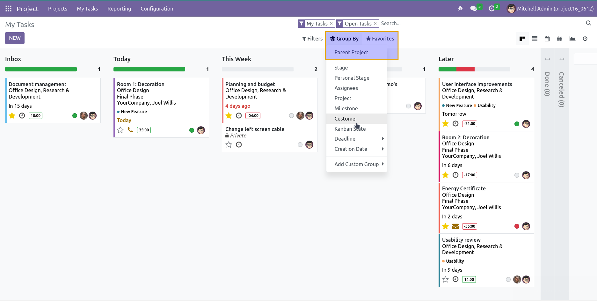
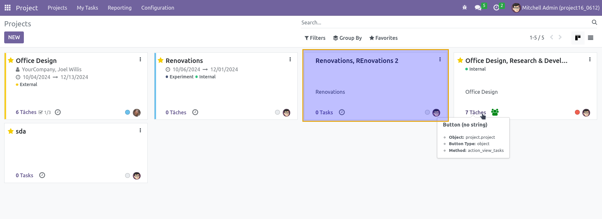

Project Parent Enhanced
=======================

This module enhances the functionality of parent-child relationships between projects and tasks in Odoo. It builds upon the features of the `project_parent` module from OCA, adding new constraints, methods, and views to better manage project hierarchies.

Dependencies
------------
This module depends on the following OCA module:
- `project_parent`: https://github.com/OCA/project/tree/16.0/project_parent

Features
--------

**Enhanced Constraints**
   - Prevent a project from being its own parent.
   - Ensure that a child project cannot have further child projects.

**Follower Propagation**
   - Automatically propagate followers from a parent project to its child projects.

**Search by Parent Projects**
   - Add a new filter view to search projects by their parent projects.

**View Adjustments**
   - Replace project names with their `display_name` to show the hierarchy in views.

Contributors
------------
- Numigi (tm) and all its contributors (https://bit.ly/numigiens)

More Information
----------------
For more details, visit:
- https://github.com/OCA/project/tree/16.0/project_parent
