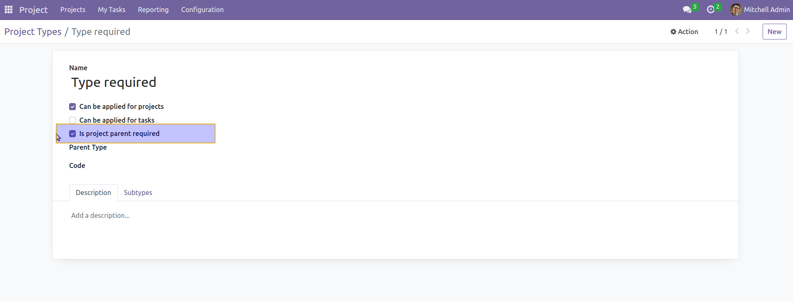
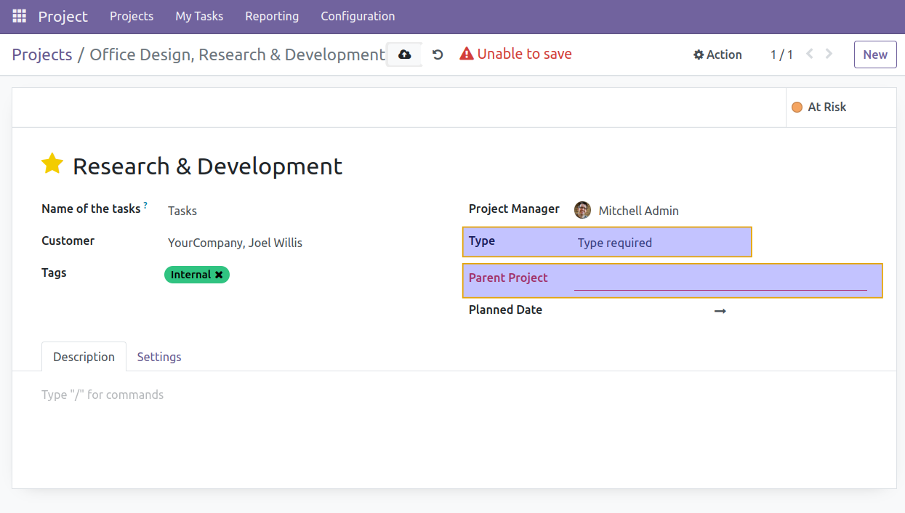
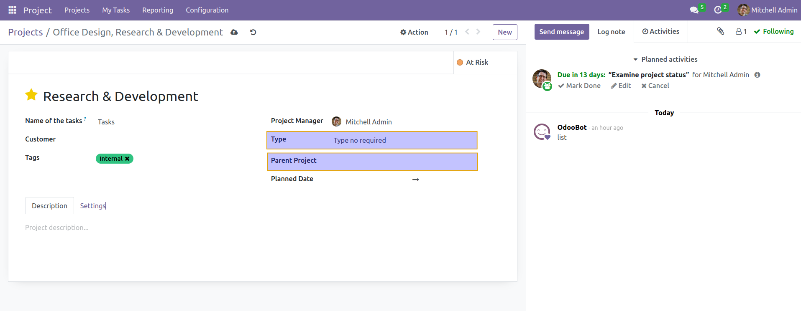

Project Parent Required
======================================

This modules allows to drive the require of parent in project from the project type.

by checking the boolean Is Parent Required, all the project of this type must have a parent set.

when I go to the project types, I see a new checkbox

After having set up the types, I can see the effect on project

If the type requires a parent project

Otherwise

Contributors
------------
- Numigi (tm) and all its contributors (https://bit.ly/numigiens)

More Information
----------------
For more details, visit:
- https://github.com/OCA/project/tree/16.0/project_parent

