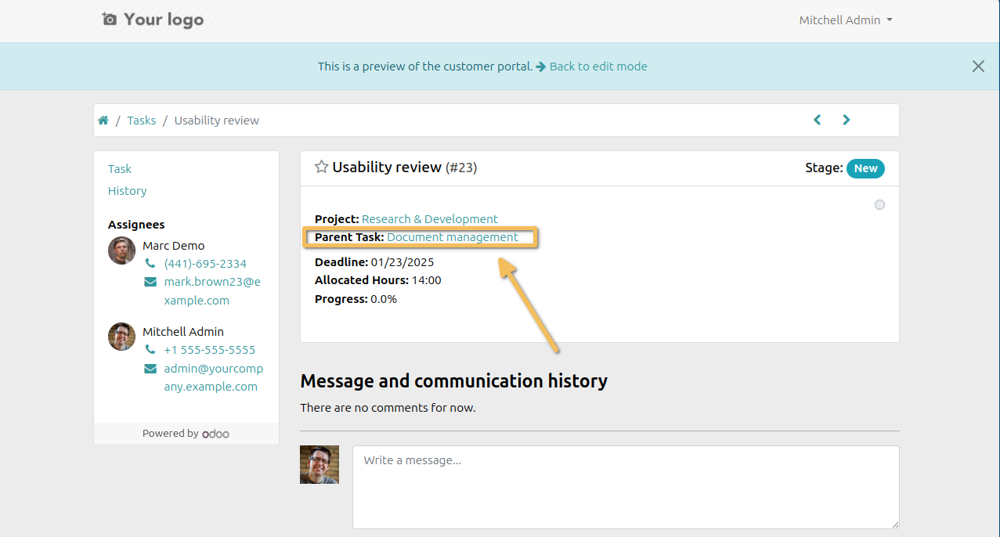

Project Portal Parent Task
==========================
This module displays the parent task on the task portal form view if the portal connected user have access to it.

The parent task is placed after the project name.

Contributors
------------
* Numigi (tm) and all its contributors (https://bit.ly/numigiens)
