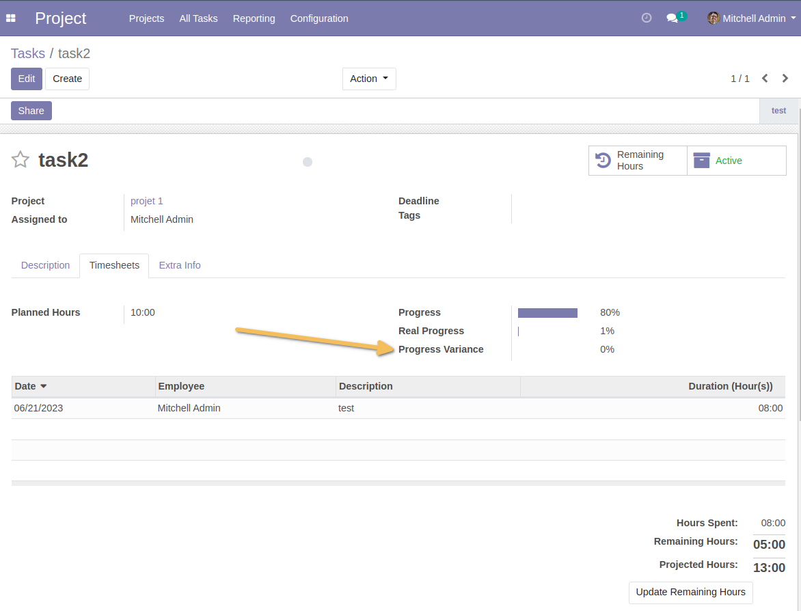
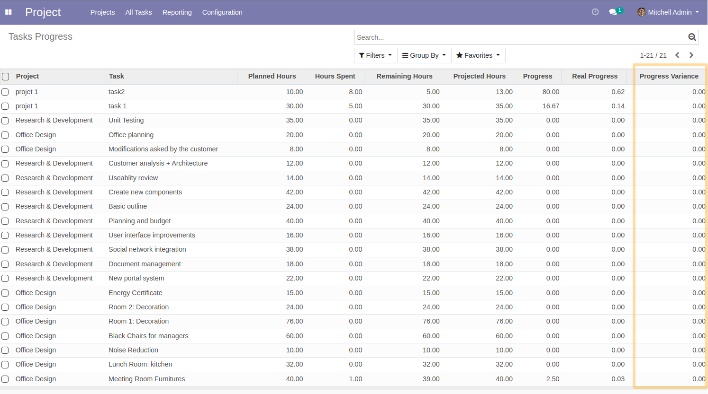

Project Progress Variance
=========================
This module allows to:

* Add the ”Variance on progress” field in the form view of a task
Computed as : task real progress + task theorical progress.

* Add the “Variance on progress” in the analysis list view “Progress of tasks”

* Add the ”Progress” tab in the form view of a project
   * The “Total theoretical progress” field
   Computed as : total of effective hours of project tasks / total of planned hours of project tasks.

   * The "Total real progress" field
   Computed as : total of effective hours of project tasks / total of projected hours of project tasks.

   * The “Total variance on progress” field
   Computed as : total of real progress - Total theoretical progress.

.. image:: static/description/project_progress_tab.png

Contributors
------------
* Numigi (tm) and all its contributors (https://bit.ly/numigiens)
