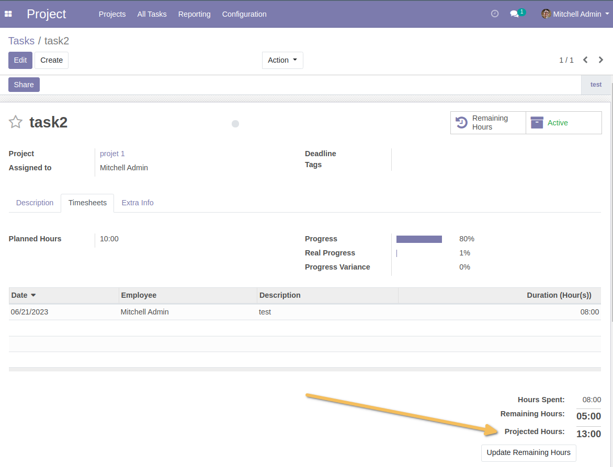
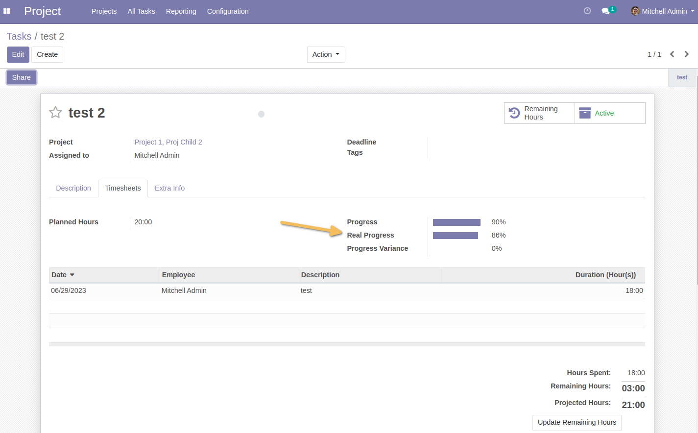
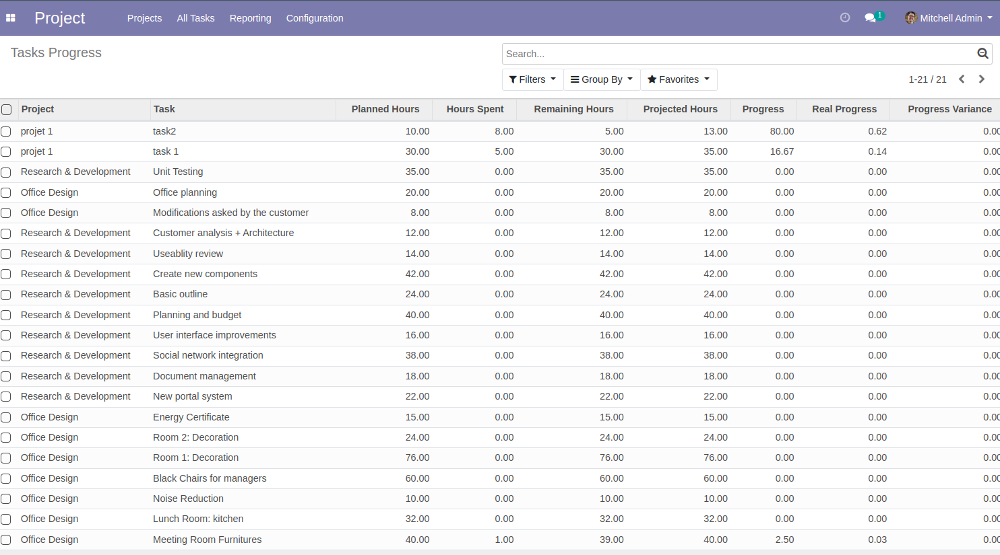

Project Projected Hours
=======================
This module allows to:

* Add “Projected Hours” in the form view of a task.
Computed as : task effective hours + task remaining hours.

* Add the "Real progress” field in the form view of a task
Computed as : task effective hours / (task effective hours + task remaining hours).

* Add a “Task Progress” analysis list view
    * Add a list view with the elements to filter and group excluding the variance on progress

.. image:: static/description/task_progress_menu.png

Contributors
------------
* Numigi (tm) and all its contributors (https://bit.ly/numigiens)
