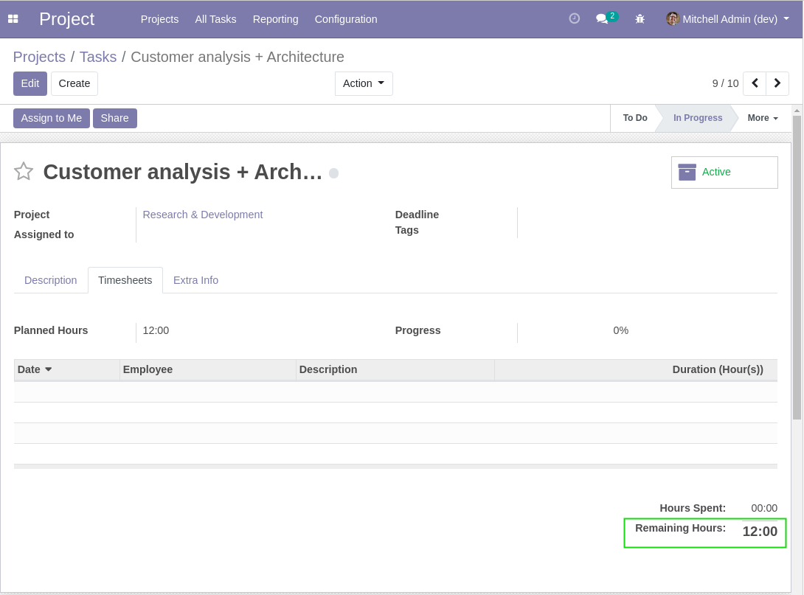
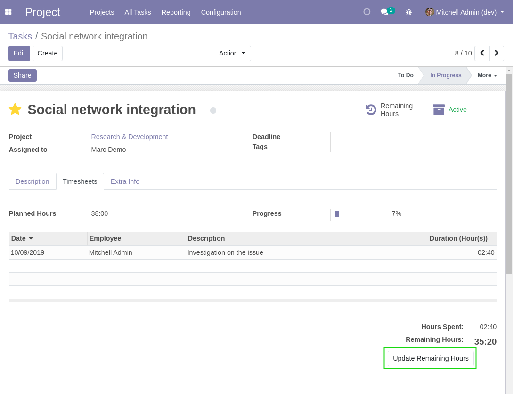
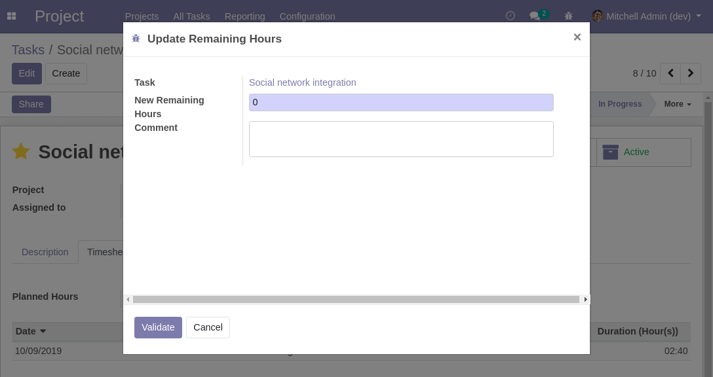
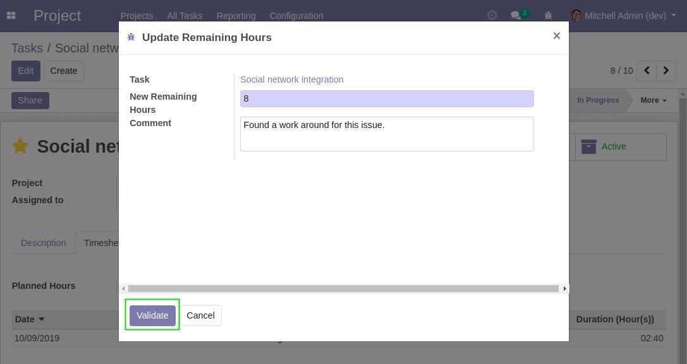
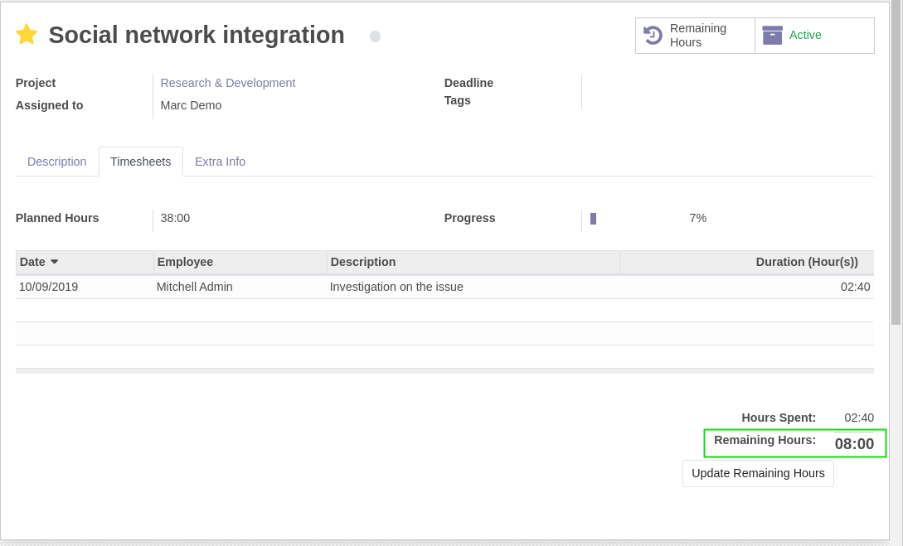
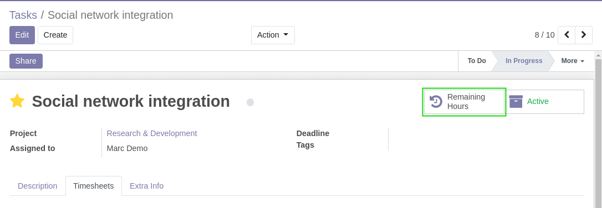
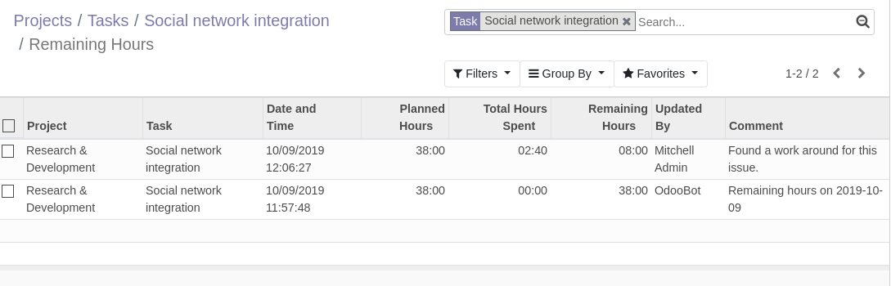
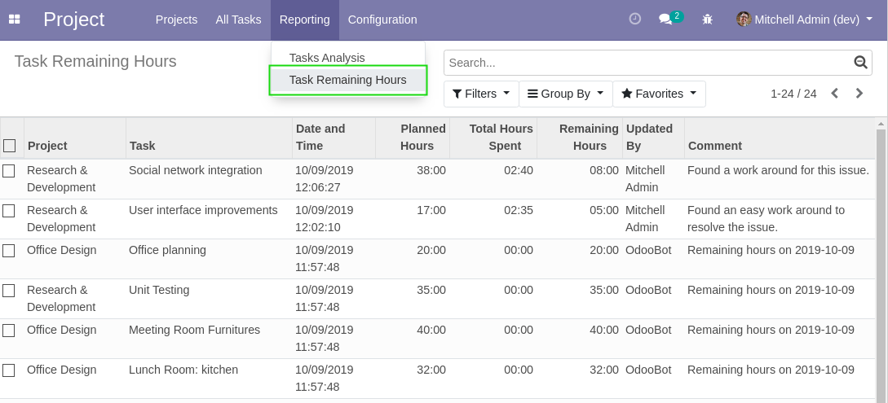

Project Remaining Hours Update
==============================
This module allows to update the remaining hours on a task.

.. contents:: Table of Contents

Context
-------
In vanilla Odoo, the remaining hours on a task is computed based on the time spent and the planned hours.

This value can not be edited manually.

When a task is partially completed and you figure that it will take more or less time than initialy planned,
you end up with two choices:

* Change the planned hours (which will most likely confuse your client).
* Leave the initial planned hours and live with inaccurate remaining hours.

Usage
-----
As member of ``Project / User``, I go to the form view of an ongoing task.

I notice a new button that allows to update the remaining hours.

I click on the button. A wizard is opened.

I enter the number of remaining hours, then click on ``Confirm``.

I notice that the remaining hours was updated on the task.

Remaining Hours History
-----------------------
On the form view of a task, a smart button allows to view the history of changes to the remaining hours.

When clicking on the button, a list view is displayed.

Each item in the list represents a change to the remaining hours on the task.

Global History List
-------------------
The remaining hours history can be accessed globally for all projects / tasks.

This list is available from ``Project / Reporting / Task Remaining Hours``.

Contributors
------------
* Numigi (tm) and all its contributors (https://bit.ly/numigiens)
