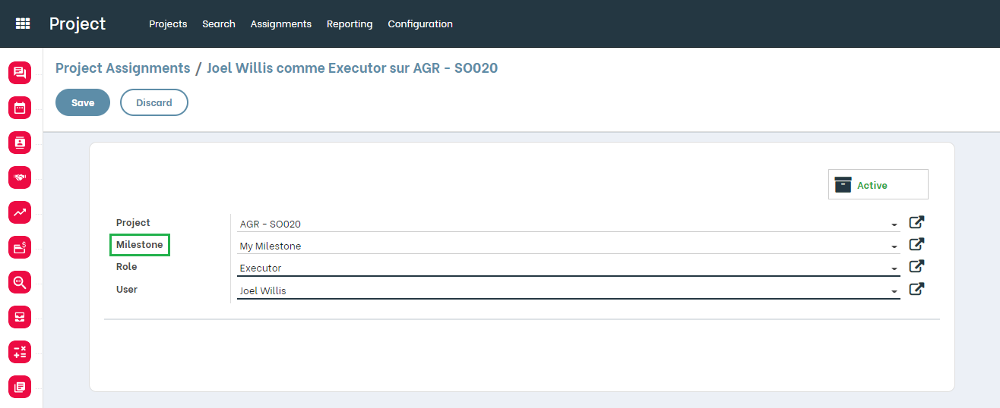
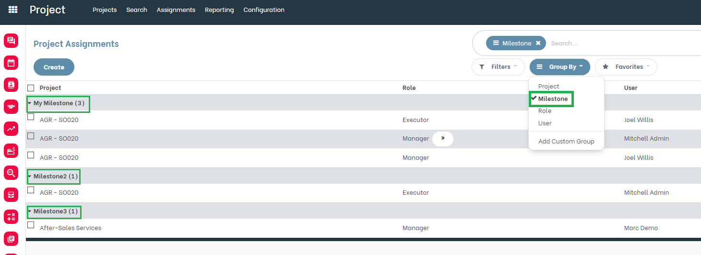
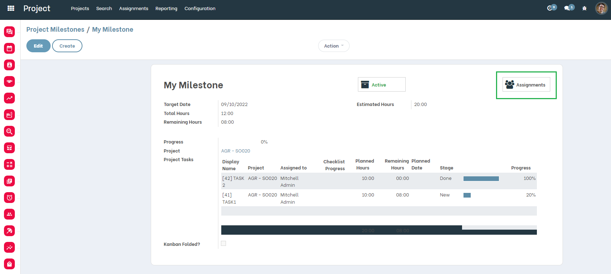

Project Role Milestone
======================
This module allows you to define and assign roles to employees involved in projects.

.. contents:: Table of Contents

Context
-------
The module `project_milestone <https://github.com/OCA/project/tree/12.0/project_milestone>`_ lets you define Milestones on Projects.

The module `project_role <https://github.com/OCA/project/tree/12.0/project_role>`_ allows maintaining project roster based on Roles and Assignments.

This module allows you to choose a Milestone in the Project's Assignement view

Overview
--------
As a user with access to Project Assignment, I go to the form view of an Assignment.

I notice that a new ``Milestone`` field is available.

This field is not required.

Milestones are filtred by the selected project.

Assignments grouped by Milestone
-------------------------

From the Assignments list view , the user can group by Milestones.

Milestone's Assignments
-------------------------
As a user with access to Milestone form view , I can display all the assignements linked to the selected milestone.

Contributors
------------
* Numigi (tm) and all its contributors (https://bit.ly/numigiens)

More information
----------------
* Meet us at https://bit.ly/numigi-com
