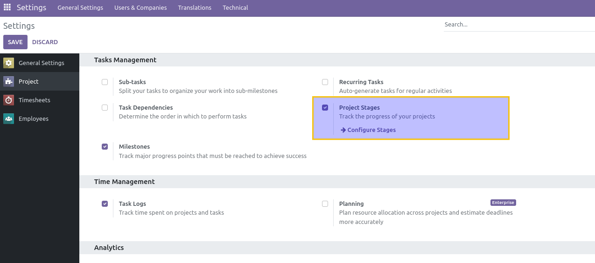
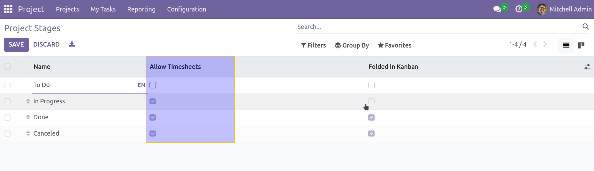
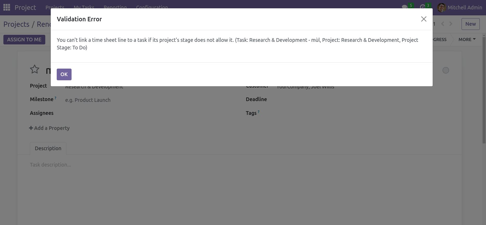

Project Stage Allow Timesheet
=============================

This module adds the notion of timesheet on project stages.
With this implementation, the field allow_timesheets on project is now readonly and it
is driven by the stage the project is in.

*This module automatically activates the feature for project_stage in the section. :* ``Project // General Settings``

*I go on the project stage configuration. I find an option to* ``Allow Timesheets`` *on tasks in this stage.*

*You can no longer change a task's project to one that does not allow timesheets. An error message will be displayed.

Contributors
------------
* Numigi (tm) and all its contributors (https://bit.ly/numigiens)
